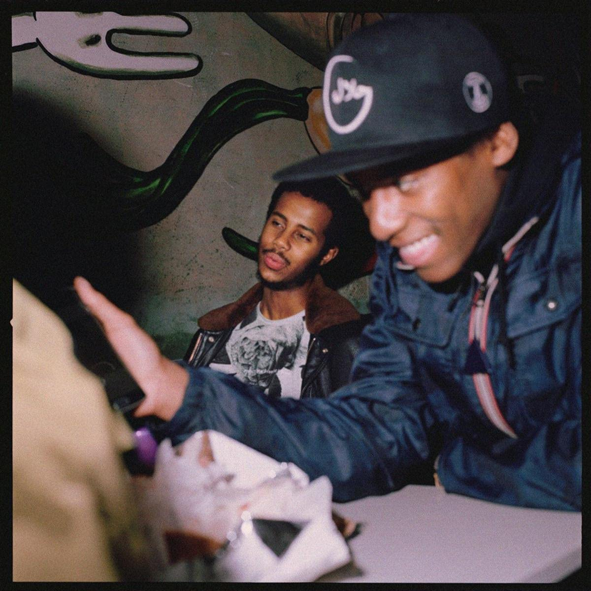

import { Slider, Button } from "carbon-components-react";
import { ArrowUpRight24 } from "@carbon/icons-react";

import SliderJS1 from "../review/slider1";
import SliderJS2 from "../review/slider2";
import SliderJS3 from "../review/slider3";
import SliderJS4 from "../review/slider4";
import AdvJS2 from "../review/adv2";
import AdvJS3 from "../review/adv3";

import { Link } from "gatsby";

Album Review

<h1 className="h1--no--margin">{props.pageContext.frontmatter.title}</h1>

  <Link to="/best50/2021/">2021 Black Music Album Best No.36</Link>

<Row className="image-card-group">
	<Column colMd={"3"} colLg={"4"} noGutterMdLeft="">
    <ImageCard>

</ImageCard>
	</Column>
	<Column colMd={"4"} colLg={"8"} noGutterMdLeft="">
	

	  Tronto出身のSinger, Mustafaのデビューアルバム(といっても8曲23分半と短め)。Weeknd, Camila Cabelo, Jonas Brothersなどへの楽曲提供で頭角を表し、デビューに至っている。
     また、Sudan系のブラック・モスリムということで、CDジャケットには一部、アラビア語でのメッセージも載っていて、サウンドにも、ほんのり、それっぽい風味も混ざっている。
     Joni Mitchell, Richie Havensあたりに影響を受けているとのことで、アコギやピアノ中心のAccousticなサウンドは、ほぼフォークといって良く、浮遊感のあるところが現代的。ただ、Lyricは友人の死や、都会人の孤独感などシリアスなものを扱っており、そう相当重たく、内省的で、Mustafaが掠れた声で切々と唄っている。
  

  

	  <Button className="button-right-mergin" href="https://amzn.to/3nd9VmP" kind="primary" size="small" renderIcon={ArrowUpRight24}>
      amazon.com
    </Button>
    <Button className="button-right-mergin" href="https://amzn.to/3u01HCh" kind="secondary" size="small" renderIcon={ArrowUpRight24}>
      amazon.co.jp
    </Button>
    <Button className="button-right-mergin" href="https://apple.co/3u1Auzn" kind="tertiary" size="small" renderIcon={ArrowUpRight24}>
      apple music
    </Button>
    <AdvJS2/>
	

	</Column>
</Row>
<Row >
  <Column colMd={"4"} colLg={"4"} noGutterMdLeft="">
    

      <h3>Score card</h3>
	    <SliderJS1 value="5" />
      <SliderJS2 value="4" />
	    <SliderJS3 value="1" />
      <SliderJS4 value="8" />
    

  </Column>
  <Column colMd={"4"} colLg={"8"} noGutterMdLeft="">
    

      <h3>Producers</h3>
      

        Frank Dukes(1,2,3,4,5,6,7)
         Frank Dukes and James Blake(8)
      

      <h3>Guests</h3>
      

        Sampha, James Blake
      

    

  </Column>
</Row>

<h3>Tracks</h3>

| No. | Title             | Composers                                                               | Performer            | Time  |
| --- | ----------------- | ----------------------------------------------------------------------- | -------------------- | ----- |
| 1   | Stay Alive        | Adam Feeney, Mustafa Ahmed, Simon Hessman, cityboymoe                   | Mustafa              | 03:01 |
| 2   | Air Forces        | Adam Feeney, Mickey Newbury, Mustafa Ahmed, Simon Hessman               | Mustafa              | 03:09 |
| 3   | Separate          | Adam Feeney, Mustafa Ahmed, Simon Hessman, cityboymoe                   | Mustafa              | 02:27 |
| 4   | The Hearse        | Adam Feeney, James Smith, Matthew Tavares, Mustafa Ahmed, Simon Hessman | Mustafa              | 02:04 |
| 5   | Capo              | Mustafa Ahmed, Sampha Sisay                                             | Mustafa feat. Sampha | 02:55 |
| 6   | Ali               | Adam Feeney, Matthew Tavares, Mustafa Ahmed, Simon Hessman              | Mustafa              | 03:12 |
| 7   | What About Heaven | Adam Feeney, Dylan Wiggins, Mustafa Ahmed, Simon Hessman                | Mustafa              | 03:38 |
| 8   | Come Back         | Adam Feeney, James Blake, Mustafa Ahmed                                 | Mustafa              | 03:12 |

<AdvJS3 />
