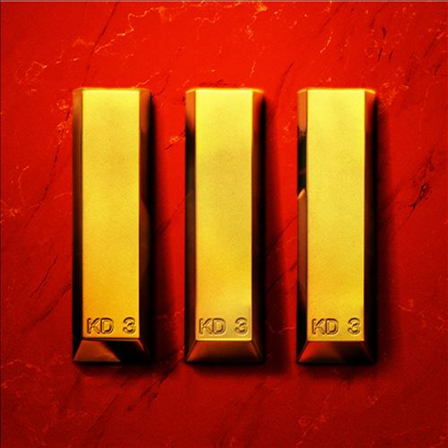

import { Slider, Button } from "@carbon/react";
import { ArrowUpRight } from "@carbon/icons-react";

import SliderJS1 from "../review/slider1";
import SliderJS2 from "../review/slider2";
import SliderJS3 from "../review/slider3";
import SliderJS4 from "../review/slider4";
import AdvJS2 from "../review/adv2";
import AdvJS3 from "../review/adv3";

import { Link } from "gatsby";

import Review1 from "../review/nas9.mdx";
import Review2 from "../review/nas8.mdx";

Album review

<h1 className="h1--no--margin">{props.pageContext.frontmatter.title}</h1>

  <Link to="/best50/2022/">2022 Black Music Album Best No.26</Link>

<Row  className="image-card-group">
	<Column colMd={3} colLg={4} noGutterMdLeft="">
       <ImageCard>

</ImageCard>
	</Column>
	<Column colMd={4} colLg={8} noGutterMdLeft="">
		

			King's Deseaseシリーズの最終作にして3作目となるNasの14thアルバム。ここ3年で4つのアルバムリリースと制作意欲が枯れることはないようだ。今回も相性抜群のHit-Boyと組んでいるが、過去2作と違って、Guestは無しである。その分、Hip-Hopの基本を突き詰めたようなサンプリング多めでオーソドックスでストレートな作品になっている。また、Quincy, Michael, Kendric Lamar, Jay-ZなどがLyricに現れており、Black Music史を回顧するような趣もある。
			 安定感は格別ではあるが、そろそろ、新しいことをやってほしい気もする。
		

		

		  <Button className="button-right-mergin"  href="https://amzn.to/42nk2rv" renderIcon={ArrowUpRight} size='sm' kind='primary'>
  	    amazon.com
  	  </Button>
  	  <Button className="button-right-mergin"  href="https://amzn.to/43GZzyR" renderIcon={ArrowUpRight} size='sm' kind='secondary'>
  	    amazon.co.jp
  	  </Button>
			<Button className="button-right-mergin"  href="https://apple.co/3oIaKIT" renderIcon={ArrowUpRight} size='sm' kind='tertiary'>
  	   	apple music
  	  </Button>
			<AdvJS2/>
		

	</Column>
</Row>
<Row >
	<Column colMd={4} colLg={4} noGutterMdLeft="">
		

		  <h3>Score card</h3>
			<SliderJS1 value="2" />
		  <SliderJS2 value="2" />
			<SliderJS3 value="1" />
		  <SliderJS4 value="8" />
		

	</Column>
	<Column colMd={8} colLg={8} noGutterMdLeft="">
		

			<h3>Producers</h3>
			

				Hit-Boy(1,2,3,4,5,6,7,8,9,10,13,14,15,16,17)
				Hit-Boy and Jansport J(11)
				Hit-Boy and C3 Official(12)
			

			<h3>Guests</h3>
			

			

		

	</Column>
</Row>

<h3>Tracks</h3>

| No. | Title                     | Composers                                                                         | Performer | Time  |
| --- | ------------------------- | --------------------------------------------------------------------------------- | --------- | ----- |
| 1   | Ghetto Reporter           | Nasir Jones, Chauncey Hollis Jr., Jesse Blum                                      | Nas       | 02:36 |
| 2   | Legit                     | Nasir Jones, Chauncey Hollis Jr., Philip Cornish                                  | Nas       | 03:22 |
| 3   | Thun                      | Nasir Jones, Chauncey Hollis Jr.                                                  | Nas       | 03:26 |
| 4   | Michael & Quincy          | Nasir Jones, Chauncey Hollis Jr., Jesse Blum                                      | Nas       | 02:47 |
| 5   | 30                        | Nasir Jones, Chauncey Hollis Jr.,                                                 | Nas       | 02:18 |
| 6   | HOOD2HOOD                 | Nasir Jones, Chauncey Hollis Jr., Quintin Gulledge                                | Nas       | 03:00 |
| 7   | Recession Proof           | Nasir Jones, Chauncey Hollis Jr.,                                                 | Nas       | 03:03 |
| 8   | Reminisce                 | Nasir Jones, Chauncey Hollis Jr., Jesse Blum                                      | Nas       | 03:33 |
| 9   | Serious Interlude         | Nasir Jones, Chauncey Hollis Jr., Jesse Blum                                      | Nas       | 02:58 |
| 10  | I'm on Fire               | Nasir Jones, Chauncey Hollis Jr.,                                                 | Nas       | 02:29 |
| 11  | WTF SMH                   | Nasir Jones, Chauncey Hollis Jr., Justin Keith Williams                           | Nas       | 03:48 |
| 12  | Once a Man, Twice a Child | Nasir Jones, Chauncey Hollis Jr., Chauncey Hollis Jr., Chauncey Hollis III        | Nas       | 03:59 |
| 13  | Get Light                 | Nasir Jones, Chauncey Hollis Jr.,                                                 | Nas       | 02:52 |
| 14  | First Time                | Nasir Jones, Chauncey Hollis Jr.,                                                 | Nas       | 02:44 |
| 15  | Beef                      | Nasir Jones, Chauncey Hollis Jr., Dustin James Corbett                            | Nas       | 03:05 |
| 16  | Don't Shoot               | Nasir Jones, Chauncey Hollis Jr., Jun Kim                                         | Nas       | 02:32 |
| 17  | Til My Last Breath        | Nasir Jones, Chauncey Hollis Jr., Thom Jongkind, Idir Makhlaf, Timothy Jude Smith | Nas       | 03:10 |

<h3>Other Reviews</h3>

<Row>
  <Column colMd={3} colLg={3} noGutterMdLeft>
    <Review1 />
  </Column>
	<Column colMd={3} colLg={3} noGutterMdLeft>
    <Review2 />
  </Column>
</Row>

<AdvJS3 />
