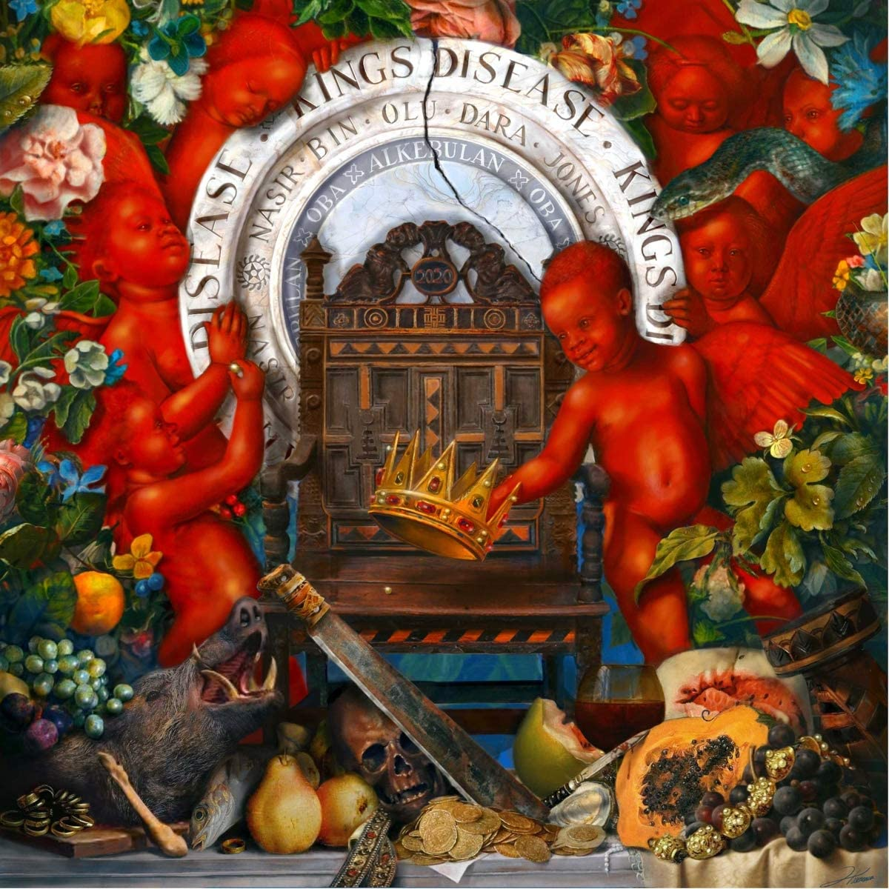

import { Slider, Button, Tag } from "@carbon/react";
import { ArrowUpRight } from "@carbon/icons-react";

import SliderJS1 from "../review/slider1";
import SliderJS2 from "../review/slider2";
import SliderJS3 from "../review/slider3";
import SliderJS4 from "../review/slider4";

import AdvJS2 from "../review/adv2";
import AdvJS3 from "../review/adv3";

import { Link } from "gatsby";

import Review1 from "../review/nas10.mdx";
import Review2 from "../review/nas9.mdx";

Album review

<h1 className="h1--no--margin">{props.pageContext.frontmatter.title}</h1>

  <Link to="/best50/2020/">2020 Black Music Album Best No.49</Link>

 
<Row  className="image-card-group">
	<Column colMd={3} colLg={4} noGutterMdLeft="">
       <ImageCard>

</ImageCard>
	</Column>
	<Column colMd={4} colLg={8} noGutterMdLeft="">
	

	2020年末にリリースされた2年ぶりとなるのNasの12作目。流行り廃りが激しいこの業界において、25年以上常に一線で活躍できてるのは、もう、この人ぐらいか。今回もNasらしい、ある意味安心できる、ストレートな王道Hip-Hopアルバムに仕上がっている。
	 Hit-Boyが全曲Produceしており、サンプリング多めでオーソドックス感を出しつつも、古臭くなく、きちんと2020年代らしいサウンドになっているのは流石。
	 そのHit-Boyがゲスト参加し、BLMにも呼応した④がリード曲となっている。また、Anderson.Paakが参加した⑧などは、本当にカッコよいし、⑩ではなんと、The Firm再結成というおまけ付きである。
	

	

	  <Button className="button-right-mergin"  href="https://amzn.to/2SMIdS3" renderIcon={ArrowUpRight} size='sm' kind='primary'>
      amazon.com
    </Button>
		<Button className="button-right-mergin"  href="https://amzn.to/3o8FsGl" renderIcon={ArrowUpRight} size='sm' kind='secondary'>
      amazon.co.jp
    </Button>
		<Button className="button-right-mergin"  href="https://apple.co/2RP4SMR" renderIcon={ArrowUpRight} size='sm' kind='tertiary'>
      apple music
    </Button>
		<AdvJS2/>
	

	</Column>
</Row>
<Row >
	<Column colMd={4} colLg={4} noGutterMdLeft="">

  <h3>Score card</h3>
	<SliderJS1 value="2" />
  <SliderJS2 value="2" />
	<SliderJS3 value="1" />
  <SliderJS4 value="9" />

</Column>
<Column colMd={8} colLg={8} noGutterMdLeft="">

<h3>Producers</h3>

	Hit-Boy(all)

<h3>Guests</h3>

	Charlie Wilson , Hit-Boy , Big Sean, Don Toliver, Lil Durk, Anderson .Paak , Brucie B, AZ, Foxy Brown, Cormega, The Firm , A$AP Ferg, Fivio Foreign

</Column>
</Row>

<h3>Tracks</h3>

| No. | Title              | Composers                                                  | Performer                                      | Time  |
| --- | ------------------ | ---------------------------------------------------------- | ---------------------------------------------- | ----- |
| 1   | King's Disease     | Nasir Jones                                                | Nas                                            | 01:52 |
| 2   | Blue Benz          | Nasir Jones                                                | Nas                                            | 02:21 |
| 3   | Car No. 85         | Nasir Jones / Charlie Wilson                               | Nas feat: Charlie Wilson                       | 03:29 |
| 4   | Ultra Black        | Hit-Boy                                                    | Nas feat: Hit-Boy                              | 03:19 |
| 5   | 27 Summers         | Nasir Jones                                                | Nas                                            | 01:43 |
| 6   | Replace Me         | Nasir Jones / Big Sean / Don Toliver                       | Nas feat: Big Sean / Don Toliver               | 02:51 |
| 7   | Til the War Is Won | Durk Banks / Nasir Jones                                   | Nas feat: Lil Durk                             | 03:22 |
| 8   | All Bad            | Anderson .Paak / Nasir Jones / Nicholas Race               | Nas feat: Anderson .Paak                       | 03:49 |
| 9   | The Definition     | Nasir Jones / Bruce Robinson                               | Nas feat: Brucie B                             | 02:02 |
| 10  | Full Circle        | AZ / Foxy Brown / Cormega / Nasir Jones                    | Nas feat: AZ / Foxy Brown / Cormega / The Firm | 03:52 |
| 11  | 10 Points          | Nasir Jones                                                | Nas                                            | 03:05 |
| 12  | The Cure           | Nasir Jones                                                | Nas                                            | 03:52 |
| 13  | Spicy              | Darold Ferguson / Nasir Jones / Derek Milano / Maxie Ryles | Nas feat: A$AP Ferg / Fivio Foreign            | 02:47 |

<h3>Other Reviews</h3>

<Row>
  <Column colMd={3} colLg={3} noGutterMdLeft>
    <Review1 />
  </Column>
	<Column colMd={3} colLg={3} noGutterMdLeft>
    <Review2 />
  </Column>
</Row>

<AdvJS3 />