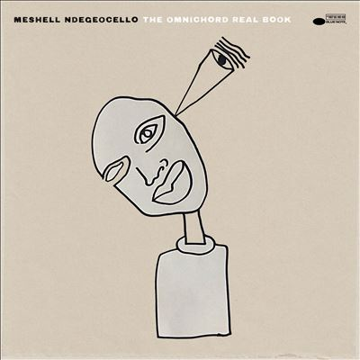

import { Slider, Button } from "@carbon/react";
import { ArrowUpRight } from "@carbon/icons-react";

import SliderJS1 from "../review/slider1";
import SliderJS2 from "../review/slider2";
import SliderJS3 from "../review/slider3";
import SliderJS4 from "../review/slider4";
import AdvJS2 from "../review/adv2";
import AdvJS3 from "../review/adv3";

import { Link } from "gatsby";

import Review1 from "../review/ndegeocello4.mdx";

Album review

<h1 className="h1--no--margin">{props.pageContext.frontmatter.title}</h1>

  <Link to="/best50/2023/">2023 Black Music Best No.18</Link>

 
<Row  className="image-card-group">
	<Column colMd={3} colLg={4} noGutterMdLeft="">
       <ImageCard>

</ImageCard>
	</Column>
	<Column colMd={4} colLg={8} noGutterMdLeft="">
		

			Meshell Ndegeocelloの5年ぶりのアルバムはBluenoteに移籍後、第一弾となる。ジャンルレスな音楽を提供しながら、近年ではJazz寄りが多かったので、良い流れと言えそうだ。当作品でもJazzとR&Bに軸足を置きつつ、アフロ的な要素を散りばめ、一部ではテクノも加わった作風に仕上がっている。
			 インストを全面に押し出した曲もあるが、多くでは男女のVocalもフィーチャーされている。実験的であったり、ダンサブルな曲もあるが、全体感としては知的で落ち着いた印象を受ける。
			 ちなみにタイトルにあるOminichordは1981年に日本の鈴木楽器製作所が作った電子楽器(なんと今年、復刻予定)であり、①②⑤でMeshellが奏でている。
		

		

		  <Button className="button-right-mergin"  href="https://amzn.to/3MFf58f" renderIcon={ArrowUpRight} size='sm' kind='primary'>
  	    amazon.com
  	  </Button>
  	  <Button className="button-right-mergin"  href="https://amzn.to/475V0jD" renderIcon={ArrowUpRight} size='sm' kind='secondary'>
  	    amazon.co.jp
  	  </Button>
			<Button className="button-right-mergin"  href="https://apple.co/40As40N" renderIcon={ArrowUpRight} size='sm' kind='tertiary'>
  	    apple music
  	  </Button>
			<AdvJS2/>
		

	</Column>
</Row>
<Row >
	<Column colMd={4} colLg={4} noGutterMdLeft="">
		

		  <h3>Score card</h3>
			<SliderJS1 value="5" />
		  <SliderJS2 value="1" />
			<SliderJS3 value="1" />
		  <SliderJS4 value="9" />
		

	</Column>
	<Column colMd={8} colLg={8} noGutterMdLeft="">
		

			<h3>Producers</h3>
			

				Josh Johnson(all)
				Jebin Bruni(14)
			

			<h3>Guests</h3>
			

				Josh Johnson, Jade Hicks, Deantoni Parks, Jeff Parker, Sanford Biggers, Cory Henry, Joan As Police Woman, Joel Ross, Jason Moran, Thandiswa, Brandee Younger, Julius Rodriguez, Ambrose Akinmusire, Hanna Benn, The Hawtplates
			

		

	</Column>
</Row>

<h3>Tracks</h3>

| No. | Title              | Composers                                                                                                                   | Performer                                                                           | Time  |
| --- | ------------------ | --------------------------------------------------------------------------------------------------------------------------- | ----------------------------------------------------------------------------------- | ----- |
| 1   | Georgia Ave        | Meshell Ndegeocello                                                                                                         | Meshell Ndegeocello feat. Josh Johnson                                              | 02:40 |
| 2   | An Invitation      | Meshell Ndegeocello                                                                                                         | Meshell Ndegeocello                                                                 | 02:21 |
| 3   | Call the Tune      | Hanna Benn / Marton Bisits / Meshell Ndegeocello                                                                            | Meshell Ndegeocello                                                                 | 01:54 |
| 4   | Good Good          | Chris Bruce / Jade Hicks / Josh Johnson / Meshell Ndegeocello                                                               | Meshell Ndegeocello feat. Jade Hicks, Josh Johnson                                  | 03:30 |
| 5   | Omnipuss           | Chris Bruce / Meshell Ndegeocello                                                                                           | Meshell Ndegeocello                                                                 | 02:52 |
| 6   | Clear Water        | Chris Bruce / Jack DeBoe / Justin Hicks / Meshell Ndegeocello / Deantoni Parks                                              | Meshell Ndegeocello feat. Deantoni Parks, Jeff Parker, Sanford Biggers              | 04:35 |
| 7   | ASR                | Tony Allen / Chris Bruce / Chris Connelly / Amp Fiddler / Justin Hicks / Meshell Ndegeocello                                | Meshell Ndegeocello feat. Jeff Parker,                                              | 07:38 |
| 8   | Gatsby             | Mike Bono / Jack DeBoe / Samora Pinderhughes / Gabe Schnider                                                                | Meshell Ndegeocello feat. Cory Henry, Joan As Police Woman                          | 04:21 |
| 9   | Towers             | Meshell Ndegeocello                                                                                                         | Meshell Ndegeocello feat. Joel Ross                                                 | 03:36 |
| 10  | Perceptions        | Chris Bruce / Jason Moran / Meshell Ndegeocello                                                                             | Meshell Ndegeocello feat. Jason Moran                                               | 02:16 |
| 11  | Tha King           | Thandiswa Mazwai                                                                                                            | Meshell Ndegeocello feat. Thandiswa                                                 | 00:27 |
| 12  | Virgo              | Andrya Ambro / Chris Bruce / Marsha DeBoe / Kenita Miller / Meshell Ndegeocello / Abe Rounds                                | Meshell Ndegeocello feat. Brandee Younger, Julius Rodriguez                         | 08:35 |
| 13  | Burn Progression   | Ambrose Akinmusire / Hanna Benn / Daniel Mintseris / Meshell Ndegeocello / Deantoni Parks                                   | Meshell Ndegeocello, Ambrose Akinmusire, Hanna Benn                                 | 04:01 |
| 14  | Onelevensixteen    | Jebin Bruni                                                                                                                 | Meshell Ndegeocello                                                                 | 02:50 |
| 15  | Vuma               | Chris Bruce / Thandiswa Mazwai / Meshell Ndegeocello                                                                        | Meshell Ndegeocello feat. Joel Ross                                                 | 03:03 |
| 16  | The 5th Dimension  | The Hawtplates / Jade Hicks / Justin Hicks / Josh Johnson / Kenita Miller / Meshell Ndegeocello / Abe Rounds / Jake Sherman | Meshell Ndegeocello feat. The Hawtplates                                            | 05:25 |
| 17  | Hole in the Bucket | The Hawtplates / Jade Hicks / Justin Hicks / Kenita Miller                                                                  | Meshell Ndegeocello                                                                 | 10:20 |
| 18  | Virgo 3            | Chris Bruce / Mark Guiliana / Oliver Lake / Meshell Ndegeocello                                                             | Meshell Ndegeocello feat. Oliver Lake, Mark Guiliana, Brandee Younger, Josh Johnson | 06:54 |

<h3>Other Reviews</h3>

<Row>
  <Column colMd={3} colLg={3} noGutterMdLeft>
    <Review1 />
  </Column>
</Row>

<AdvJS3 />
