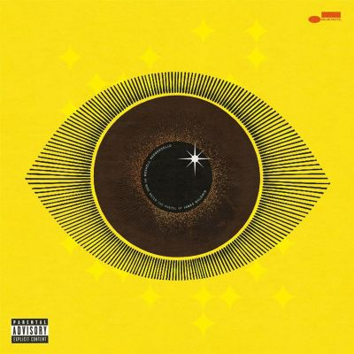

import { Slider, Button } from "@carbon/react";
import { ArrowUpRight } from "@carbon/icons-react";

import SliderJS1 from "../review/slider1";
import SliderJS2 from "../review/slider2";
import SliderJS3 from "../review/slider3";
import SliderJS4 from "../review/slider4";
import AdvJS2 from "../review/adv2";
import AdvJS3 from "../review/adv3";

import { Link } from "gatsby";
import Review1 from "../review/ndegeocello5.mdx";
import Review2 from "../review/ndegeocello4.mdx";

Album Review

<h1 className="h1--no--margin">{props.pageContext.frontmatter.title}</h1>

<Row  className="image-card-group">
	<Column colMd={3} colLg={4} noGutterMdLeft="">
       <ImageCard>

</ImageCard>
	</Column>
	<Column colMd={4} colLg={8} noGutterMdLeft="">
		

			2024年夏にリリースされたMeshell Ndegeocelloの1年ぶりのアルバム。この作品でグラミーも獲得している。
			 著名な黒人作家James Baldwinの生誕100年に合わせたトリビュート作になっている。(タイトルにGospelの文字がはいっているが、ゴスペルミュージックとは直接関係はない。)
       通常の楽曲だけでなく、活動家や作家によるSpoken Wordなど、様々なアプローチでBaldwinの世界観を表現しようという試みがなされている。Trackもアコースティックなバンド編成によるJazz, Neo-SouL, アフロなど多様なものになっている。
			 また、、唄もMeshellだけでなく、男性Vocalも多めで、人種差別や性差別など重めのテーマが取り上げられており、静謐ながらも心に訴えてくるものがある。
		

		

		  <Button className="button-right-mergin"  href="https://amzn.to/4tmpYji" renderIcon={ArrowUpRight} size='sm' kind='primary'>
  	    amazon.com
  	  </Button>
  	  <Button className="button-right-mergin"  href="https://amzn.to/4qfGBtW" renderIcon={ArrowUpRight} size='sm' kind='secondary'>
  	    amazon.co.jp
  	  </Button>
		 	<Button className="button-right-mergin"  href="https://apple.co/4ru8gsf" renderIcon={ArrowUpRight} size='sm' kind='tertiary'>
  	    apple music
  	  </Button>
		<AdvJS2/>
		

	</Column>
</Row>
<Row >
	<Column colMd={4} colLg={4} noGutterMdLeft="">
		

		  <h3>Score card</h3>
			<SliderJS1 value="4" />
		  <SliderJS2 value="2" />
			<SliderJS3 value="2" />
		  <SliderJS4 value="9" />
		

	</Column>
	<Column colMd={4} colLg={8} noGutterMdLeft="">
		

			<h3>Producers</h3>
			

				Meshell Ndegeocello and Chris Bruce
			

			<h3>Guests</h3>
			

				
			

		

	</Column>
</Row>

<h3>Tracks</h3>

| No. | Title                   | Composers                                                                                                                                                        | Performer           | Time |
| --- | ----------------------- | ---------------------------------------------------------------------------------------------------------------------------------------------------------------- | ------------------- | ---- |
| 1   | Travel                  | James Baldwin / Chris Bruce / Jebin Bruni / Staceyann Chin / Justin Hicks / Meshell Ndegeocello / Julius Rodriguez / Abe Rounds / Jake Sherman                   | Meshell Ndegeocello | 4:09 |
| 2   | On the Mountain         | Hilton Als / James Baldwin / Chris Bruce / Jebin Bruni / Justin Hicks / Meshell Ndegeocello / Abe Rounds / Jake Sherman / Paul Thompson                          | Meshell Ndegeocello | 5:59 |
| 3   | Baldwin Manifesto I     | James Baldwin                                                                                                                                                    | Meshell Ndegeocello | 0:43 |
| 4   | Raise the Roof          | Staceyann Chin / Josh Johnson                                                                                                                                    | Meshell Ndegeocello | 5:06 |
| 5   | The Price of the Ticket | Chris Bruce / Meshell Ndegeocello                                                                                                                                | Meshell Ndegeocello | 1:33 |
| 6   | What Did I Do?          | Chris Bruce / Jebin Bruni / Justin Hicks / Meshell Ndegeocello / Abe Rounds                                                                                      | Meshell Ndegeocello | 5:18 |
| 7   | Pride I                 | Chris Bruce / Justin Hicks / Meshell Ndegeocello / Abe Rounds                                                                                                    | Meshell Ndegeocello | 2:54 |
| 8   | Pride II                | Chris Bruce / Jebin Bruni / Justin Hicks / Meshell Ndegeocello / Abe Rounds                                                                                      | Meshell Ndegeocello | 2:38 |
| 9   | Eyes                    | James Baldwin / Justin Hicks                                                                                                                                     | Meshell Ndegeocello | 5:17 |
| 10  | Trouble                 | Chris Bruce / Jack DeBoe / Justin Hicks / Kenita Miller / Meshell Ndegeocello / Alison Riley / Julius Rodriguez / Abe Rounds / Jake Sherman / James Daniel Woods | Meshell Ndegeocello | 7:18 |
| 11  | Thus Sayeth the Lorde   | Chris Bruce / Jack DeBoe / Justin Hicks / Kenita Miller / Meshell Ndegeocello / Alison Riley / Julius Rodriguez / Abe Rounds / Jake Sherman                      | Meshell Ndegeocello | 5:40 |
| 12  | Love                    | James Baldwin / Chris Bruce / Jebin Bruni / Justin Hicks / Meshell Ndegeocello / Abe Rounds                                                                      | Meshell Ndegeocello | 3:42 |
| 13  | Hatred                  | James Baldwin / Chris Bruce / Jebin Bruni / Justin Hicks / Meshell Ndegeocello / Abe Rounds                                                                      | Meshell Ndegeocello | 5:28 |
| 14  | Tsunami Rising          | Staceyann Chin / Josh Johnson                                                                                                                                    | Meshell Ndegeocello | 8:04 |
| 15  | Another Country         | Chris Bruce / Jebin Bruni / Justin Hicks / Meshell Ndegeocello / Abe Rounds / Jake Sherman / Cauleen Smith                                                       | Meshell Ndegeocello | 4:47 |
| 16  | Baldwin Manifesto II    | James Baldwin / Josh Johnson                                                                                                                                     | Meshell Ndegeocello | 2:06 |
| 17  | Down at the Cross       | Chris Bruce / Jebin Bruni / Justin Hicks / Meshell Ndegeocello / Abe Rounds                                                                                      | Meshell Ndegeocello | 5:42 |

<h3>Other Reviews</h3>

<Row>
  <Column colMd={3} colLg={3} noGutterMdLeft>
    <Review1 />
  </Column>
  <Column colMd={3} colLg={3} noGutterMdLeft>
    <Review2 />
  </Column>
</Row>

<AdvJS3 />
