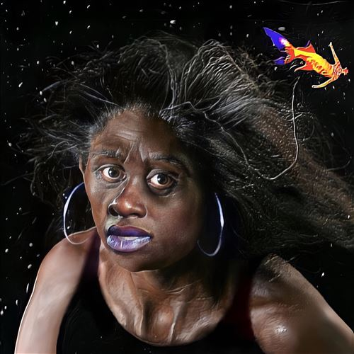

import { Slider, Button } from "@carbon/react";
import { ArrowUpRight } from "@carbon/icons-react";

import SliderJS1 from "./slider1";
import SliderJS2 from "./slider2";
import SliderJS3 from "./slider3";
import SliderJS4 from "./slider4";
import AdvJS2 from "../review/adv2";
import AdvJS3 from "../review/adv3";

import { Link } from "gatsby";

import Review1 from "../review/noname2.mdx";
import Review2 from "../review/noname1.mdx";

Album review

<h1 className="h1--no--margin">{props.pageContext.frontmatter.title}</h1>

  <Link to="/best50/2023/">2023 Black Music Best No.2</Link>

 
<Row  className="image-card-group">
	<Column colMd={3} colLg={4} noGutterMdLeft="">
       <ImageCard>

</ImageCard>
	</Column>
	<Column colMd={4} colLg={8} noGutterMdLeft="">
		

			前作はセルフリリースだったが、今度はレーベルからのリリースとなるNonameの2作目。サウンドは、バンドによるJazz色が一層強く基調となっている。加えて、Latin, Neo Soul, Trap, Funkなども塗されており、Gospelっぽいコーラスも2曲ほど。
			 参加制作陣多数ではあるが、統一感は保たれていて、全体的な印象はスムースでムーディーなものとなっている。これにNonameの穏やかに諭すようなSpoken WordっぽいRapや唄がのっかるところは、今まで通り。ただ、そんなTrackの半面、Lyricは社会性を帯びた物が多いのが特徴的。
			 同郷のSaba, Commonなどのサポートもあり、また、Jay Electronicaによる落ち着いたRapとの相性も良い。
		

		

		  <Button className="button-right-mergin"  href="https://amzn.to/41peEVG" renderIcon={ArrowUpRight} size='sm' kind='primary'>
  	    amazon.com
  	  </Button>
  	  <Button className="button-right-mergin"  href="https://amzn.to/46YBJQc" renderIcon={ArrowUpRight} size='sm' kind='secondary'>
  	    amazon.co.jp
  	  </Button>
			<Button className="button-right-mergin"  href="https://apple.co/3uWqDOy" renderIcon={ArrowUpRight} size='sm' kind='secondary'>
  	    apple music
  	  </Button>
			<AdvJS2/>
		

	</Column>
</Row>
<Row >
	<Column colMd={4} colLg={4} noGutterMdLeft="">
		

	  	<h3>Score card</h3>
			<SliderJS1 value="3" />
	    <SliderJS2 value="2" />
			<SliderJS3 value="1" />
	    <SliderJS4 value="9" />
		

	</Column>
	<Column colMd={8} colLg={8} noGutterMdLeft="">
		

			<h3>Producers</h3>
			

				Daoud(1)
				 Gaetan Judd, Kofo and BMC(2)
				 Saba and Ben Nartey(3)
				 Gaetan Judd(4)
				 Wesley Singerman and Yussef Dayes(5)
				 Slimwav(6)
				 ​emil and R-Kay(7)
				 Saba, Ben Nartey and A.J. Hall(8)
				 Nascent(9)
				 Gaetan Judd and Waine(10)
				 Berg(11)
			

			<h3>Guests</h3>
			

				imetta Rose, The Voices of Creation, ay Electronica, Eryn Allen Kane, $ilkMoney, billy woods, STOUT, Ayoni & Common
			

		

	</Column>
</Row>

<h3>Tracks</h3>

| No. | Title                     | Composers                                    | Performer                                         | Time  |
| --- | ------------------------- | -------------------------------------------- | ------------------------------------------------- | ----- |
| 1   | black mirror              | Noname                                       | Noname                                            | 02:17 |
| 2   | hold me down              | Noname, Jimetta Rose, The Voices of Creation | Noname feat. Jimetta Rose, The Voices of Creation | 02:21 |
| 3   | balloons                  | Noname, Jay Electronica, Eryn Allen Kane     | Noname feat. Jay Electronica, Eryn Allen Kane     | 03:44 |
| 4   | boomboom                  | Noname, Ayoni                                | Noname feat. Ayoni                                | 03:22 |
| 5   | potentially the interlude | Noname                                       | Noname                                            | 02:07 |
| 6   | namesake                  | Noname                                       | Noname                                            | 02:58 |
| 7   | beauty supply             | Noname                                       | Noname                                            | 03:13 |
| 8   | toxic                     | Noname                                       | Noname                                            | 03:14 |
| 9   | afro futurism             | Noname                                       | Noname                                            | 02:00 |
| 10  | gospel?                   | Noname, $ilkMoney, ?billy woods, STOUT       | Noname feat. $ilkMoney, billy woods, STOUT        | 03:36 |
| 11  | oblivion                  | Noname, Ayoni, Common                        | Noname feat. Ayoni & Common                       | 02:58 |

<h3>Other Reviews</h3>

<Row>
  <Column colMd={3} colLg={3} noGutterMdLeft>
    <Review1 />
  </Column>
	<Column colMd={3} colLg={3} noGutterMdLeft>
    <Review2 />
  </Column>
</Row>

<AdvJS3 />
