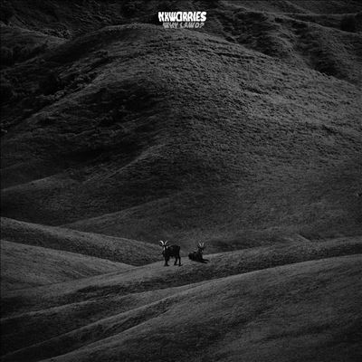

import { Slider, Button } from "@carbon/react";
import { ArrowUpRight } from "@carbon/icons-react";

import SliderJS1 from "../review/slider1";
import SliderJS2 from "../review/slider2";
import SliderJS3 from "../review/slider3";
import SliderJS4 from "../review/slider4";
import AdvJS2 from "../review/adv2";
import AdvJS3 from "../review/adv3";

import { Link } from "gatsby";

import Review1_1 from "../review/nxworries1.mdx";

import Review2_1 from "../review/andersonpaak4.mdx";
import Review2_2 from "../review/andersonpaak3.mdx";
import Review2_3 from "../review/andersonpaak2.mdx";

Album review

<h1 className="h1--no--margin">{props.pageContext.frontmatter.title}</h1>

<Link to="/best50/2024/">2018 Black Music Best No.16</Link>

 
<Row  className="image-card-group">
	<Column colMd={3} colLg={4} noGutterMdLeft="">
       <ImageCard>

</ImageCard>
	</Column>
	<Column colMd={4} colLg={8} noGutterMdLeft="">
		

			NxWorriesの8年ぶりとなる2作目。ソロをメインに活躍している2人だが、久々の再結成となった。
			 Knxwledgeによるサンプリング主体のビート(CreditにはProduceではなくBeatと記載されている)は、前作より聴き易くなり、スイート・ソウル、ネオソウル感一杯。ただ、短い曲を曲間を廃排してどんどんつないでいく構成は前作同様となっている。
			 Anderson .Paakのほうは、私生活における傷心などをいつものひしゃげた声でメランコリックに唄い上げている。
			 また、Snoop, Thundercat, H.E.R., Earl Sweatshirtなど西海岸より豪華ゲストが参加しているが、あまり出しゃばらない程度に抑えられている。
			 なお、ラストのインスト曲⑲では、大野雄二によるルパン三世の劇中曲をサンプリングしている。
		

		

		  <Button className="button-right-mergin"  href="https://amzn.to/3XxH7r3" renderIcon={ArrowUpRight} size='sm' kind='primary'>
  	    amazon.com
  	  </Button>
  	  <Button className="button-right-mergin"  href="https://amzn.to/4dgzprb" renderIcon={ArrowUpRight} size='sm' kind='secondary'>
  	    amazon.co.jp
  	  </Button>
			<Button className="button-right-mergin"  href="https://apple.co/47zZQa4" renderIcon={ArrowUpRight} size='sm' kind='tertiary'>
				apple music
			</Button>
			<AdvJS2/>
		

	</Column>
</Row>
<Row >
	<Column colMd={4} colLg={4} noGutterMdLeft="">
		

		  <h3>Score card</h3>
			<SliderJS1 value="5" />
		  <SliderJS2 value="2" />
			<SliderJS3 value="1" />
		  <SliderJS4 value="9" />
		

	</Column>
	<Column colMd={8} colLg={8} noGutterMdLeft="">
		

			<h3>Producers</h3>
			

				Knxwledge
			

			<h3>Guests</h3>
				Dave Chappelle, Andra Day, BJ THe Chicago Kid, Ann One, Thundercat, Ab-So, H.E.R., Snoop Dogg, October London, Rae Kahlil, Charlie Wilson, Earl Sweatshirt
			

			

		

	</Column>
</Row>

<h3>Tracks</h3>

| No. | Title        | Composers                                                                                                       | Performer                                   | Time  |
| --- | ------------ | --------------------------------------------------------------------------------------------------------------- | ------------------------------------------- | ----- |
| 1   | ThankU       | Glen Boothe, Dave Chappelle, Jesse Murrah, Jr., Don Milnor                                                      | NxWorries feat. Dave Chappelle              | 00:50 |
| 2   | 86Sentra     | Brandon Anderson, Glen Boothe                                                                                   | NxWorries                                   | 01:36 |
| 3   | MoveOn       | Brandon Anderson, Glen Boothe, Ann Hoon Chung, Andra Day, BJ the Chicago Kid, Nicholas Race                     | NxWorries                                   | 02:47 |
| 4   | KeepHer      | Brandon Anderson, Glen Boothe, Ann Hoon Chung, Thundercat                                                       | NxWorries feat. Thundercat                  | 04:14 |
| 5   | Distractions | Brandon Anderson, Glen Boothe                                                                                   | NxWorries                                   | 01:49 |
| 6   | Lookin'      | Brandon Anderson, Glen Boothe, Herbert Anthony Stevens IV                                                       | NxWorries                                   | 00:54 |
| 7   | WhereIGo     | Brandon Anderson, Glen Boothe, Maxx Moor, Gabriella Wilson                                                      | NxWorries feat. H.E.R.                      | 03:18 |
| 8   | Daydreaming  | Brandon Anderson, Glen Boothe, Stanley Clarke, George Duke, Jairus Mozee, Nicholas Race                         | NxWorries                                   | 03:01 |
| 9   | FromHere     | Brandon Anderson, Glen Boothe, Calvin Broadus, Jared Samuel Erskine                                             | NxWorries feat. Snoop Dogg, October London  | 04:01 |
| 10  | FallThru     | Brandon Anderson, Joe Bataan, Glen Boothe                                                                       | NxWorries                                   | 02:21 |
| 11  | Battlefield  | Brandon Anderson, Glen Boothe, Haley Reinhart, Willie Stewart                                                   | NxWorries                                   | 03:38 |
| 12  | HereIAm      | Brandon Anderson, Glen Boothe, Gregory Cook, Kathryn Thomas                                                     | NxWorries                                   | 01:34 |
| 13  | OutTheWay    | Brandon Anderson, Glen Boothe, Ann Hoon Chung, David Conley, Bernard Jackson, Kenya Rae Johnson, David Townsend | NxWorries feat. Rae Kahlil                  | 03:26 |
| 14  | SheUsed      | Gene Allan, Brandon Anderson, Glen Boothe, Gary Knight                                                          | NxWorries                                   | 02:36 |
| 15  | MoreOfIt     | Brandon Anderson, Glen Boothe                                                                                   | NxWorries                                   | 01:12 |
| 16  | NVR.Remix    | Brandon Anderson, Glen Boothe, Charlie Wilson                                                                   | NxWorries feat. Charlie Wilson              | 01:18 |
| 17  | DistantSpace | Brandon Anderson, Glen Boothe, Alana Chenevert, John Smythe                                                     | NxWorries                                   | 01:23 |
| 18  | WalkOnBy     | Brandon Anderson, Glen Boothe, Kenya Rae Johnson, Thebe Kgositsile, Aida Osman                                  | NxWorries feat. Rae Kahlil, Earl Sweatshirt | 03:47 |
| 19  | EvnMore      | Glen Boothe, Yuji Ohno                                                                                          | NxWorries                                   | 00:26 |

<h3>Other Reviews</h3>

<Row>
  <Column colMd={3} colLg={3} noGutterMdLeft>
    <Review1_1 />
  </Column>
</Row>

<Row>
  <Column colMd={3} colLg={3} noGutterMdLeft>
    <Review2_1 />
  </Column>
  <Column colMd={3} colLg={3} noGutterMdLeft>
    <Review2_2 />
  </Column>
	<Column colMd={3} colLg={3} noGutterMdLeft>
    <Review2_3 />
  </Column>
</Row>

<AdvJS3 />
