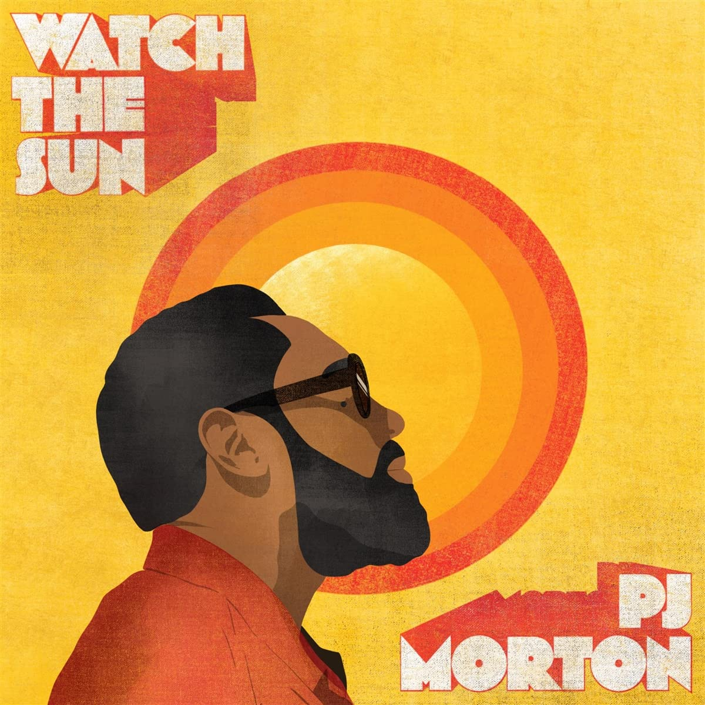

import { Slider, Button } from "@carbon/react";
import { ArrowUpRight } from "@carbon/icons-react";

import SliderJS1 from "../review/slider1";
import SliderJS2 from "../review/slider2";
import SliderJS3 from "../review/slider3";
import SliderJS4 from "../review/slider4";
import AdvJS2 from "../review/adv2";
import AdvJS3 from "../review/adv3";

import { Link } from "gatsby";

import Review1 from "../review/pjmorton1.mdx";

Album review

<h1 className="h1--no--margin">{props.pageContext.frontmatter.title}</h1>

  <Link to="/best50/2022/">2022 Black Music Album Best No.20</Link>

 
<Row  className="image-card-group">
	<Column colMd={3} colLg={4} noGutterMdLeft="">
       <ImageCard>

</ImageCard>
	</Column>
	<Column colMd={4} colLg={8} noGutterMdLeft="">
	  

	    PJ Mortonの2年ぶりのアルバム。前作はGospelシンガーたちとのGospel作であったが、今回は通常運転となる。ゆったりとし穏やかなオールドソウル作品となっており、ブラスを効果的に用いたりして、出自のNew Orleans色が強くなっている。
       サウンドやPJの唄など、70年代ソウルとJohn Legendを合わせたようなPJならではのサウンドが展開されている。ちょっとレゲエっぽい表題曲④など、本当に心地良い。NasやWaleといったRapperや御大Stevieまでゲスト陣も幅広いが、うまく自身の世界に取り込んでいると思う。
    

  

	  <Button className="button-right-mergin"  href="https://amzn.to/2XKOjCC" renderIcon={ArrowUpRight} size='sm' kind='primary'>
      amazon.com
    </Button>
    <Button className="button-right-mergin"  href="https://amzn.to/3dIDaYx" renderIcon={ArrowUpRight} size='sm' kind='secondary'>
      amazon.co.jp
    </Button>
	

	  
    <AdvJS2/>
    </Column>
</Row>
<Row >
  <Column colMd={4} colLg={4} noGutterMdLeft="">
    

      <h3>Score card</h3>
	    <SliderJS1 value="4" />
      <SliderJS2 value="4" />
	    <SliderJS3 value="1" />
      <SliderJS4 value="9" />
    

  </Column>
  <Column colMd={8} colLg={8} noGutterMdLeft="">
    

      <h3>Producers</h3>
      

        PJ Morton(all)
      

      <h3>Guests</h3>
      

        Chronixx, Mr. Talkbox, Stevie Wonder, Nas, Jill Scott, Alex Isley, El Debarge, Zacardi Cortex, Gene Moore, Samoht, Tim Rogers, Darrel "Musiqcity" Walls
      

    

  </Column>
</Row>

<h3>Tracks</h3>

| No. | Title                                  | Composers                                                                                            | Performer                                                                                | Time  |
| --- | -------------------------------------- | ---------------------------------------------------------------------------------------------------- | ---------------------------------------------------------------------------------------- | ----- |
| 1   | Love's Disease (Just Can't Get Enough) | PJ Morton                                                                                            | PJ Morton                                                                                | 02:57 |
| 2   | Biggest Mistake                        | PJ Morton                                                                                            | PJ Morton                                                                                | 03:05 |
| 3   | Please Don't Walk Away                 | PJ Morton                                                                                            | PJ Morton                                                                                | 03:51 |
| 4   | Watch the Sun                          | Jamar McNaughton / PJ Morton                                                                         | PJ Morton feat. Chronixx                                                                 | 02:54 |
| 5   | My Peace                               | Andr? Benjamin / Patrick Brown / Byron Manard Chambers / Joanna Levesque / PJ Morton / Antwan Patton | PJ Morton feat: JoJo. Mr. Talkbox                                                        | 03:47 |
| 6   | Be Like Water                          | Nasir Jones / PJ Morton                                                                              | PJ Morton feat. Stevie Wonder, Nas                                                       | 03:17 |
| 7   | So Lonely                              | PJ Morton / Wale                                                                                     | PJ Morton feat. Wale                                                                     | 03:34 |
| 8   | Still Believe                          | PJ Morton / Jill Scott                                                                               | PJ Morton feat. Jill Scott, Alex Isley                                                   | 03:40 |
| 9   | A Lil Too Heavy                        | PJ Morton                                                                                            | PJ Morton                                                                                | 02:50 |
| 10  | On My Way                              | PJ Morton                                                                                            | PJ Morton feat. El Debarge                                                               | 02:21 |
| 11  | The Better Benediction                 | PJ Morton                                                                                            | PJ Morton feat. Zacardi Cortex, Gene Moore, Samoht, Tim Rogers, Darrel "Musiqcity" Walls | 05:23 |

<h3>Other Reviews</h3>

<Row>
  <Column colMd={3} colLg={3} noGutterMdLeft>
    <Review1 />
  </Column>
</Row>

<AdvJS3 />
