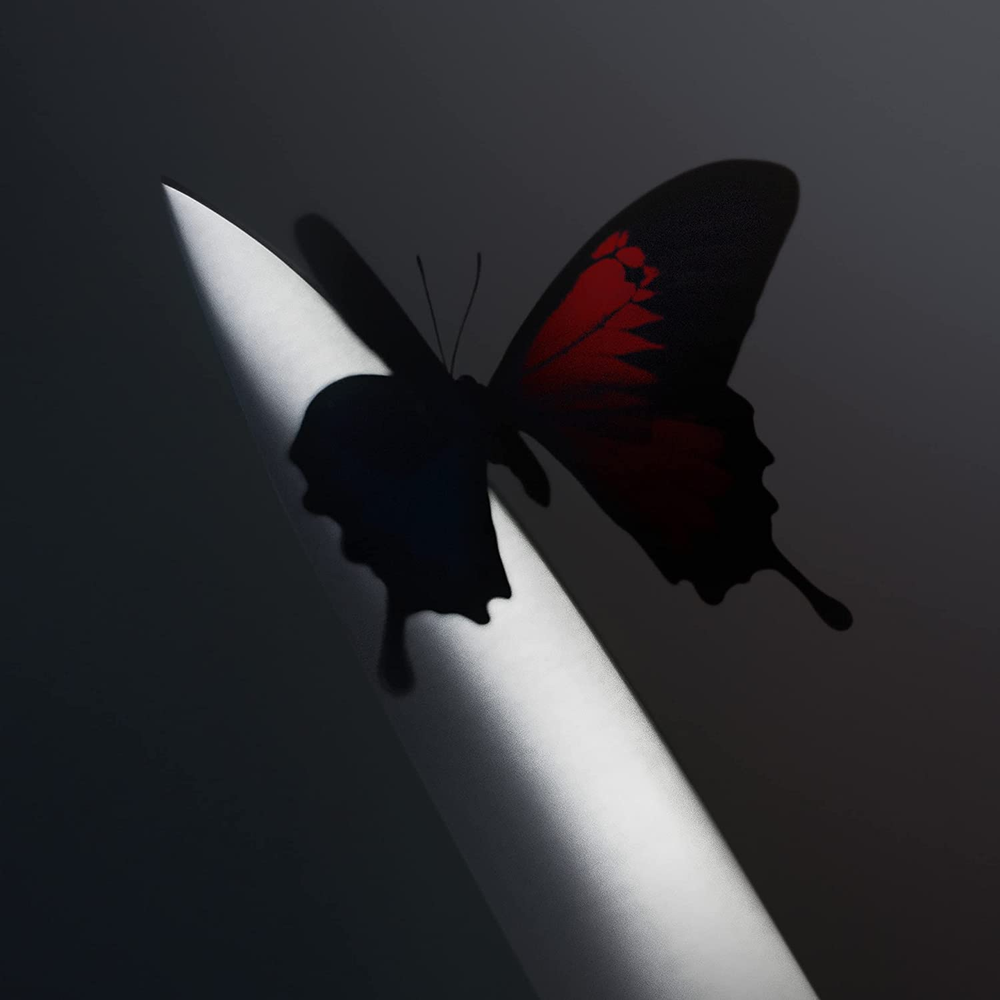

import { Slider, Button } from "@carbon/react";
import { ArrowUpRight } from "@carbon/icons-react";

import SliderJS1 from "../review/slider1";
import SliderJS2 from "../review/slider2";
import SliderJS3 from "../review/slider3";
import SliderJS4 from "../review/slider4";
import AdvJS2 from "../review/adv2";
import AdvJS3 from "../review/adv3";

import Review1 from "../review/postmalone2.mdx";
import Review2 from "../review/postmalone1.mdx";

import { Link } from "gatsby";

Album review

<h1 className="h1--no--margin">{props.pageContext.frontmatter.title}</h1>

 
<Row  className="image-card-group">
	<Column colMd={3} colLg={4} noGutterMdLeft="">
       <ImageCard>

</ImageCard>
	</Column>
	<Column colMd={4} colLg={8} noGutterMdLeft="">
	  

	    Post Maloneの3年振り4作目。ちなみに、風貌から想像つかないが、まだ27歳とのこと。前作同様、チャートアクションも好調で、その前作より、さらに聴き易くなっている。
       Hip-Hop界からのGuestも唄の披露にとどまり、Rapはほぼ無くなった。引き続きLouis Bellを中心とした制作陣によるTrackは、メロディアスでPopなものが全編を占めている。ミディアムが基調となり、Doja Catとの④などメローな曲も多いが、曲自体のクオリティが高く、そのあたり、Song Writingの才能を感じさせる。
       また、茫洋としたところも薄まって、一層、判りやすく、一般受けは良さそうだ。
    

    

	    <Button className="button-right-mergin"  href="https://amzn.to/3XBsPEb" renderIcon={ArrowUpRight} size='sm' kind='primary'>
        amazon.com
      </Button>
      <Button className="button-right-mergin"  href="https://amzn.to/3GWfmQO" renderIcon={ArrowUpRight} size='sm' kind='secondary'>
        amazon.co.jp
      </Button>
      <Button className="button-right-mergin"  href="https://apple.co/3kqb0tu" renderIcon={ArrowUpRight} size='sm' kind='tertiary'>
        apple music
      </Button>
	  

	  <AdvJS2/>
    </Column>
</Row>
<Row >
  <Column colMd={4} colLg={4} noGutterMdLeft="">
    

      <h3>Score card</h3>
	    <SliderJS1 value="5" />
      <SliderJS2 value="2" />
	    <SliderJS3 value="1" />
      <SliderJS4 value="8" />
    

  </Column>
  <Column colMd={8} colLg={8} noGutterMdLeft="">
    

      <h3>Producers</h3>
      

        Louis Bell(1,9)
         Louis Bell and Post Malone(2,7,8,10,11,12,14)
         Charlie Handsome, Louis Bell and Post Malone(3)
         Post Malone, Louis Bell, Andrew Watt and Omer Fedi(4)
         Louis Bell and Jasper Harris'(5)
         Louis Bell and Taurus Currie Jr.(6)
         Louis Bell, Brian Lee and Andrew Bolooki(13)
      

      <h3>Guests</h3>
      

        Roddy Ricch, Doja Cat, Gunna, leet Foxes, he Kid LAROI, The Weeknd
      

    

  </Column>
</Row>

<h3>Tracks</h3>

| No. | Title                         | Composers                                                                       | Performer                       | Time  |
| --- | ----------------------------- | ------------------------------------------------------------------------------- | ------------------------------- | ----- |
| 1   | Reputation                    | Austin Post, Louis Bell                                                         | Post Malone                     | 04:08 |
| 2   | Cooped Up                     | Louis Bell, Austin Post, Rodrick Moore Jr.Louis Bell, William Walsh             | Post Malone feat: Roddy Ricch   | 03:05 |
| 3   | Lemon Tree                    | Ryan Vojtesak, Louis Bell, Austin Post, Brian Lee                               | Post Malone                     | 04:03 |
| 4   | Wrapped Around Your Finger    | Austin Post, Louis Bell, Andrew Watt, Omer Fedi                                 | Post Malone                     | 03:13 |
| 5   | I Like You (A Happier Song)   | Louis Bell, Jasper Harris, Austin Post, Amala Dlamini                           | Post Malone feat: Doja Cat      | 03:12 |
| 6   | I Cannot Be (A Sadder Song)   | Louis Bell, Taurus Currie Jr.                                                   | Post Malone feat: Gunna         | 02:49 |
| 7   | Insane                        | Louis Bell, Austin Austin Post, William Walsh                                   | Post Malone                     | 02:49 |
| 8   | Love/Hate Letter to Alcohol   | Louis Bell, Austin Austin Post, Robin Pecknold                                  | Post Malone feat: Fleet Foxes   | 03:03 |
| 9   | Wasting Angels                | Austin Post, Charlton Howard, Louis Bell, William Walsh                         | Post Malone feat: The Kid LAROI | 04:03 |
| 10  | Euthanasia                    | Louis Bell, Austin Post                                                         | Post Malone                     | 02:25 |
| 11  | When I’m Alone                | Austin Post, Louis Bell, William Walsh                                          | Post Malone                     | 03:15 |
| 12  | Waiting for a Miracle         | Louis Bell, Austin Post                                                         | Post Malone                     | 02:21 |
| 13  | One Right Now                 | Austin Post, Abel Tesfaye, Louis Bell, Brian Lee, Andrew Bolooki, William Walsh | Post Malone feat: The Weeknd    | 03:12 |
| 14  | New Recording 12, Jan 3, 2020 | Louis Bell, Austin Post                                                         | Post Malone                     | 01:32 |

<h3>Other Reviews</h3>

<Row>
  <Column colMd={3} colLg={3} noGutterMdLeft>
    <Review1 />
  </Column>
  <Column colMd={3} colLg={3} noGutterMdLeft>
    <Review2 />
  </Column>
</Row>

<AdvJS3 />
