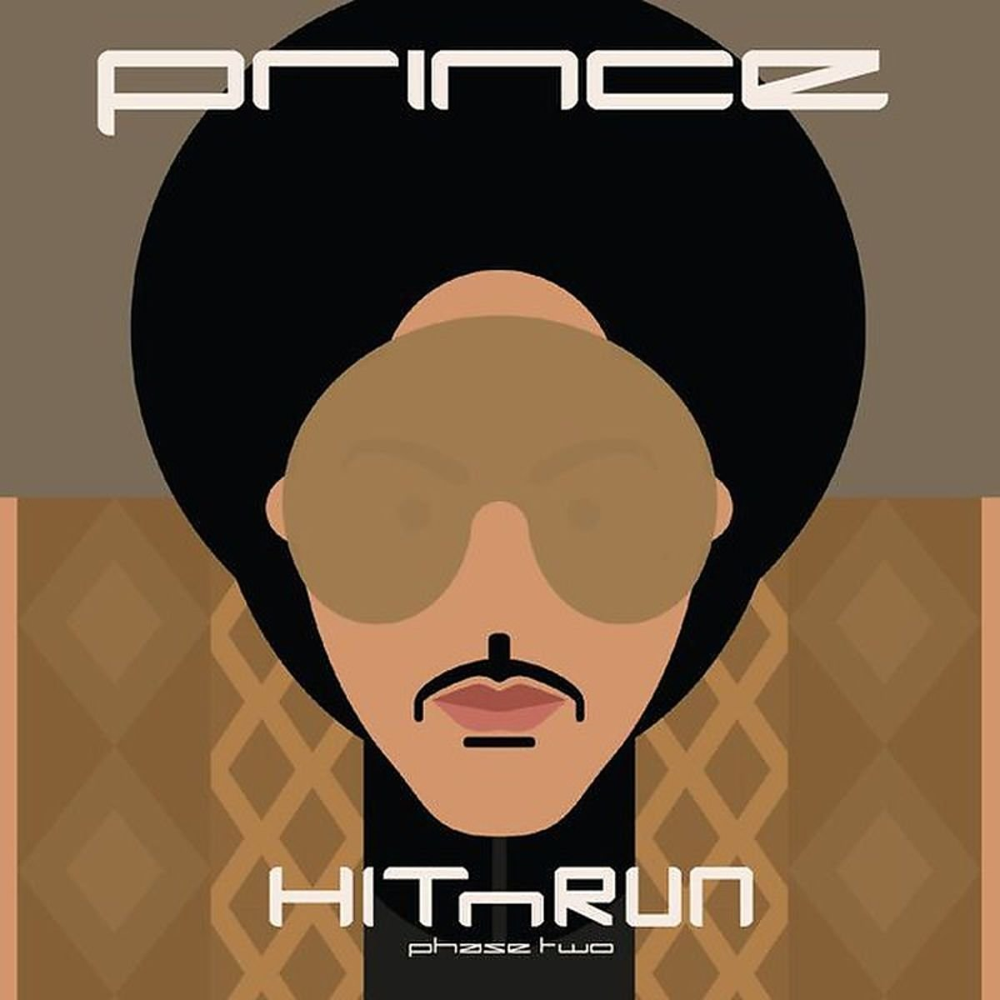

import { Slider, Button } from 'carbon-components-react';
import { ArrowUpRight24  } from '@carbon/icons-react';

import SliderJS1 from "../review/slider1"
import SliderJS2 from "../review/slider2"
import SliderJS3 from "../review/slider3"
import SliderJS4 from "../review/slider4"

import { Link } from "gatsby"

CD review

<h1 className="h1--no--margin">{props.pageContext.frontmatter.title}</h1>

 
<Row  className="image-card-group">
	<Column colMd={"4"} colLg={"4"} noGutterMdLeft="">
       <ImageCard>

 
</ImageCard>
	</Column>
	<Column colMd={"8"} colLg={"8"} noGutterMdLeft="">
	  

	    2016年4月に帰らぬ人となってしまったPrinceの当時時点での遺作となる作品。前作よりほぼ半年という短いインターバルでHitnRunシリーズの続編としてリリースされた。その前作はEDMよりの曲があったりして、多少の寄せ集め感があったが、今作は通常運転。NPGをバックに、軽快でFunkなPopに、ファルセットによるメローなスロー曲と、これぞPrinceというアルバムになっている。既発表曲を5曲含んでいるものの、いつも以上のまとまりの良さも特徴的だ。全体のトーンが非常に穏やかで、今後の方向性が示唆されていたような気もする。また、どの曲もメロディーが際立っていて、天才ぶりを再確認できるアルバムでもある。③のタイトルが今から思うと暗示的だ。
    

    

	    <Button href="https://amzn.to/38nD7l9" kind="primary" size="small" renderIcon={ArrowUpRight24}>
        amazon.com
      </Button>
      <Button href="https://amzn.to/386XOS9" kind="secondary" size="small" renderIcon={ArrowUpRight24}>
        amazon.co.jp
      </Button>
      <Button href="https://apple.co/3mM6u4c" kind="tertiary" size="small" renderIcon={ArrowUpRight24}>
        amazon.co.jp
      </Button>
	  

	</Column>
</Row>
<Row >
  <Column colMd={"4"} colLg={"4"} noGutterMdLeft="">
    

      <h3>Score card</h3>
	    <SliderJS1 value="5" />
      <SliderJS2 value="2" />
	    <SliderJS3 value="1" />
      <SliderJS4 value="0" />
    

  </Column>
  <Column colMd={"8"} colLg={"8"} noGutterMdLeft="">
    

      <h3>Producers</h3>
      

        Pince and The New Power Generation(all)
      

      <h3>Guests</h3>
      

      

    

  </Column>
</Row>

<h3>Tracks</h3>

| No. |	 Title                    |	 Composers                       	| Performer	|	 Time	|
| --- |	------------------------- | --------------------------------- | --------- | ----- |
|	1	  |	Baltimore                	| Prince & the New Power Generation	|	Prince   	|	04:33 |
|	2	  |	Rock and Roll Love Affair	| Prince & the New Power Generation	|	Prince   	|	04:01 |
|	3	  |	2 Y. 2 D.                	| Prince & the New Power Generation	|	Prince   	|	03:49 |
|	4	  |	Look at Me, Look at U    	| Prince & the New Power Generation	|	Prince   	|	03:27 |
|	5	  |	Stare                    	| Prince & the New Power Generation	|	Prince   	|	03:45 |
|	6	  |	Xtraloveable             	| Prince & the New Power Generation	|	Prince   	|	05:00 |
|	7	  |	Groovy Potential         	| Prince & the New Power Generation	|	Prince   	|	06:16 |
|	8	  |	When She Comes           	| Prince & the New Power Generation	|	Prince   	|	03:45 |
|	9	  |	Screwdriver              	| Prince & the New Power Generation	|	Prince   	|	04:14 |
|	10	|	Black Muse               	| Prince & the New Power Generation	|	Prince   	|	07:21 |
|	11	|	Revelation               	| Prince & the New Power Generation	|	Prince   	|	05:21 |
|	12	|	Big City                 	| Prince & the New Power Generation	|	Prince   	|	06:25 |
