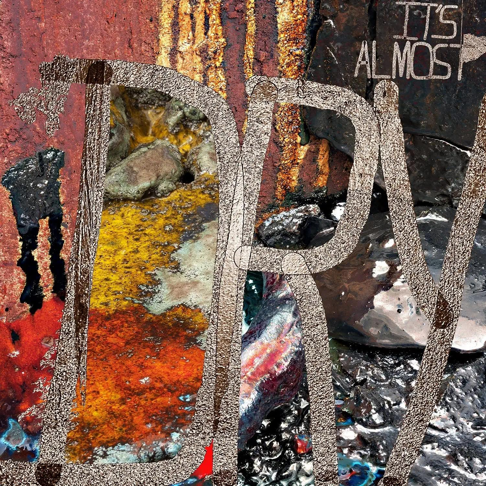

import { Slider, Button } from "@carbon/react";
import { ArrowUpRight } from "@carbon/icons-react";

import SliderJS1 from "../review/slider1";
import SliderJS2 from "../review/slider2";
import SliderJS3 from "../review/slider3";
import SliderJS4 from "../review/slider4";
import AdvJS2 from "../review/adv2";
import AdvJS3 from "../review/adv3";

import { Link } from "gatsby";

import Review1 from "../review/pushat3.mdx";

Album review

<h1 className="h1--no--margin">{props.pageContext.frontmatter.title}</h1>

<Row  className="image-card-group">
	<Column colMd={3} colLg={4} noGutterMdLeft="">
       <ImageCard>

</ImageCard>
	</Column>
	<Column colMd={4} colLg={8} noGutterMdLeft="">
		

			4年ぶりとなるPusha-Tの4thアルバム。既にチャート1位を獲得している。兄とのDuo、Clipse(ラスト曲で再結成)をフックアップしたNeptuneのPharrellと、Solo活動後をバックアップするKanye Westがほぼ半分づつProduceしており、⑦では二人ともCreditされている。
			 Trackは全体的にはストレートな感じで、Pharrellプロデュース曲は、Popさは抑え気味であり、いつもよりハード寄り。Kanyeのプロデュース曲で特に③⑤⑦あたりは、初期のKanyeらしさが戻ってきたようで好感が持てる。
			 Pusha TのRapは引き続き力強い。リリースが少ないのでもう少し若いのかと思っていたが、改めてBIOを見返してみると既に40歳代半ばであり、なるほどの迫力と自信が感じられる。
		

		

		  <Button className="button-right-mergin"  href="https://amzn.to/3DvGjZS" renderIcon={ArrowUpRight} size='sm' kind='primary'>
  	    amazon.com
  	  </Button>
  	  <Button className="button-right-mergin"  href="https://amzn.to/3h67Zga" renderIcon={ArrowUpRight} size='sm' kind='secondary'>
  	    amazon.co.jp
  	  </Button>
			<Button className="button-right-mergin"  href="https://apple.co/3td5R9r" renderIcon={ArrowUpRight} size='sm' kind='tertiary'>
  	   	apple music
  	  </Button>
			<AdvJS2/>
		

	</Column>
</Row>
<Row >
	<Column colMd={4} colLg={4} noGutterMdLeft="">
		

		  <h3>Score card</h3>
			<SliderJS1 value="1" />
		  <SliderJS2 value="1" />
			<SliderJS3 value="2" />
		  <SliderJS4 value="9" />
		

	</Column>
	<Column colMd={8} colLg={8} noGutterMdLeft="">
		

			<h3>Producers</h3>
			

				Pharrell(1,2,4,8,9,11)
				 Kanye West(3)
				 Kanye West, BoogzDaBeast and FNZ(5)
				 88-Keys and Kanye West(6)
				 Kanye West and Pharrell(7)
				 Kanye West and BoogzDaBeast(10)
				 Kanye West and Labrinth(12)
			

			<h3>Guests</h3>
			

				Kanye West, Jay-Z, Pharrell Williams, Kid Cudi , Don Toliver, Lil Uzi Vert, Nigo, Clipse, Labrinth, Malice
			

		

	</Column>
</Row>

<h3>Tracks</h3>

| No. | Title                            | Composers                                                                                                                                                                                       | Performer                                | Time  |
| --- | -------------------------------- | ----------------------------------------------------------------------------------------------------------------------------------------------------------------------------------------------- | ---------------------------------------- | ----- |
| 1   | Brambleton                       | Terrence Thornton / Pharrell Williams                                                                                                                                                           | Pusha T                                  | 02:51 |
| 2   | Let the Smokers Shine the Coupes | Raul Cubina / Terrence Thornton / Mark Williams / Pharrell Williams                                                                                                                             | Pusha T                                  | 02:30 |
| 3   | Dreamin of the Past              | John Lennon / Terrence Thornton / Kanye West                                                                                                                                                    | Pusha T feat: Kanye West                 | 02:54 |
| 4   | Neck & Wrist                     | Shawn Carter / Terrence Thornton / Pharrell Williams                                                                                                                                            | Pusha T feat: Jay-Z / Pharrell Williams  | 03:29 |
| 5   | Just So You Remember             | Isaac de Boni / Brian Farrell / Jahmal Gwin / Michael Mule / Terrence Thornton / Kanye West                                                                                                     | Pusha T                                  | 02:59 |
| 6   | Diet Coke                        | [erry Butler / Joseph Cartagena / Charles Njapa / Terrence Thornton / Kanye West / Marvin Yancy                                                                                                 | Pusha T                                  | 03:00 |
| 7   | Rock N Roll                      | Raul Cubina / Beyonc? Knowles / Scott Mescudi / Terius Nash / Christopher "Tricky" Stewart / Terrence Thornton / Kanye West / Mark Williams / Pharrell Williams                                 | Pusha T feat: Kid Cudi / Kanye West      | 03:54 |
| 8   | Call My Bluff                    | Terrence Thornton / Pharrell Williams                                                                                                                                                           | Pusha T                                  | 02:48 |
| 9   | Scrape It Off                    | Terrence Thornton / Caleb Toliver / Pharrell Williams / Symere Woods                                                                                                                            | Pusha T feat: Don Toliver / Lil Uzi Vert | 02:33 |
| 10  | Hear Me Clearly                  | Lawrence Berment / Shawn Carter / Rennard East / Leigh Elliott / Jahmal Gwin / Johnny Mollings / Lenny Mollings / William Roberts / Luca Starz / John Stephens / Terrence Thornton / Kanye West | Pusha T feat: Nigo                       | 02:21 |
| 11  | Open Air                         | Terrence Thornton / Pharrell Williams                                                                                                                                                           | Pusha T                                  | 02:13 |
| 12  | I Pray for You                   | Timothy McKenzie / Gene Thornton / Terrence Thornton / Kanye West                                                                                                                               | Pusha T feat: Clipse / Labrinth / Malice | 04:22 |

<AdvJS3 />

<h3>Other Reviews</h3>

<Row>
  <Column colMd={3} colLg={3} noGutterMdLeft>
    <Review1 />
  </Column>
</Row>
