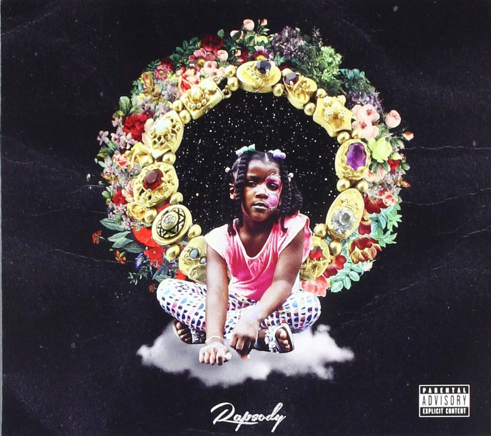

import { Slider, Button } from "carbon-components-react";
import { ArrowUpRight24 } from "@carbon/icons-react";

import SliderJS1 from "../review/slider1";
import SliderJS2 from "../review/slider2";
import SliderJS3 from "../review/slider3";
import SliderJS4 from "../review/slider4";

import { Link } from "gatsby";

Album review

<h1 className="h1--no--margin">{props.pageContext.frontmatter.title}</h1>

  <Link to="/best50/2017/">2017 Black Music Best No.17</Link>

<Row  className="image-card-group">
	<Column colMd={"3"} colLg={"4"} noGutterMdLeft="">
       <ImageCard>

</ImageCard>
	</Column>
	<Column colMd={"4"} colLg={"8"} noGutterMdLeft="">
	

	North Carolina出身で29歳の女性MC, Rapsodyの2作目。キャリアは10年近くになるが、2017のGrammyにもノミネートされ、一気に注目が高まっている。
	 9th Wonderのレーベル所属ということもあり、9th Wonderおよびその一派のProducerが制作を担当している。
	 Terrace MartinやJames Poyserも部分参加した演奏中心のオーガニックでゆったりとしたTrackはソウル色が強く、かなりの心地よさで、落ち着きと力強さを重ね持つRapsodyのRapとの相性も良い。
	 さらには、Roc Nationとの提携もあってか、豪華なGuest陣が花を添えている。最近にR&B, Hip-Hopの方向性ともシンクロした作品だと思う。ちなみにLailaはRapsodyの祖母とのことです。
	

	

	    <Button className="button-right-mergin"  href="https://amzn.to/2WDBDMz" kind="primary" size="small" renderIcon={ArrowUpRight24}>
        amazon.com
      </Button>
      <Button className="button-right-mergin"  href="https://amzn.to/2WKjm0q" kind="secondary" size="small" renderIcon={ArrowUpRight24}>
        amazon.co.jp
      </Button>
	

	
	</Column>
</Row>
<Row >
	<Column colMd={"4"} colLg={"4"} noGutterMdLeft="">
	

    <h3>Score card</h3>
		<SliderJS1 value="4" />
    <SliderJS2 value="2" />
		<SliderJS3 value="1" />
    <SliderJS4 value="9" />
	

	</Column>
	<Column colMd={"8"} colLg={"8"} noGutterMdLeft="">
		

			<h3>Producers</h3>
			

				Nottz(1)
				 9th Wonder(2,8,9,10,11,12,14)
				 Khrysis and Ka$h Don't Make Beats(3,4)
				 9th Wonder and Eric G(5)
				 Eric G(6)
				 Khrysis and 9th Wonder(7)
				 Khrysis(13)
			

			<h3>Guests</h3>
			

				Kendrick Lamar, Lance Skiiiwalker, GQ, Anderson.Paak, Black Thought, Moonchild, BJ the Chicago Kid, Busta Rhymes, Musiq Soulchild, Gwen Bunn, Terrace Martin, Amber Navran, James Poyser
			

		

	</Column>
</Row>

<h3>Tracks</h3>

| No. | Title                           | Composers                                                                                                                                                                                                         | Performer                                               | Time  |
| --- | ------------------------------- | ----------------------------------------------------------------------------------------------------------------------------------------------------------------------------------------------------------------- | ------------------------------------------------------- | ----- |
| 1   | Laila's Wisdom                  | Marlanna Evans / Weldon Irvine / Dominick Lamb / Neil Simone                                                                                                                                                      | Rapsody                                                 | 03:15 |
| 2   | Power                           | George Clinton / Bootsy Collins / William Collins / Gary Cooper / Patrick Douthit / Kendrick Duckworth / Marlanna Evans / Lance Howard / Chuck Jackson                                                            | Rapsody feat. Kendrick Lamar & Lance Skiiiwalker        | 05:35 |
| 3   | Chrome (Like Ooh)               | Patrick Douthit / Marlanna Evans                                                                                                                                                                                  | Rapsody                                                 | 03:28 |
| 4   | Pay Up                          | Marlanna Evans / Kashif "Kash" Norville / Cicely Louise Tyson                                                                                                                                                     | Rapsody                                                 | 03:16 |
| 5   | Ridin'                          | Patrick Douthit / Marlanna Evans / Eric Gabouer / John Hammink / Andre Solomko / Quay Thomas                                                                                                                      | Rapsody feat. GQ                                        | 04:52 |
| 6   | Sassy                           | Marlanna Evans / Eric Gabouer                                                                                                                                                                                     | Rapsody                                                 | 03:13 |
| 7   | Nobody                          | Max Bryk / Patrick Douthit / Rauli Eskolin / Marlanna Evans / Alex Franck / George Porter, Jr. / Andris Mattson / Ziggy Modeliste / Amber Navran / Naomi Neville / Leo Nocentelli / Anderson Paak / Tariq Trotter | Rapsody feat. Anderson .Paak, Black Thought & Moonchild | 07:27 |
| 8   | Black & Ugly                    | Charlie Bereal / Patrick Douthit / Marlanna Evans / Charlene Keys / Bryan Sledge                                                                                                                                  | Rapsody feat. BJ the Chicago Kid                        | 04:09 |
| 9   | You Should Know                 | Robert Barnett / Merna Bishouty / Patrick Brown / Thomas Callaway / Patrick Douthit / Marlanna Evans / Eric Gabouer / Cameron Gipp / Willie Knighton / Ray Murray / Rico Wade                                     | Rapsody feat. Busta Rhymes                              | 06:17 |
| 10  | A Rollercoaster Jam Called Love | Gwen Bunn / Patrick Douthit / Marlanna Evans / Michelle Hailey / Taalib Johnson / Raphael Saadiq / Carl Wheeler / D'Wayne Wiggins                                                                                 | Rapsody feat. Musiq Soulchild & Gwen Bunn               | 05:19 |
| 11  | U Used 2 Love Me                | Patrick Douthit / Marlanna Evans / Terrace Martin                                                                                                                                                                 | Rapsody feat. Terrace Martin                            | 02:42 |
| 12  | Knock on My Door                | Piero Ciampi / Patrick Douthit / Marlanna Evans / Gianni Marchetti / Giuseppe Pavone / Bryan Sledge                                                                                                               | Rapsody feat. BJ the Chicago Kid                        | 04:42 |
| 13  | OooWee                          | Marlanna Evans / Anderson Paak / Cicely Louise Tyson                                                                                                                                                              | Rapsody feat. Anderson .Paak                            | 04:01 |
| 14  | Jesus Coming                    | Patrick Douthit / Marlanna Evans / Otis Johnson / Amber Navran                                                                                                                                                    | Rapsody feat. Amber Navran                              | 06:20 |
