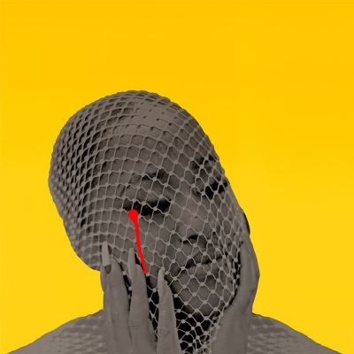

import { Slider, Button } from "@carbon/react";
import { ArrowUpRight } from "@carbon/icons-react";

import SliderJS1 from "../review/slider1";
import SliderJS2 from "../review/slider2";
import SliderJS3 from "../review/slider3";
import SliderJS4 from "../review/slider4";
import AdvJS2 from "../review/adv2";
import AdvJS3 from "../review/adv3";

import { Link } from "gatsby";
import Review1 from "../review/rapsody2.mdx";
import Review2 from "../review/rapsody1.mdx";

Album review

<h1 className="h1--no--margin">{props.pageContext.frontmatter.title}</h1>

  <Link to="/best50/2024/">2024 Black Music Best No.27</Link>

<Row  className="image-card-group">
	<Column colMd={3} colLg={4} noGutterMdLeft="">
       <ImageCard>

</ImageCard>
	</Column>
	<Column colMd={4} colLg={8} noGutterMdLeft="">
		

			2024年夏にリリースされたRapsodyの5年振り4作目。⑨でついにグラミーを受賞している。
			 5年という不在感を埋めるように22曲の大作になっているが、各曲が短めで、押しの強い曲は少ないので、ゆったりと聴けると思う。
			 BLK ODYSSY, S1, Eric G, Major Sevenなど中堅の制作陣が、ストレートなHip-Hopを中心に, Reggae, スローなR&Bなど様々な曲調のTrackを提供している。
			 アルバムを通して、Rapsody自身の内面に問いかけた自己探求と回顧を経て、自信を取り戻すといたストーリーが根底に流れていて、その始まりとして②は本人の1st nameを曲名にしており、後半にかけて癒しを感じさせる曲も並んでいる。
			 ベテランの域に達している人であるが、フローのスキルだけでなく、リリシストとしての一面が強く押し出されたアルバムになっている。
		

		

		  <Button className="button-right-mergin"  href="https://amzn.to/3RpvHTG" renderIcon={ArrowUpRight} size='sm' kind='primary'>
  	    amazon.com
  	  </Button>
  	  <Button className="button-right-mergin"  href="https://amzn.to/4jc4CiU" renderIcon={ArrowUpRight} size='sm' kind='secondary'>
  	    amazon.co.jp
  	  </Button>
			<Button className="button-right-mergin"  href="https://apple.co/3YH77BB" renderIcon={ArrowUpRight} size='sm' kind='tertiary'>
				apple music
			</Button>
			<AdvJS2/>
		

	</Column>
</Row>
<Row >
	<Column colMd={4} colLg={4} noGutterMdLeft="">
		

    	<h3>Score card</h3>
			<SliderJS1 value="4" />
    	<SliderJS2 value="2" />
			<SliderJS3 value="1" />
    	<SliderJS4 value="9" />
		

	</Column>
	<Column colMd={8} colLg={8} noGutterMdLeft="">
	

		<h3>Producers</h3>
		

			BLK ODYSSY and Rapsody(1)
			 BLK ODYSSY and Sndtrk(2)
			 HIt-Boy and Corbett(3)
			 BLK ODYSSY(4,5,8,13,18,19)
			 S1, and Epikh Pro(6)
			 Eric G(7,14,22)
			 Lonestarrmuzik, S1 and Jemarcus Bridges(9)
			 S1 and Sir Tim(10)
			 S1 and WU10(11,17)
			 Major Seven(12,15,21)
			 Sndtrak and Markeith Reid(16)
			 Mralanna Evansand Andre Mego(20)
		

		<h3>Guests</h3>
		

			Phylicia Rashad, Hit-Boy, Bee-B, DIXON, Erykah Badu, Alex Isley, Bibi Bourelly, Keznamdi, Nicole Bus, Lil Wayne, Niko Brim, BabyTate, Amber Navran
		

	

</Column>
</Row>

<h3>Tracks</h3>

| No. | Title                      | Composers                                                                                                                                                                                       | Performer                                   | Time  |
| --- | -------------------------- | ----------------------------------------------------------------------------------------------------------------------------------------------------------------------------------------------- | ------------------------------------------- | ----- |
| 1   | She’s Expecting You        | Mralanna Evans, Juwan Elcock, Chester Burnett                                                                                                                                                   | Rapsody feat. Phylicia Rashad               | 01:08 |
| 2   | Marlanna                   | Mralanna Evans, Juwan Elcock, Anthony Bloussard                                                                                                                                                 | Rapsody                                     | 02:33 |
| 3   | Asteroids                  | Mralanna Evans, Chauncey Hollis Jr. Dustin Corbett                                                                                                                                              | Rapsody & Hit-Boy                           | 02:35 |
| 4   | Look What You’ve Done      | Mralanna Evans, Juwan Elcock, Lara Maigue, Alejandro Rios                                                                                                                                       | Rapsody                                     | 04:20 |
| 5   | DND (It’s Not Personal)    | Dallas Austin, Mralanna Evans, Brittany Chikyra Barber, Justin Martin, Quincy Jones, George Clinton, Juwan Elcock, Derrick Simmons, James Todd Smith, Jerry Davis, Philippe Wynne, Willie Baker | Rapsody feat. Bee-B                         | 02:35 |
| 6   | Black Popstar              | Mralanna Evans, Darius Dixson, Larry Griffin Jr., Stuart Lowery                                                                                                                                 | Rapsodyfeat. DIXON                          | 02:39 |
| 7   | Stand Tall                 | Mralanna Evans, Curtis Colbert, Harriet Hurst, Eric Gabouer                                                                                                                                     | Rapsody                                     | 02:09 |
| 8   | That One Time              | Mralanna Evans, Juwan Elcock                                                                                                                                                                    | Rapsody                                     | 03:13 |
| 9   | 3:AM                       | Mralanna Evans, Erykah Badu, Larry Griffin Jr., Marc Bridges                                                                                                                                    | Rapsody feat. Erykah Badu                   | 03:33 |
| 10  | Loose Rocks                | Mralanna Evans, Alex Isley, Larry Griffin Jr., Tim German                                                                                                                                       | Rapsody feat. Alex Isley                    | 04:01 |
| 11  | Diary Of A Mad Bitch       | Mralanna Evans, Bibi Bourelly, Larry Griffin Jr., Kelvin Wooten                                                                                                                                 | Rapsody feat. Bibi Bourelly                 | 03:23 |
| 12  | Never Enough               | Mralanna Evans, Keznamdi McDonald, Omar Walker                                                                                                                                                  | Rapsody feat. Keznamdi, Nicole Bus          | 03:50 |
| 13  | He Shot Me                 | Mralanna Evans, Juwan Elcock, Bob Marley                                                                                                                                                        | Rapsody                                     | 03:09 |
| 14  | God’s Light                | Mralanna Evans, Eric Gabouer, Jamar McNaughton, Kelsey Gonz?lez, Matthew Merisola, Vicky Farewell Nguyen, Danniel McKinnon, David Pimentel                                                      | Rapsody                                     | 02:39 |
| 15  | Back In My Bag             | Ebo Taylor, Mralanna Evans, Omar Walker                                                                                                                                                         | Rapsody                                     | 03:01 |
| 16  | Niko’s Interlude           | Niko Brim                                                                                                                                                                                       | Rapsody feat. Niko Brim                     | 01:04 |
| 17  | Raw                        | Mralanna Evans, Dwayne Carter, Kelvin Wooten, Larry Griffin Jr., Niko Brim, Robert F Diggs, Russel Jones                                                                                        | Rapsody feat. Lil Wayne, Niko Brim          | 02:44 |
| 18  | Lonely Women               | Mralanna Evans, Juwan Elcock, Alejandro Rios                                                                                                                                                    | Rapsody                                     | 01:42 |
| 19  | A Ballad For Homegirls     | Mralanna Evans, Juwan Elcock, Tate Sequoya Farris, Steve Octave, Lara                                                                                                                           | Rapsody feat. BabyTate                      | 04:22 |
| 20  | Please Don’t Dry Interlude | Mralanna Evans, Andre Mego, Omar Walker                                                                                                                                                         | Rapsody feat. Phylicia Rashad               | 02:01 |
| 21  | Faith                      | Mralanna Evans, Ayotunde Elizabeth Awosika, Omar Walker                                                                                                                                         | Rapsody                                     | 03:35 |
| 22  | Forget Me Not              | Mralanna Evans, Amber Navran, Eric Gabouer, Ciarán McDonald                                                                                                                                     | Rapsody feat. Phylicia Rashad, Amber Navran | 04:34 |

<h3>Other Reviews</h3>

<Row>
  <Column colMd={3} colLg={3} noGutterMdLeft>
    <Review1 />
  </Column>
	<Column colMd={3} colLg={3} noGutterMdLeft>
    <Review2 />
  </Column>
</Row>

<AdvJS3 />
