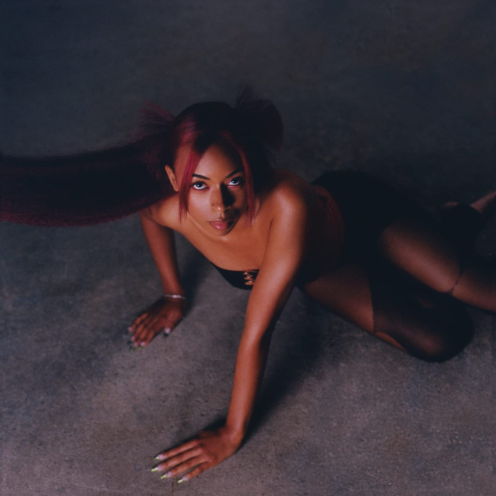

import { Slider, Button } from "@carbon/react";
import { ArrowUpRight } from "@carbon/icons-react";

import SliderJS1 from "../review/slider1";
import SliderJS2 from "../review/slider2";
import SliderJS3 from "../review/slider3";
import SliderJS4 from "../review/slider4";
import AdvJS2 from "../review/adv2";
import AdvJS3 from "../review/adv3";

import { Link } from "gatsby";

Album Review

<h1 className="h1--no--margin">{props.pageContext.frontmatter.title}</h1>

  <Link to="/best50/2022/">2022 Black Music Best No.14</Link>

<Row  className="image-card-group">
	<Column colMd={3} colLg={4} noGutterMdLeft="">
       <ImageCard>

</ImageCard>
	</Column>
	<Column colMd={4} colLg={8} noGutterMdLeft="">
		

			Chicago出身のSinger, Ravy Lanaeのデビューアルバム。10代より、音楽活動を開始し、23歳でフルアルバムリリースに至っており、全曲でSong Writingも行っている。
			 Trackは特に前半、Electroな感じで、後半に向けて、今どきのR&Bになり、若干のネオソウルっぽさも感じられる。制作陣としてはSteve Lacyが6曲に参加し、⑩などは本人の最新作Gemeni Rightsに収まっててもおかしくないくらい、それと判るサウンドになっている。
			 曲調はスローが多く、ミディアムが少々。また、後半はメロウでメロディアスな曲が続く。なんといってもRavynのインティメイトなウイスパリングボイスがスローにはベストマッチになっている。
		

  	

		  <Button className="button-right-mergin"  href="https://amzn.to/40AM82W" renderIcon={ArrowUpRight} size='sm' kind='primary'>
  	    amazon.com
  	  </Button>
  	  <Button className="button-right-mergin"  href="https://amzn.to/3X5Z4un" renderIcon={ArrowUpRight} size='sm' kind='secondary'>
  	    amazon.co.jp
  	  </Button>
			<Button className="button-right-mergin"  href="https://apple.co/3jt4zWx" renderIcon={ArrowUpRight} size='sm' kind='tertiary'>
  	    apple music
  	  </Button>
			<AdvJS2/>
		

		</Column>
</Row>
<Row >
	<Column colMd={4} colLg={4} noGutterMdLeft="">
		

		  <h3>Score card</h3>
			<SliderJS1 value="5" />
		  <SliderJS2 value="1" />
			<SliderJS3 value="1" />
		  <SliderJS4 value="9" />
		

</Column>
<Column colMd={8} colLg={8} noGutterMdLeft="">
	

		<h3>Producers</h3>
		

			Luke Titus and Steve Lacy(1,10,13)
			 Monte Booker(2,8,11)
			 Luke Titus, Phoelix and Teo Halm(3)
			 IAMNOBODI and Sango(4)
			 Steve Lacy(5,12)
			 Luke Titus and Teo Halm(6)
			 Phoelix and Steve Lacy(7)
			 Monte Booker and Phoelix(9)
			 Kaytranada(14)
			 Fousheé and Luke Titus(15)
			 Luke Titus(16)
		

		<h3>Guests</h3>
		

			Steve Lacy, Mereba, Smino, Fousheé
		

	

</Column>
</Row>

<h3>Tracks</h3>

| No. | Title             | Composers                                                     | Performer                    | Time  |
| --- | ----------------- | ------------------------------------------------------------- | ---------------------------- | ----- |
| 1   | Cameo             | Ravyn Lenae                                                   | Ravyn Lenae                  | 01:26 |
| 2   | Venom             | Ravyn Lenae                                                   | Ravyn Lenae                  | 03:31 |
| 3   | Inside Out        | Ravyn Lenae                                                   | Ravyn Lenae                  | 04:13 |
| 4   | M.I.A.            | IAMNOBODI, India Perkins, Jean Deaux, Kai Wright, Ravyn Lenae | Ravyn Lenae                  | 03:30 |
| 5   | Skin Tight        | Luke Titus, Ravyn Lenae, Steve Lacy                           | Ravyn Lenae feat. Steve Lacy | 03:49 |
| 6   | Where I'm From    | Ravyn Lenae, Marian Mereba                                    | Ravyn Lenae feat. Mereba     | 03:47 |
| 7   | Deep in the World | Ravyn Lenae                                                   | Ravyn Lenae                  | 03:14 |
| 8   | Higher            | Ravyn Lenae                                                   | Ravyn Lenae                  | 01:37 |
| 9   | 3D                | Ravyn Lenae, Christopher Smith Jr                             | Ravyn Lenae feat. Smino      | 03:11 |
| 10  | Satellites        | Ravyn Lenae                                                   | Ravyn Lenae                  | 04:27 |
| 11  | Lullabye          | Ravyn Lenae                                                   | Ravyn Lenae                  | 04:01 |
| 12  | Light Me Up       | Luke Titus, Phoelix, Ravyn Lenae, Steve Lacy                  | Ravyn Lenae                  | 03:51 |
| 13  | Like You Do       | Ravyn Lenae                                                   | Ravyn Lenae                  | 01:55 |
| 14  | Xtasy             | Ravyn Lenae, Louis Kevin Celestin                             | Ravyn Lenae                  | 03:00 |
| 15  | Mercury           | Ravyn Lenae, Britanny Foushee                                 | Ravyn Lenae feat. Fousheé    | 04:25 |
| 16  | Wish              | Ravyn Lenae                                                   | Ravyn Lenae                  | 04:03 |

<AdvJS3 />