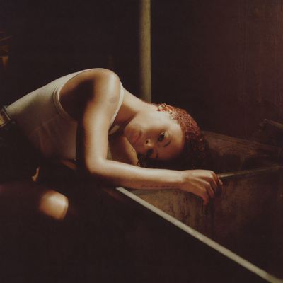

import { Slider, Button } from "@carbon/react";
import { ArrowUpRight } from "@carbon/icons-react";

import SliderJS1 from "../review/slider1";
import SliderJS2 from "../review/slider2";
import SliderJS3 from "../review/slider3";
import SliderJS4 from "../review/slider4";
import AdvJS2 from "../review/adv2";
import AdvJS3 from "../review/adv3";

import { Link } from "gatsby";
import Review1 from "../review/ravynlenae1.mdx";

Album Review

<h1 className="h1--no--margin">{props.pageContext.frontmatter.title}</h1>

  <Link to="/best50/2024/">2024 Black Music Best No.29</Link>

<Row  className="image-card-group">
	<Column colMd={3} colLg={4} noGutterMdLeft="">
       <ImageCard>

</ImageCard>
	</Column>
	<Column colMd={4} colLg={8} noGutterMdLeft="">
		

			Ravyn Lanaeの2年ぶり、2作目。DJ Dahiが全面的にProduceに参加した楽曲は前作に比べ、よりオーソドックスなR&Bに近づいた。
			 ラヴァーズロックな⑤など、耳に心地よいスローな曲が多め。アップ、ミディアムを含めて、全体的に懐かしい感じのメロディアスでハッピーな印象の曲が多く、ゆったりとした気分で聴くことができる。
			 Ravynのコケティッシュなウイスパリングボイスも加わり、統一感、完成度、ともに高いレベルに達しており、ゲストのChildish Gambino, Ty Dolla $ignも曲に溶け込むような歌唱を提供している。
		

  	

		  <Button className="button-right-mergin"  href="https://amzn.to/43ODe5i" renderIcon={ArrowUpRight} size='sm' kind='primary'>
  	    amazon.com
  	  </Button>
  	  <Button className="button-right-mergin"  href="https://amzn.to/4kbwHr0" renderIcon={ArrowUpRight} size='sm' kind='secondary'>
  	    amazon.co.jp
  	  </Button>
			<Button className="button-right-mergin"  href="https://apple.co/3SkD0wr" renderIcon={ArrowUpRight} size='sm' kind='tertiary'>
  	    apple music
  	  </Button>
			<AdvJS2/>
		

		</Column>
</Row>
<Row >
	<Column colMd={4} colLg={4} noGutterMdLeft="">
		

		  <h3>Score card</h3>
			<SliderJS1 value="5" />
		  <SliderJS2 value="1" />
			<SliderJS3 value="1" />
		  <SliderJS4 value="9" />
		

</Column>
<Column colMd={8} colLg={8} noGutterMdLeft="">
	

		<h3>Producers</h3>
		

			Dahi and Spencer Stewart(1,11)
			 Dahi and J. LBS(2)
			 Dahi and FNZ(3)
			 Dahi, Ely Rise and Spencer Stewart(4)
			 Dahi and Ely Rise (5)
			 Dahi, Spencer Stewart and Solomonophonic(6)
			 Dahi, Ely Rise, Spencer Stewar and Jimmy Jam and Terry Lewis(7)
			 Dah, J. LBS and Lascal(8)
			 Dahi, Steve Lacyand Spencer Stewart(9)
			 Dahi and Danny McKinnon(10)
		

		<h3>Guests</h3>
		

			Ty Dolla $ign, Childish Gambino
		

	

</Column>
</Row>

<h3>Tracks</h3>

| No. | Title         | Composers                                                                                                                                                                                | Performer                          | Time  |
| --- | ------------- | ---------------------------------------------------------------------------------------------------------------------------------------------------------------------------------------- | ---------------------------------- | ----- |
| 1   | Genius        | Sarah Aarons / Ravyn Lenae / Dacoury Natche / Spencer Stewart                                                                                                                            | Ravyn Lenae                        | 02:35 |
| 2   | Bad Idea      | Sarah Aarons / Jaron Alston / Johnta Austin / Ricardo Bell / Jermaine Dupri / Ravyn Lenae / Dacoury Natche / Jason Pounds / Ralph Tresvant                                               | Ravyn Lenae                        | 02:14 |
| 3   | One Wish      | Sarah Aarons / Fortunato Arduini / Luiz Antonio Bizarro / Isaac de Boni / Childish Gambino / Ravyn Lenae / Michael Mule / Dacoury Natche / Ely Weisfeld / Margaux Whitney                | Ravyn Lenae feat. Childish Gambino | 03:15 |
| 4   | Dream Girl    | Sarah Aarons / Tyrone Griffin / Jimmy Jam / Ravyn Lenae / Dacoury Natche / Spencer Stewart / Ely Weisfeld                                                                                | Ravyn Lenae feat, Ty Dolla $ign    | 03:39 |
| 5   | Candy         | Sarah Aarons / Ravyn Lenae / Dacoury Natche / Ely Weisfeld                                                                                                                               | Ravyn Lenae                        | 03:06 |
| 6   | Love Is Blind | Sarah Aarons / Ravyn Lenae / Dacoury Natche / Jared Solomon / Spencer Stewart                                                                                                            | Ravyn Lenae                        | 03:51 |
| 7   | Love Me Not   | Anderson .Paak / Sarah Aarons / Dominic Angelella / Craig Balmoris / Christian Farlow / Jaelen Irizarry / Ravyn Lenae / Dacoury Natche / Julian Nixon / Brent Reynolds / Spencer Stewart | Ravyn Lenae                        | 03:33 |
| 8   | From Scratch  | Sarah Aarons / Yonatan Ayal / Tobias Breuer / Ravyn Lenae / Dacoury Natche / Hayley Penner / Jason Pounds / Spencer Stewart                                                              | Ravyn Lenae                        | 03:25 |
| 9   | 1 of 1        | Sarah Aarons / Steve Lacy / Ravyn Lenae / Dacoury Natche / Spencer Stewart                                                                                                               | Ravyn Lenae                        | 02:45 |
| 10  | Pilot         | Sarah Aarons / Ravyn Lenae / Daniel McKinnon / Dacoury Natche / Hayley Penner / Spencer Stewart / Ely Weisfeld                                                                           | Ravyn Lenae                        | 03:13 |
| 11  | Days          | Sarah Aarons / Tobias Breuer / Ravyn Lenae / Dacoury Natche / Hayley Penner / Spencer Stewart / Ely Weisfeld                                                                             | Ravyn Lenae                        | 04:03 |

<h3>Other Reviews</h3>

<Row>
  <Column colMd={3} colLg={3} noGutterMdLeft>
    <Review1 />
  </Column>
</Row>

<AdvJS3 />
