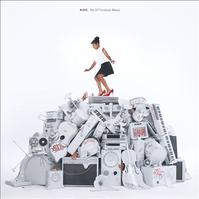

import { Slider, Button } from "@carbon/react";
import { ArrowUpRight } from "@carbon/icons-react";

import SliderJS1 from "../review/slider1";
import SliderJS2 from "../review/slider2";
import SliderJS3 from "../review/slider3";
import SliderJS4 from "../review/slider4";
import AdvJS2 from "../review/adv2";
import AdvJS3 from "../review/adv3";

import { Link } from "gatsby";

Album review

<h1 className="h1--no--margin">{props.pageContext.frontmatter.title}</h1>

  <Link to="/best50/2023/">2023 Black Music Best No.37</Link>

<Row  className="image-card-group">
	<Column colMd={3} colLg={4} noGutterMdLeft="">
       <ImageCard>

</ImageCard>
	</Column>
	<Column colMd={4} colLg={8} noGutterMdLeft="">
		

			南ロンドン出身でUK, Swiss, Gahnaをルーツに持つのSinger, Song Writer, Rayeがインディへ移籍後、⑤のTik-Tokでのバイラルヒットを経て、2023年春にリリースした2nd Album。
			 2024のBrit Awardを総なめし、時の人になっている。タイトルにあるように、実質的1曲目の②では、Bluesっぽさを打ち出しているが、その後はダンスを基調に、エレクトロ, Pop, R&B, ハウスに実質的エンド曲での⑮ではGospelまで披露と、曲調は幅広く、これ自体で十分に楽しめる。
			 これだけでなく、メジャーレーベルに属し、8年近くを過ごした音楽業界への不満や怒り、性的虐待、性的暴行、身体醜形障害、依存症、男尊女卑、さらには気候変動まで盛り込んだLyricも相俟って、大いなる注目を集めている。
			 メジャーを離れ、伝えたいことを伝え切った解放感や逆境を経験した人の強さが感じられるアルバムである。
		

		

		  <Button className="button-right-mergin"  href="https://amzn.to/4bJvG5i" renderIcon={ArrowUpRight} size='sm' kind='primary'>
  	    amazon.com
  	  </Button>
  	  <Button className="button-right-mergin"  href="https://amzn.to/3X14AlR" renderIcon={ArrowUpRight} size='sm' kind='secondary'>
  	    amazon.co.jp
  	  </Button>
			<Button className="button-right-mergin"  href="https://apple.co/3X3DUkk" renderIcon={ArrowUpRight} size='sm' kind='tertiary'>
  	   	apple music
  	  </Button>
			 
			<a href="https://click.linksynergy.com/link?id=MzkEpFBSn/U&offerid=314039.288013409287&type=2&murl=https%3A%2F%2Fwww.hmv.co.jp%2Fproduct%2Fdetail%2F13409287%2F%3Futm_source%3Daaa500000s0%26utm_medium%3Daffiliate">Raye/My 21st Century BluesをHMVで購入</a>
			<AdvJS2/>
		

	</Column>
</Row>
<Row >
	<Column colMd={4} colLg={4} noGutterMdLeft="">
		

		  <h3>Score card</h3>
			<SliderJS1 value="5" />
		  <SliderJS2 value="2" />
			<SliderJS3 value="1" />
		  <SliderJS4 value="9" />
		

	</Column>
	<Column colMd={8} colLg={8} noGutterMdLeft="">
		

			<h3>Producers</h3>
			

				Mika Samath(1,2,3,5,6,7,8,10,11,12,13
				 Punctual(Will Lansley and Johan Morgan((4)
				 Mika Samath and Stephen McGregor(9)
				 Mika Samath and Raye(14,15)
			

			<h3>Guests</h3>
			

				070 Shake, Mahalia
			

		

	</Column>
</Row>

<h3>Tracks</h3>

| No. | Title                 | Composers                                                  | Performer            | Time  |
| --- | --------------------- | ---------------------------------------------------------- | -------------------- | ----- |
| 1   | Introduction          | Austin Lichtenstein, Pete Miller                           | RAYE                 | 00:57 |
| 2   | Oscar Winning Tears   | RAYE, Mike Sabath                                          | RAYE                 | 03:03 |
| 3   | Hard Out Here         | Brandon Colbein, RAYE, Mike Sabath, Justin Tranter         | RAYE                 | 03:10 |
| 4   | Black Mascara         | William Martyn Morris Lansley, Johan Morgan, RAYE          | RAYE                 | 03:59 |
| 5   | Escapism              | RAYE, Mike Sabath, 070 Shake                               | RAYE feat. 070 Shake | 04:32 |
| 6   | Mary Jane             | RAYE, Mike Sabath                                          | RAYE                 | 03:52 |
| 7   | The Thrill Is Gone.   | Anton Goransson, RAYE, Mike Sabath, Isabella Sj?strand     | RAYE                 | 03:19 |
| 8   | Ice Cream Man         | RAYE, Mike Sabath, Michael Tucker                          | RAYE                 | 04:08 |
| 9   | Flip a Switch         | Stephen McGregor, RAYE                                     | RAYE                 | 03:21 |
| 10  | Body Dysmorphia       | RAYE, Mike Sabath                                          | RAYE                 | 02:33 |
| 11  | Environmental Anxiety | Jenna Felsenthal, RAYE, Mike Sabath                        | RAYE                 | 03:14 |
| 12  | Five Star Hotels      | Eddie Benjamin, Kennedi Lykken, Mahalia, RAYE, Mike Sabath | RAYE feat. Mahalia   | 03:24 |
| 13  | Worth It              | John Hill, Akil King, RAYE, Mike Sabath                    | RAYE                 | 04:06 |
| 14  | Buss It Down          | Eyelar Mirzazadeh, RAYE, Mike Sabath, Antoinette Smith     | RAYE                 | 02:37 |
| 15  | Fin                   | RAYE                                                       | RAYE                 | 00:30 |

<AdvJS3 />
