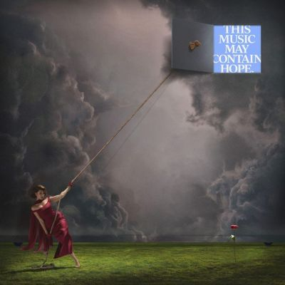

---
title: "Raye / THIS MUSIC MAY CONTAIN HOPE."
description: "Album Review of Raye / THIS MUSIC MAY CONTAIN HOPE."
keywords: "Raye, THIS MUSIC MAY CONTAIN HOPE."
---

import { Slider, Button } from "@carbon/react";
import { ArrowUpRight } from "@carbon/icons-react";

import SliderJS1 from "../review/slider1";
import SliderJS2 from "../review/slider2";
import SliderJS3 from "../review/slider3";
import SliderJS4 from "../review/slider4";
import AdvJS2 from "../review/adv2";
import AdvJS3 from "../review/adv3";

import { Link } from "gatsby";
import Review1 from "../review/raye1.mdx";

Album Review

<h1 className="h1--no--margin">{props.pageContext.frontmatter.title}</h1>

<Row  className="image-card-group">
	<Column colMd={3} colLg={4} noGutterMdLeft="">
       <ImageCard>

</ImageCard>
	</Column>
	<Column colMd={4} colLg={8} noGutterMdLeft="">
		

			前作『My 21st Century Blues』で大ブレイクを果たしたRayeの3年ぶりとなる2ndアルバム。引き続き自身のレーベルからのリリースとなり、制約の無い環境で作られた、壮大で時流にとらわれない作品となっている。
       全17曲、約73分に及ぶ、タイパ重視のストリーミング時代に真っ向から逆行するような「マキシマリズム」を体現した大作で、「音楽は薬」という信念のもと、失恋や自己不信のどん底から回復へと向かう心の旅路を「秋・冬・春・夏」の四季になぞらえて構成したコンセプトアルバムになっている。
			孤独や失望の秋から、ハッピーで開放感のある夏までをドラマティックな展開で、描き出している。
       サウンドはオーケストラ、ビッグバンド、ゴスペルを多用した厚みのあるもので、R&amp;B, ポップ, ジャズ, ビッグバンド, ヴィンテージ・ソウル, ディスコ, ディープハウスまで、多彩なジャンルをシームレスに横断している。
			特筆すべきは生演奏の豊かな響きで、往年のハリウッド古典映画やミュージカルを思わせる、壮麗でシネマティックなサウンドスケープを展開している。
       制作は前作に続きMike Sabathが中心となり、映画音楽の巨匠Hans Zimmerをプロデューサーに迎えた楽曲では、彼の劇的なオーケストラ・アレンジが圧倒的なスケール感を生み出している。
			 ゲストではAl Greenが温かくメンターのように寄り添うデュエットを披露し、実の祖父Grandad Michaelや妹のAmma、Absolutelyらもゲスト参加し、家族の絆を作品に吹き込んでいます。
       RayeのVocalは、様々な曲調に応じた歌唱力を魅せ、感情の限界まで歌い上げる熱唱がある一方で、スポークンワード（語り）を用いてミュージカルのように親密に語りかける場面も多く用意されている。
		

		

		  <Button className="button-right-mergin"  href="https://amzn.to/4g3tnxg" renderIcon={ArrowUpRight} size='sm' kind='primary'>
  	    amazon.com
  	  </Button>
  	  <Button className="button-right-mergin"  href="https://amzn.to/4zcOR3H" renderIcon={ArrowUpRight} size='sm' kind='secondary'>
  	    amazon.co.jp
  	  </Button>
			<Button className="button-right-mergin"  href="https://apple.co/4whJ6Pp" renderIcon={ArrowUpRight} size='sm' kind='tertiary'>
  	    apple music
  	  </Button>
		<AdvJS2/>
		

	</Column>
</Row>
<Row >
	<Column colMd={4} colLg={4} noGutterMdLeft="">
		

		  <h3>Score card</h3>
			<SliderJS1 value="5" />
		  <SliderJS2 value="2" />
			<SliderJS3 value="1" />
		  <SliderJS4 value="9" />
		

	</Column>
	<Column colMd={4} colLg={8} noGutterMdLeft="">
		

			<h3>Producers</h3>
			

				RAYE, Tom Richards, Chris Hill(1,9,17)
				 Tom Richards, Chris Hill, RAYE(2)
				 RAYE, Mike Sabath(3,4,13)
				 RAYE, Marvin “Tony” Hemmings, Mike Sabath(5)
				 RAYE, Hans Zimmer, Mike Sabath(6)
				 RAYE, Jordan Riley, Pete Clements(7)
				 Punctual, Jordan Riley, RAYE(8)
				 RAYE, Pete Clements(10,16)
				 RAYE, Tom Richards(11)
				 Mike Sabath, RAYE(12)
				 RAYE, Mike Sabath, Alex Robinson(14)
				 RAYE, Mike Sabath, Tom Richards(15)
			

			<h3>Guests</h3>
			

				Hans Zimmer, Al Green, Grandad Michael, Amma, Absolutely, The London Symphony Orchestra
			

		

	</Column>
</Row>

<h3>Tracks</h3>

| No. | Title                                | Composers                                                                                                                               | Performer                   | Time |
| --- | ------------------------------------ | --------------------------------------------------------------------------------------------------------------------------------------- | --------------------------- | ---- |
| 1   | Intro: Girl Under The Grey Cloud.    | Rachel Keen, Chris Hill, Tom Richards                                                                                                   | RAYE                        | 1:12 |
| 2   | I Will Overcome.                     | Rachel Keen, Chris Hill, Tom Richards, Mike Sabath, Antoine Klein                                                                       | RAYE                        | 4:55 |
| 3   | Beware.. The South London Lover Boy. | Rachel Keen, Pete Clements, Mike Sabath                                                                                                 | RAYE                        | 3:26 |
| 4   | The WhatsApp Shakespeare.            | Rachel Keen, Callum Au, Tom Richards, Mike Sabath                                                                                       | RAYE                        | 3:56 |
| 5   | Winter Woman.                        | Rachel Keen, Chris Hill, Tom Richards, Toneworld, Mike Sabath                                                                           | RAYE                        | 4:23 |
| 6   | Click Clack Symphony.                | Rachel Keen, Mike Sabath, Hans Zimmer, Hendric Buenck, Russell Emanuel, Billie Ray Fingers                                              | RAYE feat. Hans Zimmer      | 5:03 |
| 7   | I Know You're Hurting.               | Rachel Keen, Graeme Blevins, Matt Brooks, Pete Clements, Augie Haas, Chris Hill, Paul Murray, Tom Richards, Jordan Riley, Oscar Steiler | RAYE                        | 6:18 |
| 8   | Life Boat.                           | Rachel Keen, Punctual, Jordan Riley                                                                                                     | RAYE                        | 4:18 |
| 9   | I Hate The Way I Look Today.         | Rachel Keen, Augie Haas, Chris Hill, Paul Murray, Tom Richards, Ed Richardson, Oscar Steiler                                            | RAYE                        | 3:30 |
| 10  | Goodbye Henry.                       | Rachel Keen, Graeme Blevins, Matt Brooks, Augie Haas, Chris Hill, Paul Murray, Tom Richards, Oscar Steiler                              | RAYE feat. Al Green         | 5:22 |
| 11  | Nightingale Lane.                    | Rachel Keen, Chris Hill, Tom Richards                                                                                                   | RAYE                        | 5:02 |
| 12  | Skin &amp; Bones.                    | Rachel Keen, Pete Clements, Mike Sabath                                                                                                 | RAYE                        | 3:14 |
| 13  | WHERE IS MY HUSBAND!                 | Rachel Keen, Mike Sabath                                                                                                                | RAYE                        | 3:17 |
| 14  | Fields.                              | Rachel Keen, Daniella Bernard, Graeme Blevins, Michael Keen, Paul Murray, Tom Richards, Alex Robinson, Mike Sabath, Liv Thompson        | RAYE feat. Grandad Michael  | 4:12 |
| 15  | Joy.                                 | Rachel Keen, Abby-Lynn Keen, Lauren Keen, Tom Richards, Mike Sabath                                                                     | RAYE feat. Amma, Absolutely | 4:25 |
| 16  | Happier Times Ahead.                 | Rachel Keen, Graeme Blevins, Matt Brooks, Pete Clements, Chris Hill, Tom Richards, Tom Walsh, Joe Webb                                  | RAYE                        | 4:31 |
| 17  | Fin.                                 | Rachel Keen, Chris Hill, Tom Richards                                                                                                   | RAYE                        | 6:27 |

<h3>Other Reviews</h3>

<Row>
  <Column colMd={3} colLg={3} noGutterMdLeft>
    <Review1 />
  </Column>
</Row>

<AdvJS3 />

