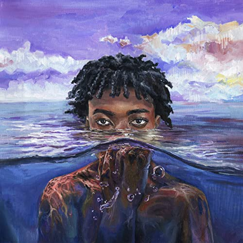

import { Slider, Button } from "carbon-components-react";
import { ArrowUpRight24 } from "@carbon/icons-react";

import SliderJS1 from "../review/slider1";
import SliderJS2 from "../review/slider2";
import SliderJS3 from "../review/slider3";
import SliderJS4 from "../review/slider4";
import AdvJS2 from "../review/adv2";
import AdvJS3 from "../review/adv3";

import { Link } from "gatsby";

Album review

<h1 className="h1--no--margin">{props.pageContext.frontmatter.title}</h1>

<Row  className="image-card-group">
	<Column colMd={"3"} colLg={"4"} noGutterMdLeft="">
       <ImageCard>

</ImageCard>
	</Column>
	<Column colMd={"4"} colLg={"8"} noGutterMdLeft="">
		

			DC生まれで近郊のMaryland州Prince George郡(3曲目タイトルのpgのこと)出身のRapper, Song Writer, Producer、Redveilの3作目。タイトルのSwimは、黒人コミュニティでうまくやって、生き残ることを意味しているらしい。
			 まだ18歳ということではあるが、サウンドの成熟度、Rapでの落着きは、既に中堅以上の域に達している。そのサウンドは、ゆったりとしたものが多く、サンプリングベースっぽい感じで、メローで時にポップ。個人的には初期のKanyeっぽいところもあったりすると思う。
			 Rapは唄うような今どきのフローで、声はやや太め。LyricはBLMとも少し違った人種差別への怒りや社会への反逆を織り込んでいる。
			 Earl Sweatshirt, Kendrick Lamar, J. Cole, TylerThe Cretor, $uicideboy$あたりに影響を受けているらしく、完全に新世代のRapperと言えそうだ。それにしても、18歳で、これだけの作品を全曲Self Produceというのは俄かに信じがたく、それほどの才能だと思う。
		

		

		  <Button className="button-right-mergin"  href="https://amzn.to/3RGxSB7" kind="primary" size="small" renderIcon={ArrowUpRight24}>
  	    amazon.com
  	  </Button>
  	  <Button className="button-right-mergin"  href="https://amzn.to/3RGxSB7" kind="secondary" size="small" renderIcon={ArrowUpRight24}>
  	    amazon.co.jp
  	  </Button>
			<Button className="button-right-mergin"  href="https://apple.co/3obqCQk" kind="tertiary" size="small" renderIcon={ArrowUpRight24}>
  	   	apple music
  	  </Button>
			<AdvJS2/>
		

	</Column>
</Row>
<Row >
	<Column colMd={"4"} colLg={"4"} noGutterMdLeft="">
		

		  <h3>Score card</h3>
			<SliderJS1 value="4" />
		  <SliderJS2 value="2" />
			<SliderJS3 value="1" />
		  <SliderJS4 value="9" />
		

	</Column>
	<Column colMd={"8"} colLg={"8"} noGutterMdLeft="">
		

			<h3>Producers</h3>
			

				Marcus Morton(all)
			

			<h3>Guests</h3>
			

				Mekdelawit & Renaissance Mic, Sam Truth, Fly Anakin & ovrkast.
			

		

	</Column>
</Row>

<h3>Tracks</h3>

| No. | Title              | Composers                                                         | Performer                                  | Time  |
| --- | ------------------ | ----------------------------------------------------------------- | ------------------------------------------ | ----- |
| 1   | Together           |                                                                   | RedVeil                                    | 03:02 |
| 2   | Diving Board       | Marcus Morton                                                     | RedVeil                                    | 02:45 |
| 3   | Pg Baby            | Donald Breedlove, Marcus Morton, Napoleon Crayton                 | RedVeil                                    | 02:37 |
| 4   | New Info           | Darrell Bell, Marcus Morton                                       | RedVeil                                    | 02:09 |
| 5   | Shoulder           | Marcus Morton, Mekdelawit Fissehazion, Renaissance Mic            | RedVeil feat. Mekdelawit & Renaissance Mic | 04:03 |
| 6   | Better             | Marcus Morton, Masood Abdul-Hakeem                                | RedVeil feat. Sam Truth                    | 03:10 |
| 7   | Sky                | Marcus Morton                                                     | RedVeil                                    | 02:48 |
| 8   | Morphine (Da Ways) | Bastian Völkel, Chirstoph Bauss, Marcus Morton                    | RedVeil                                    | 01:57 |
| 9   | Automatic          | Frank L Walton Jr., Marcus Morton, Silas Wilson, William A. Keyes | RedVeil feat. Fly Anakin & ovrkast.        | 03:47 |
| 10  | Home               | Marcus Morton                                                     | RedVeil                                    | 03:00 |
| 11  | Mars               | Marcus Morton                                                     | RedVeil                                    | 03:18 |
| 12  | Working On It      | Marcus Morton                                                     | RedVeil                                    | 02:54 |
| 0   |                    |                                                                   |                                            | 00:00 |

<AdvJS3/>