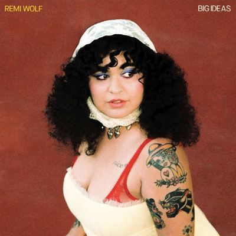

import { Slider, Button } from "@carbon/react";
import { ArrowUpRight } from "@carbon/icons-react";

import SliderJS1 from "../review/slider1";
import SliderJS2 from "../review/slider2";
import SliderJS3 from "../review/slider3";
import SliderJS4 from "../review/slider4";
import AdvJS2 from "../review/adv2";
import AdvJS3 from "../review/adv3";

import { Link } from "gatsby";

import Review1 from "../review/remiwolf1.mdx";

Album review

<h1 className="h1--no--margin">{props.pageContext.frontmatter.title}</h1>

  <Link to="/best50/2024/">2024 Black Music Best No.47</Link>

<Row  className="image-card-group">
	<Column colMd={3} colLg={4} noGutterMdLeft="">
       <ImageCard>

</ImageCard>
	</Column>
	<Column colMd={4} colLg={8} noGutterMdLeft="">
		

			Remi Wolfの3年ぶり2作目。ベースは前作同様、カラフルで元気でノリの良いガールポップであるが、ディスコ、レゲエ、ファンク、インディロック、サイケ、バラードなど様々なジャンル・曲調も取り込んでいて、飽きさせない。そこは高校生以来の付き合いというJared Solomon(Solomonophonic)の制作によるところが大きそう。
			 変わったところではEl Michel AffairのLeon Michelsも3曲で制作陣に加わっている。また、キャッチーなメロディラインも魅力の一部であり、Lyricでは日々の様々な心情を唄っている。前作に比べると、癖の強さが抜け気味で、半面、一般受けはしそうだ。
		

		

		  <Button className="button-right-mergin"  href="https://amzn.to/3QjopA1" renderIcon={ArrowUpRight} size='sm' kind='primary'>
  	    amazon.com
  	  </Button>
  	  <Button className="button-right-mergin"  href="https://amzn.to/3WW4ISL" renderIcon={ArrowUpRight} size='sm' kind='secondary'>
  	    amazon.co.jp
  	  </Button>
			<Button className="button-right-mergin"  href="https://apple.co/4hwstsG" renderIcon={ArrowUpRight} size='sm' kind='tertiary'>
  	   	apple music
  	  </Button>
			<AdvJS2/>
		

	</Column>
</Row>
<Row >
	<Column colMd={4} colLg={4} noGutterMdLeft="">
		

		  <h3>Score card</h3>
			<SliderJS1 value="5" />
		  <SliderJS2 value="2" />
			<SliderJS3 value="1" />
		  <SliderJS4 value="9" />
		

	</Column>
	<Column colMd={8} colLg={8} noGutterMdLeft="">
		

			<h3>Producers</h3>
			

				Remi Wolf and Solomonophonic(1,8)
				 Remi Wolf, Solomonophonic, Know Fortune and Carter Lang(2,9)
				 Remi Wolf, Leon Michels and Kenny Beats(3,12)
				 Remi Wolf, Ethan Gruska and Solomonophonic(4,5,11)
				 Remi Wolf, Solomonophonic and Know Fortune(6)
				 Remi Wolf, Solomonophonic and Leon Michels(7)
				 Remi Wolf, Solomonophonic and Porches(10)
				 Remi Wolf, Solomonophonic and Jacob Portrait(13)
			

			<h3>Guests</h3>
			

			

		

	</Column>
</Row>

<h3>Tracks</h3>

| No. | Title                 | Composers                                                                                         | Performer | Time  |
| --- | --------------------- | ------------------------------------------------------------------------------------------------- | --------- | ----- |
| 1   | Cinderella            | Jared Solomon / Remi Wolf                                                                         | Remi Wolf | 04:03 |
| 2   | Soup                  | Carter Lang / Kevin Rhomberg / Jared Solomon / Remi Wolf                                          | Remi Wolf | 03:33 |
| 3   | Motorcycle            | Paul Castelluzzo / Kenneth Blume III / Leon Michels / Nick Movshon / Homer Steinweiss / Remi Wolf | Remi Wolf | 02:46 |
| 4   | Toro                  | Jack Demeo / Ethan Gruska / Jared Solomon / Remi Wolf                                             | Remi Wolf | 02:55 |
| 5   | Alone in Miami        | Jack Demeo / Ethan Gruska / Remi Wolf                                                             | Remi Wolf | 02:41 |
| 6   | Cherries and Cream    | Kevin Rhomberg / Jared Solomon / Remi Wolf                                                        | Remi Wolf | 04:26 |
| 7   | Kangaroo              | Leon Michels / Nick Movshon / Jared Solomon / Remi Wolf                                           | Remi Wolf | 03:54 |
| 8   | Pitiful               | Benny Sings / Jared Solomon / Remi Wolf                                                           | Remi Wolf | 03:05 |
| 9   | Wave                  | Carter Lang / Kevin Rhomberg / Jared Solomon / Remi Wolf                                          | Remi Wolf | 03:49 |
| 10  | When I Thought of You | Aaron Maine / Jared Solomon / Remi Wolf                                                           | Remi Wolf | 02:39 |
| 11  | Frog Rock             | Jack Demeo / Ethan Gruska / Jared Solomon / Remi Wolf                                             | Remi Wolf | 03:45 |
| 12  | Just the Start        | Remi Wolf                                                                                         | Remi Wolf | 02:19 |
| 13  | Slay Bitch            | Curtis Hudson / Jacob Portrait / Jared Solomon / Lisa Stevens / Remi Wolf                         | Remi Wolf | 03:08 |

<h3>Other Reviews</h3>

<Row>
  <Column colMd={3} colLg={3} noGutterMdLeft>
    <Review1 />
  </Column>
</Row>