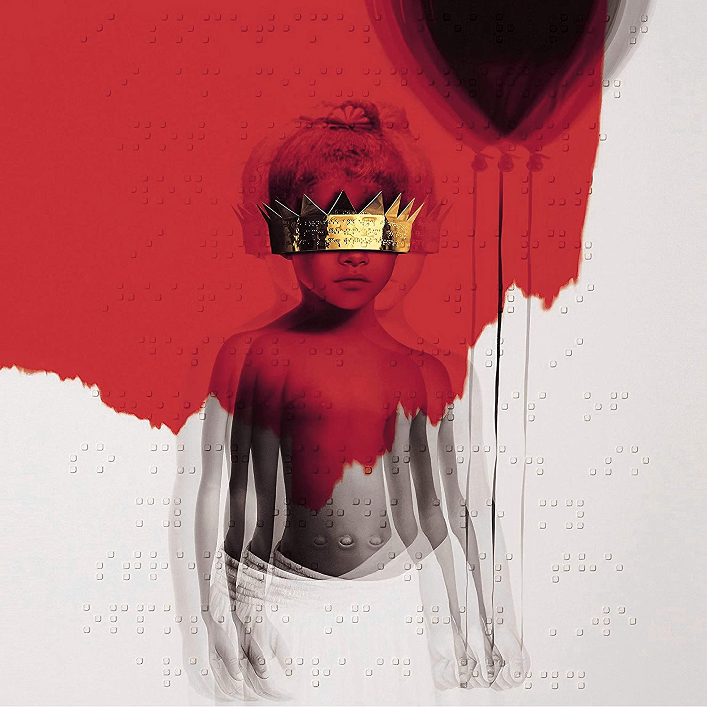

import { Slider, Button } from 'carbon-components-react';
import { ArrowUpRight24  } from '@carbon/icons-react';

import SliderJS1 from "../review/slider1"
import SliderJS2 from "../review/slider2"
import SliderJS3 from "../review/slider3"
import SliderJS4 from "../review/slider4"

CD review

<h1 className="h1--no--margin">{props.pageContext.frontmatter.title}</h1>

<Link to="/best50/2016/">2016 Black Music Best No.9</Link>

<Row  className="image-card-group">
	<Column colMd={"4"} colLg={"4"} noGutterMdLeft="">
       <ImageCard>

 
</ImageCard>
	</Column>
	<Column colMd={"8"} colLg={"8"} noGutterMdLeft="">
	

	盲目2016年春にリリースされたRihannaの8作目。Tidalからの無料リリースを経て、CDとしても入手可能になった。過去にないような抑制の効いたスロー曲がほとんど。それに十分、耐えうるRihannaの進化した歌唱を聴くことができる。20代もそろそろ終わりということで、時には声を荒げ、感情込めて唄っている。Trackのほうは、エレクトロをベースに楽器を組み合わせ、一部ではアコースティックなものもあり、適度な尖がり方で、落ち着いた印象を受ける。全曲、Producerが違うというのも今どきでは珍しいが、Rihanna本人がExec. Producerを務めていることもあって、アルバムとしての統一感は高い。
	のSinger / SOngriter, Raul Midonの11枚目のアルバム。50歳を越えるベテランだが、いまだにコンスタントにアルバムリリースしているのは流石。p, g,dsベースのアコースティックなバンドサウンドにミディアム-スローなトラックが中心となる。そこにRaulが落ち着いたトーンで静かに唄ういあげている。ただ、歌声はまだまだ若いと思う。ボサノバ、Jazzや、Spoken Wordなどちょっとした変化もあり、楽しめる作品、Jazz系のGuest Musizianも目立ち過ぎず。Raulを盛り立てている。
	

	

	  <Button href="https://amzn.to/2PU6d0Q" kind="primary" size="small" renderIcon={ArrowUpRight24}>
      amazon.com
    </Button>
    <Button href="https://amzn.to/3arjPu0" kind="secondary" size="small" renderIcon={ArrowUpRight24}>
      amazon.co.jp
    </Button>
	

	
	
	</Column>
</Row>
<Row >
	<Column colMd={"4"} colLg={"4"} noGutterMdLeft="">

  <h3>Score card</h3>
	<SliderJS1 value="5" />
  <SliderJS2 value="1" />
	<SliderJS3 value="1" />
  <SliderJS4 value="8" />

</Column>
<Column colMd={"8"} colLg={"8"} noGutterMdLeft="">

<h3>Producers</h3>

Scum(1)
 Robert Shea Taylor (2)
 Jeff Bhasker(3)
 Boi-1da(4)
 Mick Schultz(5)
 Hit-Boy(6)
 DJ Mustard(7)
 Timbaland, Fade Majah and Daniel Jones (8)
 Kevin Parker(9)
 Chad Sabo(10)
 Fred Ball(11)
 NO I.D(12)
 Brian Kennedy(13)

<h3>Guests</h3>

SZA, Drake, Kevin Parker

</Column>
</Row>

<h3>Tracks</h3>

| No. |	 Title            |	 Composers                                                                                                                                                             |	 Performer         | Time	 |
| --- |	----------------- |	 --------------------------------------------------------------------------------------------------------------------------------------------------------------------- | ------------------- | ----- |
|	1	  |	Consideration    	| Tyran Donaldson / Robyn Fenty / Solana Rowe                                                                                                                            | Rihanna feat. SZA   | 02:41 |
|	2	  |	James Joint      	| James Fauntleroy / Robyn Fenty / Shea Taylor                                                                                                                           | Rihanna             | 01:12 |
|	3	  |	Kiss It Better   	| Jeff Bhasker / Robyn Fenty / John Glass / Teddy Sinclair                                                                                                               | Rihanna             | 04:13 |
|	4	  |	Work             	| Jahron Brathwaite / Robyn Fenty / Aubrey Graham / Rupert Thomas, Jr. / Monte Moir / Allen Ritter / Matthew Samuels                                                     | Rihanna feat. Drake | 03:39 |
|	5	  |	Desperado        	| James Fauntleroy / Robyn Fenty / Rook Monroe / Mick Schultz / Krystin Watkins                                                                                          | Rihanna             | 03:06 |
|	6	  |	Woo              	| Jean Baptiste / Jeremy Felton / Robyn Fenty / Chauncey Hollis / Terius Nash / Abel Tesfaye / Jacques Webster                                                           | Rihanna             | 03:55 |
|	7	  |	Needed Me        	| Nick Audino / Adam Feeney / Robyn Fenty / Brittany Hazzard / Lewis Hughes / Charles Hinshaw, Jr. / Dijon McFarlane / Derrus Rachel / Khaled Rohaim / Te Whiti Warbrick | Rihanna             | 03:11 |
|	8	  |	Yeah, I Said It  	| Evon Barnes / Bibi Bourelly / Jean-Paul Bourelly / Robyn Fenty / Chris Godbey / Daniel Jones / Timothy Mosley                                                          | Rihanna             | 02:13 |
|	9	  |	Same Ol' Mistakes	| Kevin Parker                                                                                                                                                           | Rihanna             | 06:37 |
|	10	|	Never Ending     	| Dido Armstrong / Robyn Fenty / Paul Herman / Chad Sabo                                                                                                                 | Rihanna             | 03:22 |
|	11	|	Love on the Brain	| J. Angel / Joseph Angel / Fred Ball / Robyn Fenty                                                                                                                      | Rihanna             | 03:43 |
|	12	|	Higher           	| Bibi Bourelly / Jerry Butler / James Fauntleroy / Robyn Fenty / Kenny Gamble / Leon Huff / Ernest Wilson                                                               | Rihanna             | 02:00 |
|	13	|	Close to You     	| James Fauntleroy / Robyn Fenty / B. Seals / Brian Kennedy Seals                                                                                                        | Rihanna             | 03:43 |