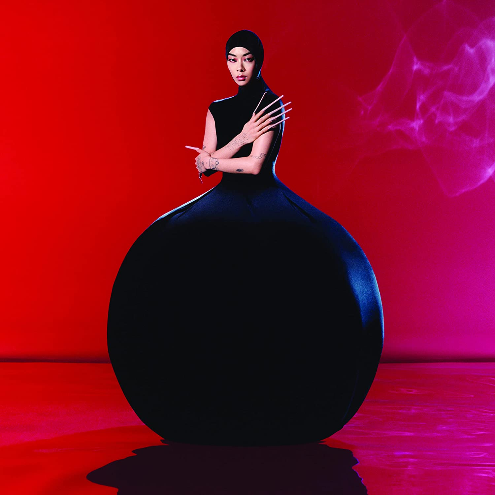

import { Slider, Button } from "@carbon/react";
import { ArrowUpRight } from "@carbon/icons-react";

import SliderJS1 from "../review/slider1";
import SliderJS2 from "../review/slider2";
import SliderJS3 from "../review/slider3";
import SliderJS4 from "../review/slider4";
import AdvJS2 from "../review/adv2";
import AdvJS3 from "../review/adv3";

import { Link } from "gatsby";

import Review1 from "../review/rinasawayama1.mdx";

Album review

<h1 className="h1--no--margin">{props.pageContext.frontmatter.title}</h1>

  <Link to="/best50/2022/">2022 Black Music Best No.22</Link>

<Row  className="image-card-group">
	<Column colMd={3} colLg={4} noGutterMdLeft="">
       <ImageCard>

</ImageCard>
	</Column>
	<Column colMd={4} colLg={8} noGutterMdLeft="">
		

			デビュー作となる前作が好評を得て、キアヌ・リーヴスとの映画での共演など活動の幅を広げるRina Sawatamaの2年ぶり2作目。前作路線を保ちつつ、アーティストとしてのステイタスも一段上がって、より、作品としてのスケールが大きくなり、総合的なレベルも上がっている。
			 サウンドはElectro Pop, Rock, UK Garageなどをミックスしているあたりは前作同様だが、カントリーっぽい⑪などは目新しいところ。
			 また、歌唱力が大分、上がってきている気がして、特に伸びのある高音を多用するようになっているのが特徴的だと思う。Lyricは社会性を帯びたものやPersonalなものなどで、彼女らしい主張が感じられる。
		

		

		  <Button className="button-right-mergin"  href="https://amzn.to/3HkPEGN" renderIcon={ArrowUpRight} size='sm' kind='primary'>
  	    amazon.com
  	  </Button>
  	  <Button className="button-right-mergin"  href="https://amzn.to/3Hjg9fW" renderIcon={ArrowUpRight} size='sm' kind='secondary'>
  	    amazon.co.jp
  	  </Button>
			<Button className="button-right-mergin"  href="https://apple.co/3J6IV4G" renderIcon={ArrowUpRight} size='sm' kind='tertiary'>
  	    apple music
  	  </Button>
			<AdvJS2/>
		

	</Column>
</Row>
<Row >
	<Column colMd={4} colLg={4} noGutterMdLeft="">

  <h3>Score card</h3>
	<SliderJS1 value="5" />
  <SliderJS2 value="1" />
	<SliderJS3 value="1" />
  <SliderJS4 value="9" />

</Column>
<Column colMd={8} colLg={8} noGutterMdLeft="">
	

		<h3>Producers</h3>
		

			Rina Sawayam, Paul Epwortha and Barney Lister(1)
			 Rina Sawayama(2)
			 Rina Sawayama, Clarence Clarity and Paul Epwortha(3)
			 Rina Sawayama, Clarence Clarity and Stuart Price(4,5,8,10,12
			 Rina Sawayama, For Those I Love and Stuart Price(6
			 Rina Sawayama, Clarence Clarity, Marcus Anderson and Lauren Aquilina(7)
			 Rina Sawayama, Clarence Clarity, Barney Listerand Paul Epworth(9)
			 Rina Sawayama, Marcus Anderson and Lauren Aquilina(11)
			 Rina Sawayama and Clarence Clarity(12)
			 Rina Sawayama, Stuart Price, Marcus Anderson and Lauren Aquilina(13)
		

		<h3>Guests</h3>
		

		

	

</Column>
</Row>

<h3>Tracks</h3>

| No. | Title                    | Composers                                                                       | Performer     | Time  |
| --- | ------------------------ | ------------------------------------------------------------------------------- | ------------- | ----- |
| 1   | Minor Feelings           | Lauren Aquilina / Vic Jamieson / Rina Sawayama                                  | Rina Sawayama | 02:00 |
| 2   | Hold the Girl            | Jonny Lattimer / Barney Lister / Rina Sawayama                                  | Rina Sawayama | 04:05 |
| 3   | This Hell                | Lauren Aquilina / Vic Jamieson / Rina Sawayama                                  | Rina Sawayama | 03:56 |
| 4   | Catch Me in the Air      | Grace Barker / Clarence Clarity / Stuart Price / Rina Sawayama / Oscar Scheller | Rina Sawayama | 03:35 |
| 5   | Forgiveness              | Clarence Clarity / Rich Cooper / Jonny Lattimer / Rina Sawayama                 | Rina Sawayama | 04:20 |
| 6   | Holy (Til You Let Me Go) | Nate Campany / Chris Lyon / Stuart Price / Rina Sawayama                        | Rina Sawayama | 03:18 |
| 7   | Your Age                 | Marcus Andersson / Lauren Aquilina / Rina Sawayama                              | Rina Sawayama | 02:54 |
| 8   | Imagining                | Lauren Aquilina / Vic Jamieson / Rina Sawayama                                  | Rina Sawayama | 03:32 |
| 9   | Frankenstein             | Lauren Aquilina / Paul Epworth / Rina Sawayama                                  | Rina Sawayama | 03:12 |
| 10  | Hurricanes               | Clarence Clarity / Rina Sawayama                                                | Rina Sawayama | 03:22 |
| 11  | Send My Love to John     | Marcus Andersson / Lauren Aquilina / Rina Sawayama                              | Rina Sawayama | 03:25 |
| 12  | Phantom                  | Lauren Aquilina / Vic Jamieson / Rina Sawayama                                  | Rina Sawayama | 04:25 |
| 13  | To Be Alive              | Marcus Andersson / Lauren Aquilina / Rina Sawayama                              | Rina Sawayama | 03:54 |

<h3>Other Reviews</h3>

<Row>
  <Column colMd={3} colLg={3} noGutterMdLeft>
    <Review1 />
  </Column>
</Row>

<AdvJS3 />
