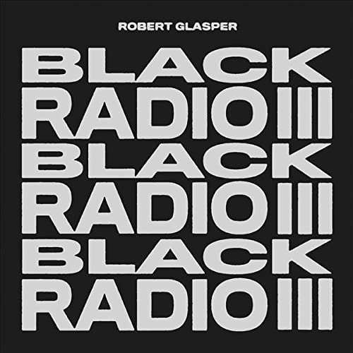

import { Slider, Button } from "@carbon/react";
import { ArrowUpRight } from "@carbon/icons-react";

import SliderJS1 from "../review/slider1";
import SliderJS2 from "../review/slider2";
import SliderJS3 from "../review/slider3";
import SliderJS4 from "../review/slider4";
import AdvJS2 from "../review/adv2";
import AdvJS3 from "../review/adv3";

import { Link } from "gatsby";

import Review1 from "../review/robertglasper2.mdx";

import Review2_1 from "../review/rplusrequalnow2.mdx";
import Review2_2 from "../review/rplusrequalnow1.mdx";

import Review3_1 from "../review/martinglasperwonderwashington1.mdx";

Album review

<h1 className="h1--no--margin">{props.pageContext.frontmatter.title}</h1>

  <Link to="/best50/2022/">2022 Black Music Best No.30</Link>

<Row  className="image-card-group">
	<Column colMd={3} colLg={4} noGutterMdLeft="">
       <ImageCard>

</ImageCard>
	</Column>
	<Column colMd={4} colLg={8} noGutterMdLeft="">
		

			様々なフォーマットでの作品をリリースするRobert Glasperではあるが、Black Radioシリーズとしては9年目となる第3弾。自己名義のオリジナルアルバムとしては3年ぶりとなる。
			 過去のシリーズ作と同様、Jazz MusicianによるJazzを下敷きにしたR&B Hip-Hop作品ということになるが、Hip-Hop寄りなのは②と③くらい。他はR&B寄りということになる。
			 本人のインタビューによると、今まで以上に声と言葉に注目が行くように意図的に制作したとのことで、それを具体化するために厳選された豪華なVocal Guestが連なっていおり、静かで内省的なTrackが多めになっている。
			 コロナ禍でレコーディングには苦労したようだが、隅々まで、丹念に作られた作品になっている。
		

		

		  <Button className="button-right-mergin"  href="https://amzn.to/3MHKxR2" renderIcon={ArrowUpRight} size='sm' kind='primary'>
  	    amazon.com
  	  </Button>
  	  <Button className="button-right-mergin"  href="https://amzn.to/3vWbKbW" renderIcon={ArrowUpRight} size='sm' kind='secondary'>
  	    amazon.co.jp
  	  </Button>
			<Button className="button-right-mergin"  href="https://apple.co/39u9y3N" renderIcon={ArrowUpRight} size='sm' kind='tertiary'>
      	apple music
    	</Button>
			<AdvJS2/>
		

	</Column>
</Row>
<Row >
	<Column colMd={4} colLg={4} noGutterMdLeft="">
		

		  <h3>Score card</h3>
			<SliderJS1 value="4" />
		  <SliderJS2 value="1" />
			<SliderJS3 value="1" />
		  <SliderJS4 value="9" />
		

	</Column>
	<Column colMd={8} colLg={8} noGutterMdLeft="">
		

			<h3>Producers</h3>
			

				Robert Glasper(1,2,3,4,5,6,7,9,11,12)
				 Robert Glasper and Jahi Sundance(8)
				 Robert Glasper and Bryan-Michael Cox(10)
				 Robert Glasper and Terrace Martin(11, 13)
			

			<h3>Guests</h3>
			

				Amir Sulaiman,Mike, BJ The Chicago Kid, Big K.R.I.T., Esperanza Spalding, Q-Tip, Yebba, H.E.R., Meshell Ndegeocello, Lala Fathaway, Common, Musiq Soulchild, Posdnuos, Gregory Porter, Ledisi, Ant Clemons, Jennifer Hudson, PJ Morton, India. Arie, Daniel Farris, Ty Dolla $ign
			

		

	</Column>
</Row>

<h3>Tracks</h3>

| No. | Title                             | Composers                                                                  | Performer                                                          | Time  |
| --- | --------------------------------- | -------------------------------------------------------------------------- | ------------------------------------------------------------------ | ----- |
| 1   | In Tune                           | Robert Glasper / Amir Sulaiman                                             | Robert Glasper feat. Amir Sulaiman                                 | 03:18 |
| 2   | Black Superhero                   | Robert Glasper / BJ the Chicago Kid / Michael Render / Justin Scott        | Robert Glasper feat. Killer Mike, BJ The Chicago Kid, Big K.R.I.T. | 05:55 |
| 3   | Shine                             | Daniel Farris / Robert Glasper / Tiffany Gouché / Justin Tyson             | Robert Glasper feat. Tiffany Gouché                                | 06:28 |
| 4   | Why We Speak                      | Kamaal Fareed / Robert Glasper / Esperanza Spalding / Burniss Travis       | Robert Glasper feat. Esperanza Spalding, Q-Tip                     | 06:19 |
| 5   | Over                              | Robert Glasper / Abbey Smith                                               | Robert Glasper feat. Yebba                                         | 04:55 |
| 6   | Better than I Imagined            | Robert Glasper / Meshell Ndegeocello / Gabriella Wilson                    | Robert Glasper feat. H.E.R., Meshell Ndegeocello                   | 04:51 |
| 7   | Everybody Wants to Rule the World | Christopher Hughes / Roland Orzabal / Ian Stanley                          | Robert Glasper feat. Lala Fathaway, Common                         | 05:41 |
| 8   | Everybody Love                    | Robert Glasper / Taalib Johnson / Alexander Lloyd / Kelvin Mercer          | Robert Glasper feat. Musiq Soulchild, Posdnuos                     | 05:03 |
| 9   | It Don't Matter                   | Chris Dave / Robert Glasper / Gregory Porter / Justin Tyson / Ledisi Young | Robert Glasperfeat. Gregory Porter, Ledisi                         | 05:27 |
| 10  | Heaven's Here                     | Ant Clemons / Bryan-Michael Cox / Robert Glasper                           | Robert Glasper feat. Ant Clemons                                   | 03:56 |
| 11  | Out of My Hands                   | Brittany Barber / Robert Glasper / Jennifer Hudson                         | Robert Glasper feat. Jennifer Hudson                               | 05:35 |
| 12  | Forever                           | Robert Glasper / PJ Morton / India Arie Simpson                            | Robert Glasper feat. PJ Morton, India. Arie                        | 05:45 |
| 13  | Bright Lights                     | Robert Glasper / Tyrone Griffin                                            | Robert Glasper feat. Ty Dolla $ign                                 | 04:02 |

<h3>Other Reviews</h3>

<Row>
  <Column colMd={3} colLg={3} noGutterMdLeft>
    <Review1 />
  </Column>
</Row>

<Row>
  <Column colMd={3} colLg={3} noGutterMdLeft>
    <Review2_1 />
  </Column>
  <Column colMd={3} colLg={3} noGutterMdLeft>
    <Review2_2 />
  </Column>
</Row>

<Row>
  <Column colMd={3} colLg={3} noGutterMdLeft>
    <Review3_1 />
  </Column>
</Row>

<AdvJS3 />
