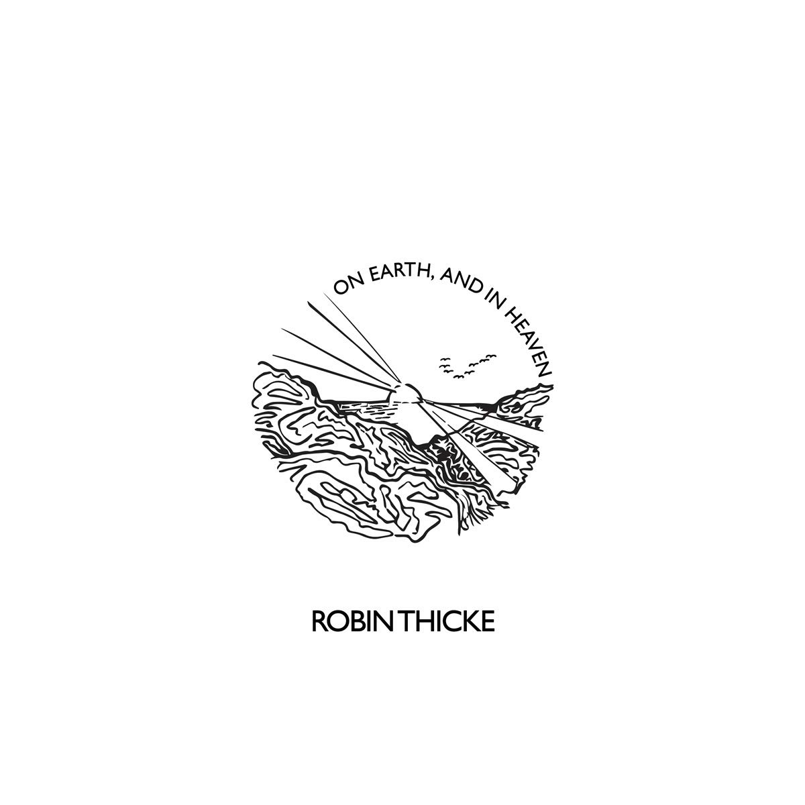

import { Slider, Button } from "carbon-components-react";
import { ArrowUpRight24 } from "@carbon/icons-react";

import SliderJS1 from "../review/slider1";
import SliderJS2 from "../review/slider2";
import SliderJS3 from "../review/slider3";
import SliderJS4 from "../review/slider4";

import { Link } from "gatsby";

Album Review

<h1 className="h1--no--margin">{props.pageContext.frontmatter.title}</h1>

<Row className="image-card-group">
	<Column colMd={"3"} colLg={"4"} noGutterMdLeft="">
    <ImageCard>

</ImageCard>
	</Column>
	<Column colMd={"4"} colLg={"8"} noGutterMdLeft="">
	

	  今やBlue Eyed Soulの第一人者ともいえるRobin Thickeの7年ぶりの7作目。今回、チャラさは捨てて、穏やかで爽やかな印象の作品になっている。
     ラテン、ボッサ、プリンスっぽいファンク、ソウルフルなバラードやJazzyなバラードなど曲ごとに様々なジャンルの曲が散りばめられている。
     美メロ曲が多く、また、全てにおいてTrackはうるさすぎず、Robin Thickeのファルセット多用のVocalもあっさりとしているので、ゆったりとした気分で聴くことができる。①なんかしみじみとして本当に良いと思う。
     オリジナリティ云々や新奇性は忘れて、心地よい楽曲に身を委ねましょうというアルバム。
  

  

	  <Button className="button-right-mergin" href="https://amzn.to/3mZyToK" kind="primary" size="small" renderIcon={ArrowUpRight24}>
      amazon.com
    </Button>
    <Button className="button-right-mergin" href="https://amzn.to/2OZvWIi" kind="secondary" size="small" renderIcon={ArrowUpRight24}>
      amazon.co.jp
    </Button>
    <Button className="button-right-mergin" href="https://apple.co/3mXCFPJ" kind="tertiary" size="small" renderIcon={ArrowUpRight24}>
      apple music
    </Button>
	

	</Column>
</Row>
<Row >
  <Column colMd={"4"} colLg={"4"} noGutterMdLeft="">
    

      <h3>Score card</h3>
	    <SliderJS1 value="5" />
      <SliderJS2 value="2" />
	    <SliderJS3 value="1" />
      <SliderJS4 value="9" />
    

  </Column>
  <Column colMd={"4"} colLg={"8"} noGutterMdLeft="">
    

      <h3>Producers</h3>
      

        Robin Thick and James Gass(1,2,3,5,6,7,10,11)
         Robin Thick(4)
         Robin Thick, James Gass and Chaz Jackson(8)
         Pharrell(9)
      

      <h3>Guests</h3>
      

      

    

  </Column>
</Row>

<h3>Tracks</h3>

| No. | Title                   | Composers                                                       | Performer    | Time  |
| --- | ----------------------- | --------------------------------------------------------------- | ------------ | ----- |
| 1   | Lucky Star              | James Gass / Nasri / Robin Thicke                               | Robin Thicke | 03:03 |
| 2   | Hola                    | James Gass / Jairus Mozee / Robin Thicke / Kenny Wright         | Robin Thicke | 02:53 |
| 3   | Lola Mia                | Larry Cox II / Chris Payton / Robin Thicke                      | Robin Thicke | 03:46 |
| 4   | Gorgeous                | Robin Thicke                                                    | Robin Thicke | 00:26 |
| 5   | The Things You Do to Me | Aaron Camper / James Gass / Larry Cox II / Robin Thicke         | Robin Thicke | 03:17 |
| 6   | Out of My Mind          | James Gass / Bobby Keyes / Rich Skillz / Robin Thicke           | Robin Thicke | 03:10 |
| 7   | Beautiful               | Gianni Credle-Harrell / James Gass / Larry Cox II / Rich Skillz | Robin Thicke | 04:11 |
| 8   | Look Easy               | Chaz Jackson / Nasri / Dre Pinckney / Ben Spivak / Robin Thicke | Robin Thicke | 03:10 |
| 9   | Take Me Higher          | Chris Payton / Robin Thicke / Pharrell Williams                 | Robin Thicke | 04:04 |
| 10  | Forever Mine            | Larry Devont Dorn / James Gass / Bobby Keyes / Robin Thicke     | Robin Thicke | 03:05 |
| 11  | That's What Love Can Do | Robert Daniels / James Gass / Larry Cox II / Robin Thicke       | Robin Thicke | 04:17 |
