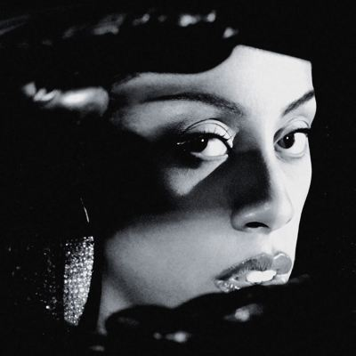

import { Slider, Button } from "@carbon/react";
import { ArrowUpRight } from "@carbon/icons-react";

import SliderJS1 from "../review/slider1";
import SliderJS2 from "../review/slider2";
import SliderJS3 from "../review/slider3";
import SliderJS4 from "../review/slider4";
import AdvJS2 from "../review/adv2";
import AdvJS3 from "../review/adv3";

import { Link } from "gatsby";

Album Review

<h1 className="h1--no--margin">{props.pageContext.frontmatter.title}</h1>

  <Link to="/best50/2025/">2025 Black Music Best No.22</Link>

<Row  className="image-card-group">
	<Column colMd={3} colLg={4} noGutterMdLeft="">
       <ImageCard>

</ImageCard>
	</Column>
	<Column colMd={4} colLg={8} noGutterMdLeft="">
		

			UK生まれでカナダ育ち、LA拠点のシンガー、Rochelle Jordanの正式には3作目。2011年デビュー後、契約トラブルや持病による7年の空白を経て2021年に再起。
			 90年代R&amp;BとUKクラブ音楽を融合した独自のスタイルを確立している。夜のクラブ体験をシミュレートしたような流動的な構成で、洗練さと親密さが同居した印象を感じる。
			 KLSHやKAYTRANADAらを迎え、ハウス、UKガラージ、R&amp;Bを統合したような重厚でサンサブルでサウンドで、浮遊感のある歌声にマッチしている。DāM FunKとの⑪などは80年代R&amp;B風でもある。
			 タイトルは「壁越しに聴いた兄の音楽」という原体験と、自己不信という「心の壁」の打破することを象徴しているとのことで。恋愛や官能性だけでなく、デジタル社会の虚無や個の解放なども唄っている。
		

		

		  <Button className="button-right-mergin"  href="https://amzn.to/47Bol7V" renderIcon={ArrowUpRight} size='sm' kind='primary'>
  	    amazon.com
  	  </Button>
  	  <Button className="button-right-mergin"  href="https://amzn.to/4sNhZKV" renderIcon={ArrowUpRight} size='sm' kind='secondary'>
  	    amazon.co.jp
  	  </Button>
			<Button className="button-right-mergin"  href="https://apple.co/4lAq1oa" renderIcon={ArrowUpRight} size='sm' kind='tertiary'>
  	    apple music
  	  </Button>
		<AdvJS2/>
		

	</Column>
</Row>
<Row >
	<Column colMd={4} colLg={4} noGutterMdLeft="">
		

		  <h3>Score card</h3>
			<SliderJS1 value="5" />
		  <SliderJS2 value="1" />
			<SliderJS3 value="1" />
		  <SliderJS4 value="9" />
		

	</Column>
	<Column colMd={4} colLg={8} noGutterMdLeft="">
		

			<h3>Producers</h3>
			

				KLSH, Rob Araujo, Machinedrum(1)
				 KLSH(2,7,12)
				 KLSH, Byron The Aquarius(3,6)
				 KAYTRANADA(4)
				 Initial Talk, KLSH, Byron The Aquarius(5)
				 Jimmy Edgar(8)
				 Machinedrum, WaveIQ(9)
				 Byron The Aquarius, KLSH(10)
				 Terry Hunter(11)
				 DāM FunK, KLSH(13)
				 Kingdom, Girl Unit(14)
				 MPH(15)
				 KLSH, Machinedrum(16)
				 Zach Nahome &amp; TommyD(11)
				 Hamdi(17)
			

			<h3>Guests</h3>
			

				
			

		

	</Column>
</Row>

<h3>Tracks</h3>

| No. | Title           | Composers                                                                  | Performer       | Time |
| --- | --------------- | -------------------------------------------------------------------------- | --------------- | ---- |
| 1   | Grace           | Kelvin Montgomery, Rob Araujo, Rochelle Fearon, Travis Stewart             | Rochelle Jordan | 0:58 |
| 2   | Ladida          | Jaz Robinson-Hairston, Kelvin Montgomery, Rivermoon, Rochelle Fearon       | Rochelle Jordan | 3:43 |
| 3   | Sum             | Brandon Blaylock, Kelvin Montgomery, Rochelle Fearon                       | Rochelle Jordan | 4:09 |
| 4   | The Boy         | Kevin Celeste, Rochelle Fearon                                             | Rochelle Jordan | 3:34 |
| 5   | Doing It Too    | Brandon Blaylock, Kelvin Montgomery, Michiaki Asada, Rochelle Fearon       | Rochelle Jordan | 3:26 |
| 6   | Never Enough    | Brandon Blaylock, Kelvin Montgomery, Paris Alexa Williams, Rochelle Fearon | Rochelle Jordan | 4:00 |
| 7   | Words 2 Say     | Kelvin Montgomery, Rochelle Fearon, Travis Stewart                         | Rochelle Jordan | 3:50 |
| 8   | Bite The Bait   | Jimmy Edgar, Rochelle Fearon                                               | Rochelle Jordan | 4:06 |
| 9   | On 2 Something  | Paris Alexa Williams, Rochelle Fearon, Travis Stewart, WaveIQ              | Rochelle Jordan | 2:23 |
| 10  | TTW             | Brandon Blaylock, Kelvin Montgomery, Paris Alexa Williams, Rochelle Fearon | Rochelle Jordan | 3:57 |
| 11  | Crave           | Paris Alexa Williams, Rochelle Fearon, Terry Hunter                        | Rochelle Jordan | 3:27 |
| 12  | Get It Off      | Kelvin Montgomery, Paris Alexa Williams, Rochelle Fearon                   | Rochelle Jordan | 4:00 |
| 13  | Sweet Sensation | Damon Riddick, Kelvin Montgomery, Paris Alexa Williams, Rochelle Fearon    | Rochelle Jordan | 3:43 |
| 14  | Eyes Shut       | Ezra Kingdom, Paris Alexa Williams, Rochelle Fearon                        | Rochelle Jordan | 3:09 |
| 15  | Close 2 Me      | MPH, Rochelle Fearon                                                       | Rochelle Jordan | 4:01 |
| 16  | I'm Your Muse   | Kelvin Montgomery, Paris Alexa Williams, Rochelle Fearon, Travis Stewart   | Rochelle Jordan | 3:35 |
| 17  | Around          | Hamdi, Rochelle Fearon                                                     | Rochelle Jordan | 3:50 |

<AdvJS3 />
