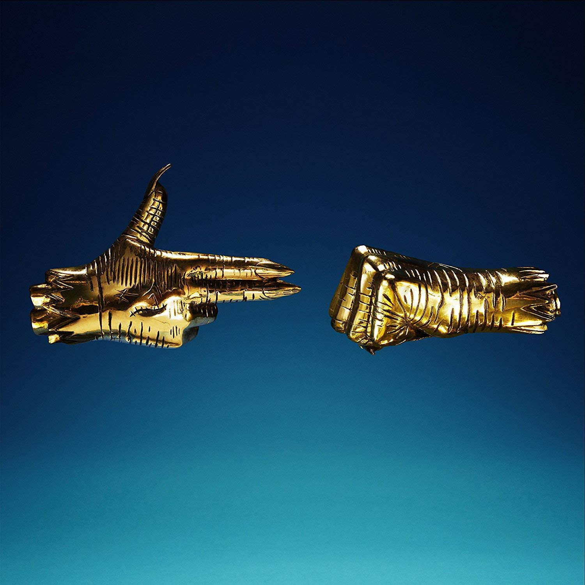

import { Slider, Button } from 'carbon-components-react';
import { ArrowUpRight24  } from '@carbon/icons-react';

import SliderJS1 from "../review/slider1"
import SliderJS2 from "../review/slider2"
import SliderJS3 from "../review/slider3"
import SliderJS4 from "../review/slider4"

import { Link } from "gatsby"

import Review1  from "../review/runthejewels4.mdx"

Album review

<h1 className="h1--no--margin">{props.pageContext.frontmatter.title}</h1>

<Link to="/best50/2017/">2017 Black Music Album Best No.27</Link>

<Row  className="image-card-group">
	<Column colMd={"3"} colLg={"4"} noGutterMdLeft="">
       <ImageCard>

 
</ImageCard>
	</Column>
	<Column colMd={"4"} colLg={"8"} noGutterMdLeft="">
	

	約2年振りとなるRun The Jewelsの第3弾。今回も無料DL, フィジカル,　デジタルで入手できる。骨、包帯と変化してきたCDジャケットの手のイラストは、今回、金の手袋をまとっているが何を意味しているのだろうか。 ポリティカルなメッセージを発信したり、ヘビーなだけでなく、そこそこキャッチーなところもあって、チャート1位も獲得している。ただ、ロック色の強いコアでストレート押しの強いHip-Hopはそのままで、3作目ということもあり、El-PとKiller Mikeのコンビネーションは完成の域にあるのではないか。Danny BrownやKamasi WashingtonといったGuestをうまく活かしていて、Trackにも相当工夫が施されているし、かなりの聴き応えだと思う。
	

	

	  <Button className="button-right-mergin"  href="https://amzn.to/2OUfsxq" kind="primary" size="small" renderIcon={ArrowUpRight24}>
      amazon.com
    </Button>
    <Button className="button-right-mergin"  href="https://amzn.to/2D3fvEJ" kind="secondary" size="small" renderIcon={ArrowUpRight24}>
      amazon.co.jp
    </Button>
	

	
	</Column>
</Row>
<Row >
	<Column colMd={"4"} colLg={"4"} noGutterMdLeft="">

    <h3>Score card</h3>
	<SliderJS1 value="4" />
    <SliderJS2 value="2" />
	<SliderJS3 value="2" />
    <SliderJS4 value="9" />

</Column>
<Column colMd={"4"} colLg={"8"} noGutterMdLeft="">

<h3>Producers</h3>

El-P(all)

<h3>Guests</h3>

Joi, Danny Brown, Tande Adebimpe, Boots, Trina, Kamasi Washington

</Column>
</Row>

<h3>Tracks</h3>

| No. |	 Title                                          |	 Composers                          |	 Performer                           | Time	 |
| --- |	----------------------------------------------- | ------------------------------------- | -------------------------------------- | ----- |
| 1	  |	Down                                           	| El-P / Killer Mike                   	| Run the Jewels feat. Joi               | 03:29 |
| 2	  |	Talk to Me                                     	| El-P / Killer Mike                   	| Run the Jewels                         | 02:31 |
| 3	  |	Legend Has It                                  	| El-P / Killer Mike                   	| Run the Jewels                         | 03:25 |
| 4	  |	Call Ticketron                                 	| El-P / Killer Mike                   	| Run the Jewels                         | 03:18 |
| 5	  |	Hey Kids                                       	| Danny Brown / El-P / Killer Mike     	| Run the Jewels feat. Danny Brown       | 03:11 |
| 6	  |	Stay Gold                                      	| El-P / Killer Mike                   	| Run the Jewels                         | 03:27 |
| 7	  |	Don't Get Captured                             	| El-P / Killer Mike                   	| Run the Jewels                         | 03:12 |
| 8	  |	Thieves! (Screamed the Ghost)                  	| Boots / El-P / Killer Mike           	| Run the Jewels feat. Tande Adebimpe    | 04:02 |
| 9	  |	2100                                           	| Boots / El-P / Killer Mike           	| Run the Jewels feat. Boots             | 04:01 |
| 10  |	Panther Like a Panther [Miracle Mix]           	| Boots / El-P / Killer Mike           	| Run the Jewels feat. Trina             | 03:41 |
| 11  |	Everybody Stay Calm                            	| El-P / Killer Mike                   	| Run the Jewels                         | 02:58 |
| 12  |	Oh Mama                                        	| El-P / Killer Mike                   	| Run the Jewels                         | 03:36 |
| 13  |	Thursday in the Danger Room                    	| El-P / Killer Mike                   	| Run the Jewels feat: Kamasi Washington | 04:22 |
| 14  |	A Report to Your Shareholders/Kill Your Masters	| El-P / Killer Mike / Zack de la Rocha	| Run the Jewels                         | 06:14 |

<h3>Other Reviews</h3>

<Row>
<Column colMd={3} colLg={3} noGutterMdLeft>
<Review1 />
</Column>
</Row>