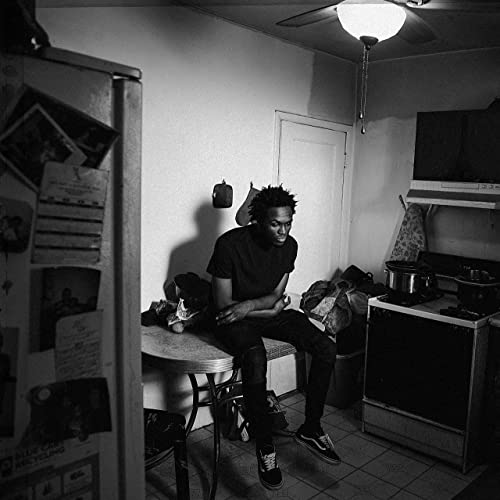

import { Slider, Button } from 'carbon-components-react';
import { ArrowUpRight24  } from '@carbon/icons-react';

import SliderJS1 from "../review/slider1"
import SliderJS2 from "../review/slider2"
import SliderJS3 from "../review/slider3"
import SliderJS4 from "../review/slider4"

import { Link } from "gatsby"

Album review

<h1 className="h1--no--margin">{props.pageContext.frontmatter.title}</h1>

<Link to="/best50/2018/">2018 Black Music Best No.15</Link>

<Row  className="image-card-group">
	<Column colMd={"3"} colLg={"4"} noGutterMdLeft="">
       <ImageCard>

 

</ImageCard>
	</Column>
	<Column colMd={"4"} colLg={"8"} noGutterMdLeft="">
	

	Chicago出身のRapper, Sabaの2ndアルバム。同郷のChance The Rapper(1曲ゲスト参加)の作品への参加経験もあり、最近のChicagoの流れを汲むオーガニックでストイックな作品。従弟であり、メンターでもある故John Waltに捧げられた作品でもある。生バンドで、Trumpetを多用したトラックは、MellowかつJazzyでかなり心地よく、メロディーはメランコリックで切ない。ただ、陰鬱な感じではないので、ゆったりとした気分で聴ける。音楽一家出身で父親がR&B歌手とのことで、ネオソウル的でもあり、音楽の素養がある人が作った印象を受ける。
	

	

	  <Button className="button-right-mergin"  href="https://amzn.to/2NbzwKX" kind="primary" size="small" renderIcon={ArrowUpRight24}>
      amazon.com
    </Button>
    <Button className="button-right-mergin"  href="https://amzn.to/2Cf9MuT" kind="secondary" size="small" renderIcon={ArrowUpRight24}>
      amazon.co.jp
    </Button>
	

	
	</Column>
</Row>
<Row >
	<Column colMd={"4"} colLg={"4"} noGutterMdLeft="">

    <h3>Score card</h3>
	<SliderJS1 value="2" />
    <SliderJS2 value="1" />
	<SliderJS3 value="1" />
    <SliderJS4 value="9" />

</Column>
<Column colMd={"8"} colLg={"8"} noGutterMdLeft="">

<h3>Producers</h3>

daedaePIVOT, Daoud and Saba(all)

<h3>Guests</h3>

theMIND, Kaina, Chance The Rapper

</Column>
</Row>

<h3>Tracks</h3>

| No. |	 Title               |	 Performer                  | Time	|
| --- |	-------------------- | ---------------------------- | ----- |
| 1	  |	Busy/Sirens          | Saba feat. theMIND          	| 05:29	|
| 2	  |	Broken Girls         | Saba                        	| 04:37	|
| 3	  |	Life                 | Saba                        	| 02:42	|
| 4	  |	Calligraphy          | Saba                        	| 03:04	|
| 5	  |	Fighter              | Saba feat. Kaina            	| 04:42	|
| 6	  |	Smile                | Saba                        	| 03:28	|
| 7	  |	Logout               | Saba feat. Chance The Rapper	| 02:30	|
| 8	  |	Grey                 | Saba                        	| 04:00	|
| 9	  |	Prom/King            | Saba                        	| 07:31	|
| 10  |	Heaven All Around Me | Saba                        	| 03:32	|
