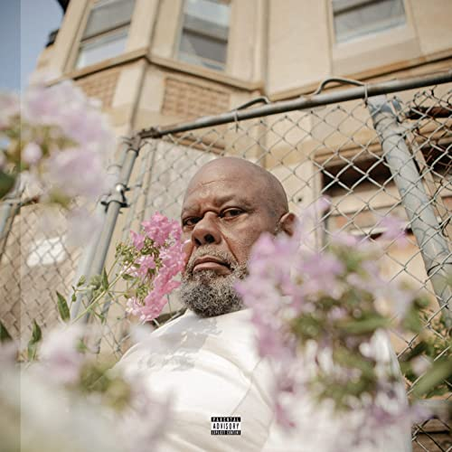

import { Slider, Button } from "@carbon/react";
import { ArrowUpRight } from "@carbon/icons-react";

import SliderJS1 from "../review/slider1";
import SliderJS2 from "../review/slider2";
import SliderJS3 from "../review/slider3";
import SliderJS4 from "../review/slider4";
import AdvJS2 from "../review/adv2";
import AdvJS3 from "../review/adv3";

import { Link } from "gatsby";

import Review1  from "../review/saba1.mdx"

Album Review

<h1 className="h1--no--margin">{props.pageContext.frontmatter.title}</h1>

  <Link to="/best50/2022/">2022 Black Music Best No.41</Link>

<Row className="image-card-group">
	<Column colMd={3} colLg={4} noGutterMdLeft="">
    <ImageCard>

</ImageCard>
	</Column>
	<Column colMd={4} colLg={8} noGutterMdLeft="">
	

	  前作で高評価を得たSabaの4年ぶりとなる3rdアルバム。その前作のMellowさは残しつつ、Jazzyなところは大分薄れて、Folkyでオーガニックな印象を受ける。
     前作同様、本人も属するHip-Hop Collectiveである、Pivot Gangのメンバー中心にProduceされたTrackは、どれも耳障りが良く、Popで温かみがあり、お洒落な感じでもある。ただ、Trapっぽい曲もあり、トレンドへも一定の目配せをしているようだ。
     本人のRapは、やや緩めで唄うようなフローが増えたのも特徴的。身内だけでなく、Krazie Bone、Black Thoughtといった大先輩もGuestに迎え、バリエーションを加えている。
  

  

	  <Button className="button-right-mergin" href="https://amzn.to/3PZ3nFI" renderIcon={ArrowUpRight} size='sm' kind='primary'>
      amazon.com
    </Button>
    <Button className="button-right-mergin" href="https://amzn.to/3GQONfb" renderIcon={ArrowUpRight} size='sm' kind='secondary'>
      amazon.co.jp
    </Button>
    <Button className="button-right-mergin" href="https://apple.co/39cLGlg" renderIcon={ArrowUpRight} size='sm' kind='tertiary'>
      apple music
    </Button>
    <AdvJS2/>
	

	</Column>
</Row>
<Row >
  <Column colMd={4} colLg={4} noGutterMdLeft="">
    

      <h3>Score card</h3>
	    <SliderJS1 value="2" />
      <SliderJS2 value="2" />
	    <SliderJS3 value="1" />
      <SliderJS4 value="9" />
    

  </Column>
  <Column colMd={4} colLg={8} noGutterMdLeft="">
    

      <h3>Producers</h3>
      

        daedaePIVOT, Daoud and Cheflee(1)
         daedaePIVOT and Daoud(2,5,6)
         daedaePIVOT, Daoud and Saba(3,4,10,11,12)
         daedaePIVOT, Daoud, Day Wave and Saba(7)
         Daoud, Jacob Rochester and Monte Booker(8)
         daedaePIVOT, Daoud, Phoelix and Saba(9)
         Nascent and Daoud(13)
         daedaePIVOT, Daoud, Saba and Cheflee(14)
      

      <h3>Guests</h3>
      

        Cheflee,, G Herbo, Eryn Allen Kane, Daoud, Krayzie Bone, 6lack Smino, Mereba, Pivot Gang, Benjamin Earl Turner, Fousheé, Day Wave, Black Thought
      

    

  </Column>
</Row>

<h3>Tracks</h3>

| No. | Title                                | Composers                                                                                                                                             | Performer                                  | Time  |
| --- | ------------------------------------ | ----------------------------------------------------------------------------------------------------------------------------------------------------- | ------------------------------------------ | ----- |
| 1   | Free Samples                         | Tahj Chandler, Imari "Cheflee" Mubarak, Jerrel "Joseph Chilliams" Chandler, Daoud Anthony                                                             | Saba feat. Cheflee                         | 02:07 |
| 2   | One Way or Every Nigga With a Budget | Tahj Chandler, Daoud Anthony, Jerrel "Joseph Chilliams" Chandler                                                                                      | Saba                                       | 02:45 |
| 3   | Survivor's Guilt                     | Tahj Chandler, Herbert Wright II, Jerrel "Joseph Chilliams" Chandler, Daoud Anthony                                                                   | Saba feat. G Herbo                         | 03:42 |
| 4   | An Interlude Called 'Circus          | Tahj Chandler, Eryn Allen Kane, Jerrel "Joseph Chilliams" Chandler, Daoud Anthony                                                                     | Saba feat. Eryn Allen Kane                 | 01:02 |
| 5   | Fearmonger                           | Tahj Chandler, Daoud Anthony, Jerrel "Joseph Chilliams" Chandler                                                                                      | Saba feat. Daoud                           | 03:41 |
| 6   | Come My Way                          | Tahj Chandler, Daoud Anthony Henderson, Jerrel "Joseph Chilliams" Chandler, Daoud Anthony                                                             | Saba feat. Krayzie Bone                    | 03:10 |
| 7   | Still                                | Tahj Chandler. Ricardo Valentine, Jr.Christopher Smith, Jr., Jerrel "Joseph Chilliams" Chandler, Daoud Anthony, Sir Darryl Farris, Carl Lewis         | Saba feat. 6lack, Smino                    | 03:45 |
| 8   | A Simpler Time                       | Tahj Chandler, Marian Mereba, Daoud Anthony, Jacob Rochester, Monte Booker                                                                            | Saba feat. Mereba                          | 03:33 |
| 9   | Soldier                              | Tahj Chandler, Jerrel "Joseph Chilliams" Chandler, Daoud Anthony, Jimmy Hood, Martin Anderson                                                         | Saba feat. Pivot Gang                      | 03:05 |
| 10  | If I Had a Dollar                    | Tahj Chandler, Benjamin Earl Turner, Jerrel "Joseph Chilliams" Chandler, Daoud Anthony                                                                | Saba feat. Benjamin Earl Turner            | 03:13 |
| 11  | Stop That                            | Tahj Chandler, Jerrel "Joseph Chilliams" Chandler, Daoud Anthony                                                                                      | Saba                                       | 02:18 |
| 12  | Make Believe                         | Tahj Chandler, Brittany Fousheé, Daoud Anthony, Jerrel "Joseph Chilliams" Chandler, LaRena Chandler                                                   | Saba feat. Fousheé                         | 03:41 |
| 13  | 2012                                 | Tahj Chandler                                                                                                                                         | Saba feat. Day Wave                        | 04:20 |
| 14  | Few Good Things                      | Tahj Chandler, Tariq Trotter, Eryn Allen Kane, Imari "Cheflee" Mubarak, Jerrel "Joseph Chilliams" Chandler, Daoud Anthony, Deborah Lewis, Carl. Lewis | Saba feat. Black Thought , Eryn Allen Kane | 07:08 |

<AdvJS3 />

<h3>Other Reviews</h3>

<Row>
  <Column colMd={3} colLg={3} noGutterMdLeft>
    <Review1 />
  </Column>
</Row>

<AdvJS3 />