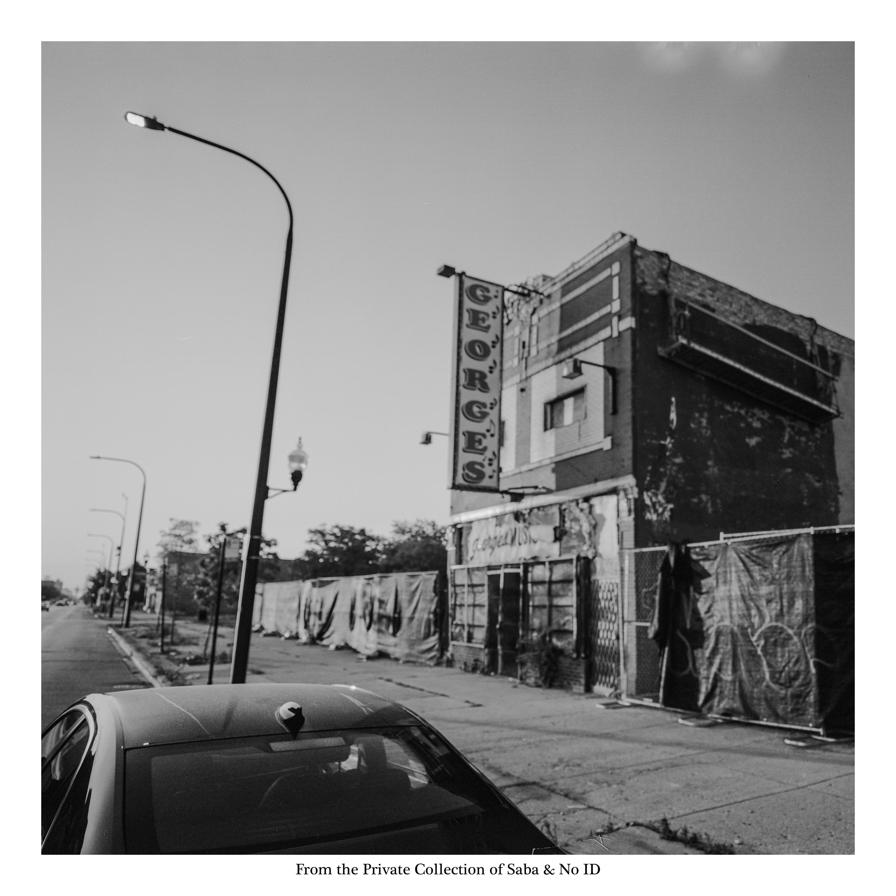

import { Slider, Button } from "@carbon/react";
import { ArrowUpRight } from "@carbon/icons-react";

import SliderJS1 from "../review/slider1";
import SliderJS2 from "../review/slider2";
import SliderJS3 from "../review/slider3";
import SliderJS4 from "../review/slider4";
import AdvJS2 from "../review/adv2";
import AdvJS3 from "../review/adv3";

import { Link } from "gatsby";

import Review2 from "../review/saba2.mdx";
import Review1 from "../review/saba1.mdx";

Album Review

<h1 className="h1--no--margin">{props.pageContext.frontmatter.title}</h1>

  <Link to="/best50/2025/">2025 Black Music Best No.26</Link>

<Row className="image-card-group">
	<Column colMd={3} colLg={4} noGutterMdLeft="">
    <ImageCard>

</ImageCard>
	</Column>
	<Column colMd={4} colLg={8} noGutterMdLeft="">
	  

	    ともにシカゴ出身のSabaとNo IDがタッグを組んだシカゴ愛溢れる作品。オールドソウルのサンプリングをメインにしたスローなTrackにSabaによるラブソングやコンシャスなRapがマッチしており、穏やかな曲も多くて、何とも心地よい。
       Vocal Guestによるソウルフルな唄声も同じく曲に溶け込んでいる。ただ、テーマやコンセプトを決めずに、楽しみながらできあがった曲の集合体ということらしく、これはタイトルにも現れている。ふたりの対話をスナップショットした作品集とも言えそうだ。
    

    

	    <Button className="button-right-mergin" href="https://amzn.to/4frgfRW" renderIcon={ArrowUpRight} size='sm' kind='primary'>
        amazon.com
      </Button>
      <Button className="button-right-mergin" href="https://amzn.to/3H8lV6V" renderIcon={ArrowUpRight} size='sm' kind='secondary'>
        amazon.co.jp
      </Button>
      <Button className="button-right-mergin" href="https://apple.co/47kWRnK" renderIcon={ArrowUpRight} size='sm' kind='tertiary'>
        apple music
      </Button>
      <AdvJS2/>
	  

	</Column>
</Row>
<Row >
  <Column colMd={4} colLg={4} noGutterMdLeft="">
    

      <h3>Score card</h3>
	    <SliderJS1 value="2" />
      <SliderJS2 value="2" />
	    <SliderJS3 value="1" />
      <SliderJS4 value="9" />
    

  </Column>
  <Column colMd={4} colLg={8} noGutterMdLeft="">
    

      <h3>Producers</h3>
      

        No ID(1,5,7,8,15)
         Saba and No ID(2,10,14)
         No ID and Greg Phillinganes(3)
         No ID and Maneesh(4)
         Saba, No ID, Maneesh, daedaePIVOT and Berlo(6)
         Saba, No ID and Elijah Fox(9)
         Saba, No ID, Tommy Skillfinger and Daoud(11)
         Saba, No ID and Imari Mubarak(12)
         Saba, No ID and Daoud(13)
      

      <h3>Guests</h3>
      

        BJ the Chicago Kid, Eryn Allen Kane, Raphael Saadiq, Kelly Rowland, MFnMelo, Madison McFerrin, Ogi, Jordan Ward, Ibeyi, oseph Chilliams, Jean Deaux, , Frsh Waters, TRU, Love Mansuy, Ogi, Smino
      

    

  </Column>
</Row>

<h3>Tracks</h3>

| No. | Title                      | Composers                                                                     | Performer                                                | Time  |
| --- | -------------------------- | ----------------------------------------------------------------------------- | -------------------------------------------------------- | ----- |
| 1   | Every Painting Has a Price | Saba, BJ the Chicago Kid, No IDSaba, BJ the Chicago Kid, No ID                | Saba and No ID feat. BJ the Chicago Kid, Eryn Allen Kane | 03:33 |
| 2   | Breakdown                  | Saba, No ID                                                                   | Saba and No ID                                           | 02:46 |
| 3   | Crash                      | Saba, No ID, Greg Phillinganes, Raphael Saadiq                                | Saba and No ID feat. Raphael Saadiq, Kelly Rowland       | 03:28 |
| 4   | Woes of the World          | Saba, No ID, Daoud                                                            | Saba and No ID                                           | 03:31 |
| 5   | Stop Playing With Me       | Saba, Jimmy Hood, No ID                                                       | Saba and No ID                                           | 01:03 |
| 6   | Westside Bound Pt. 4       | Saba, No ID, Maneesh, Martin Anderson, Reese, Dylan C Frank, Leo Berliant     | Saba and No ID feat. MFnMelo                             | 04:06 |
| 7   | head.rap                   | Saba, No ID, Madison McFerrin, Ogi, Jordan Ward                               | Saba and No ID feat. Madison McFerrin, Ogi, Jordan Ward  | 03:10 |
| 8   | Acts 1.5                   | Saba, No ID                                                                   | Saba and No ID                                           | 01:59 |
| 9   | Reciprocity                | Saba, No ID, Lisa-Kaindé Diaz, Naomi Diaz                                     | Saba and No ID feat. Ibeyi                               | 01:29 |
| 10  | Stomping                   | Saba, No ID                                                                   | Saba and No ID                                           | 01:55 |
| 11  | BIG PICTURE                | Saba, No ID, Chandlar, Daoud, Ogi                                             | Saba and No ID feat. Ogi                                 | 02:40 |
| 12  | 30secchop                  | Saba, No ID, Philip “Tru” Bucknor, Jean Deaux, Jerrel Chandler, Imari Mubarak | Saba and No ID feat. Joseph Chilliams, Jean Deaux        | 02:28 |
| 13  | How to Impress God         | Saba, No ID                                                                   | Saba and No ID                                           | 03:15 |
| 14  | She Called It              | Saba, No ID, Daoud, Jimmy Hood                                                | Saba and No ID feat. Frsh Waters, TRU                    | 03:13 |
| 15  | a FEW songs                | Saba, No ID, Smino, Love Mansuy, Lisa-Kaindé Diaz, Naomi Diaz                 | Saba and No ID feat. Love Mansuy, Ogi, Smino             | 03:10 |

<h3>Other Reviews</h3>

<Row>
  <Column colMd={3} colLg={3} noGutterMdLeft>
    <Review2 />
  </Column>
  <Column colMd={3} colLg={3} noGutterMdLeft>
    <Review1 />
  </Column>
</Row>

<AdvJS3 />
