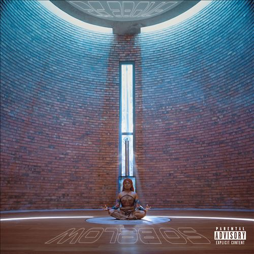

import { Slider, Button } from "@carbon/react";
import { ArrowUpRight } from "@carbon/icons-react";

import SliderJS1 from "../review/slider1";
import SliderJS2 from "../review/slider2";
import SliderJS3 from "../review/slider3";
import SliderJS4 from "../review/slider4";
import AdvJS2 from "../review/adv2";
import AdvJS3 from "../review/adv3";

import { Link } from "gatsby";

Album review

<h1 className="h1--no--margin">{props.pageContext.frontmatter.title}</h1>

<Row  className="image-card-group">
	<Column colMd={3} colLg={4} noGutterMdLeft="">
       <ImageCard>

</ImageCard>
	</Column>
	<Column colMd={4} colLg={8} noGutterMdLeft="">
		

			Zambia出身で、Australiaで活動するSinger / Rapper / Song Writer, Sampa The Greatの3年ぶりとなる2ndアルバム。既に29歳ということで、作品の充実度は高く、貫禄も感じさせる。
			 サウンドは、全体を通して、AfricanとNeo Soul, Hip-Hopをミックスしたユニークなもので、曲によって、これらの要素のバランスが変えているので、トーンは変わらずとも、バラエティに富んでいて飽きさせない。
			 リズムはトライバルなものが多く、一部ではロックっぽさも加えたり、メローで温まる⑨などもあって、一層の面白さを感じさせる。
			 Sampaも曲調によって、唄い方も変えたり、Rapにスイッチしたりと、高いスキルを披露している。Guestも様々だが、Denzal CurryのRapが力強くて印象に残った。
		

		

		  <Button className="button-right-mergin"  href="https://amzn.to/3ZJEfIl" renderIcon={ArrowUpRight} size='sm' kind='primary'>
  	    amazon.com
  	  </Button>
  	  <Button className="button-right-mergin"  href="https://amzn.to/3ZMFhmJ" renderIcon={ArrowUpRight} size='sm' kind='secondary'>
  	    amazon.co.jp
  	  </Button>
			<Button className="button-right-mergin"  href="https://apple.co/3tuU5KB" renderIcon={ArrowUpRight} size='sm' kind='tertiary'>
  	    apple music
  	  </Button>
			<AdvJS2/>
		

	</Column>
</Row>
<Row >
	<Column colMd={4} colLg={4} noGutterMdLeft="">
		

		  <h3>Score card</h3>
			<SliderJS1 value="3" />
		  <SliderJS2 value="3" />
			<SliderJS3 value="1" />
		  <SliderJS4 value="9" />
		

	</Column>
	<Column colMd={8} colLg={8} noGutterMdLeft="">
		

			<h3>Producers</h3>
			

				Magnus “Mag44” Mando(1,3,6,12)
				 Jeff Kleinman, Powers Pleasant and Mason Sacks (2)
				 Magnus “Mag44” Mando, Solomon "Plate" Moyo and Sampa The Great(4)
				 Magnus “Mag44” Mando and Sampa The Great(5,7,11)
				 Magnus “Mag44” Mando and Solomon "Plate" Moyo(8)
				 Powers Pleasant, Dreamlife and Magnus “Mag44” Mando(9)
			

			<h3>Guests</h3>
			

			

		

	</Column>
</Row>

<h3>Tracks</h3>

| Title             | Composers                                                                            | Performer                                            | Time  |
| ----------------- | ------------------------------------------------------------------------------------ | ---------------------------------------------------- | ----- |
| Shadows           | Magnus “Mag44” Mando / Sampa Tembo                                                   | Sampa the Great                                      | 04:08 |
| Lane              | Denzel Curry / Jeff Kleinman / Powers Pleasant / Mason Sacks / Sampa Tembo           | Sampa the Great feat: Denzel Curry / Powers Pleasant | 02:42 |
| Never Forget      | Kondwani Kaira / Magnus “Mag44” Mando / Taonga Nyirongo / Mwanje Tembo / Sampa Tembo | Sampa the Great feat: Chef 187 / Mwanje / Tio Nason  | 03:37 |
| Mask On           | Magnus “Mag44” Mando / Solomon Moyo / Sampa Tembo / Jo-Vaughn Virginie               | Sampa the Great feat: Joey Bada$$                    | 02:52 |
| Bona              | Magnus “Mag44” Mando / Sampa Tembo                                                   | Sampa the Great                                      | 02:40 |
| Can I Live        | ?Emmanuel Kangwa "Jagari" Chanda / Magnus “Mag44” Mando / Sampa Tembo                | Sampa the Great feat: W.I.T.C.H.                     | 04:14 |
| Imposter Syndrome | Magnus “Mag44” Mando / Samuel Nyambe / James Sakala / Sampa Tembo                    | Sampa the Great feat: James Sakala                   | 04:17 |
| Tilibobo          | Magnus “Mag44” Mando / Solomon Moyo / Sampa Tembo                                    | Sampa the Great                                      | 03:04 |
| Lo Rain           | Dreamlife / Powers Pleasant / Mwanje Tembo / Sampa Tembo                             | Sampa the Great feat: Mwanje                         | 03:32 |
| IDGAF             | Kwadwo Adu Genfi Amponsah / Magnus “Mag44” Mando / Sampa Tembo                       | Sampa the Great feat: Kojey Radical                  | 04:08 |
| Let Me Be Great   | Ang?lique Kidjo / Magnus “Mag44” Mando / Sammy Masta / Sampa Tembo                   | Sampa the Great feat: Angélique Kidjo                | 03:54 |

<AdvJS3 />
