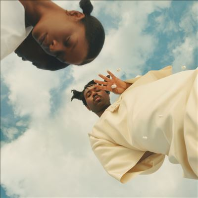

import { Slider, Button } from "@carbon/react";
import { ArrowUpRight } from "@carbon/icons-react";

import SliderJS1 from "../review/slider1";
import SliderJS2 from "../review/slider2";
import SliderJS3 from "../review/slider3";
import SliderJS4 from "../review/slider4";
import AdvJS2 from "../review/adv2";
import AdvJS3 from "../review/adv3";

import { Link } from "gatsby";

import Review1 from "../review/sampha1.mdx";

Album review

<h1 className="h1--no--margin">{props.pageContext.frontmatter.title}</h1>

  <Link to="/best50/2023/">2023 Black Music Album Best No.3</Link>

<Row  className="image-card-group">
	<Column colMd={3} colLg={4} noGutterMdLeft="">
       <ImageCard>

</ImageCard>
	</Column>
	<Column colMd={4} colLg={8} noGutterMdLeft="">
		

			Samphaの約6年半ぶりの2ndアルバム。デビュー作で成功したにも拘わらず、この間、コロナなどもあって、音楽活動はスローダウンしてたとのことで、勿体ない気もするが、良質な作品で戻ってきてくれた。
			 タイトルはシェラレオネの祖父の名前であり、自身のミドルネームでもあるとのことだが、特にルーツ志向が強いわけでもなさそうだ。
			 静謐で抑え気味のゆったりとしたエレクトリックソウルをベースに、UK Grage, Jungleが加わり、Jazz, Hip-Hop, 西アフリカの音楽などもとりいれた独特のサウンドが展開されている。
			 Produceではスペイン人のEl Guinchoのサポートを得て、Guest陣もLéa Sen, Sheila Maurice-Grey, Yaeji, Morgan Simpson, Ibeyiと多彩でグローバルではあるが、Samphaの作る音楽にパーツ的に組み込まれている感じだ。また、ところどころSpoken Wordや荘厳なコーラスが使われてたりして、Lyricを含め、トータルとしてSpritualな印象を受ける作品だ。
		

		

		  <Button className="button-right-mergin"  href="https://amzn.to/48qPsB2" renderIcon={ArrowUpRight} size='sm' kind='primary'>
  	    amazon.com
  	  </Button>
  	  <Button className="button-right-mergin"  href="https://amzn.to/48fmtA5" renderIcon={ArrowUpRight} size='sm' kind='secondary'>
  	    amazon.co.jp
  	  </Button>
			<Button className="button-right-mergin"  href="https://apple.co/3vsvOGl" renderIcon={ArrowUpRight} size='sm' kind='tertiary'>
  	    apple music
  	  </Button>
			<AdvJS2/>
		

	</Column>
</Row>
<Row >
	<Column colMd={4} colLg={4} noGutterMdLeft="">
		

    	<h3>Score card</h3>
			<SliderJS1 value="5" />
    	<SliderJS2 value="1" />
			<SliderJS3 value="2" />
    	<SliderJS4 value="9" />
		

	</Column>
	<Column colMd={8} colLg={8} noGutterMdLeft="">
		

			<h3>Producers</h3>
			

				Sampha(1,3,4,5,6,7,9,10,12,13,14)
				Sampha and El Guincho(2,8,11)
			

			<h3>Guests</h3>
			

				Léa Sen, Sheila Maurice-Grey, Kathy Yaeji Lee, Morgan Simpson, Ibeyi
			

		

	</Column>
</Row>

<h3>Tracks</h3>

| No. | Title                                | Composers                                                              | Performer           | Time  |
| --- | ------------------------------------ | ---------------------------------------------------------------------- | ------------------- | ----- |
| 1   | Stereo Colour Cloud (Shaman's Dream) | Giles King-Ashong / Sampha Sisay                                       | Sampha              | 02:58 |
| 2   | Spirit 2.0                           | Yussef Dayes / Pablo Diaz-Reixa / Kathy Yaeji Lee / Sampha Sisay       | Sampha              | 04:49 |
| 3   | Dancing Circles                      | Pablo Diaz-Reixa / Sampha Sisay                                        | Sampha              | 03:53 |
| 4   | Suspended                            | Sampha Sisay                                                           | Sampha              | 03:05 |
| 5   | Satellite Business                   | Sampha Sisay                                                           | Sampha              | 01:24 |
| 6   | Jonathan L. Seagull                  | Mansur Brown / Laura Groves / Ben Reed / Morgan Simpson / Sampha Sisay | Sampha              | 04:34 |
| 7   | Inclination Compass (Tenderness)     | Sampha Sisay                                                           | Sampha              | 03:08 |
| 8   | Only                                 | Pablo Diaz-Reixa / Sampha Sisay                                        | Sampha              | 02:49 |
| 9   | Time Piece                           | Ibeyi / Sampha Sisay                                                   | Sampha              | 00:20 |
| 10  | Can't Go Back                        | Ibeyi / Giles King-Ashong / Sheila Maurice-Grey / Sampha Sisay         | Sampha              | 03:41 |
| 11  | Evidence                             | Pablo Diaz-Reixa / Sampha Sisay                                        | Sampha              | 03:17 |
| 12  | Wave Therapy                         | Sampha Sisay                                                           | Sampha              | 00:28 |
| 13  | What if You Hypnotise Me             | Léa Sen / Sampha Sisay                                                 | Sampha feat. Léa Se | 03:38 |
| 14  | Rose Tint                            | Jonathan Geyevu / Sampha Sisay                                         | Sampha              | 02:48 |

<h3>Other Reviews</h3>

<Row>
  <Column colMd={3} colLg={3} noGutterMdLeft>
    <Review1 />
  </Column>
</Row>

<AdvJS3 />