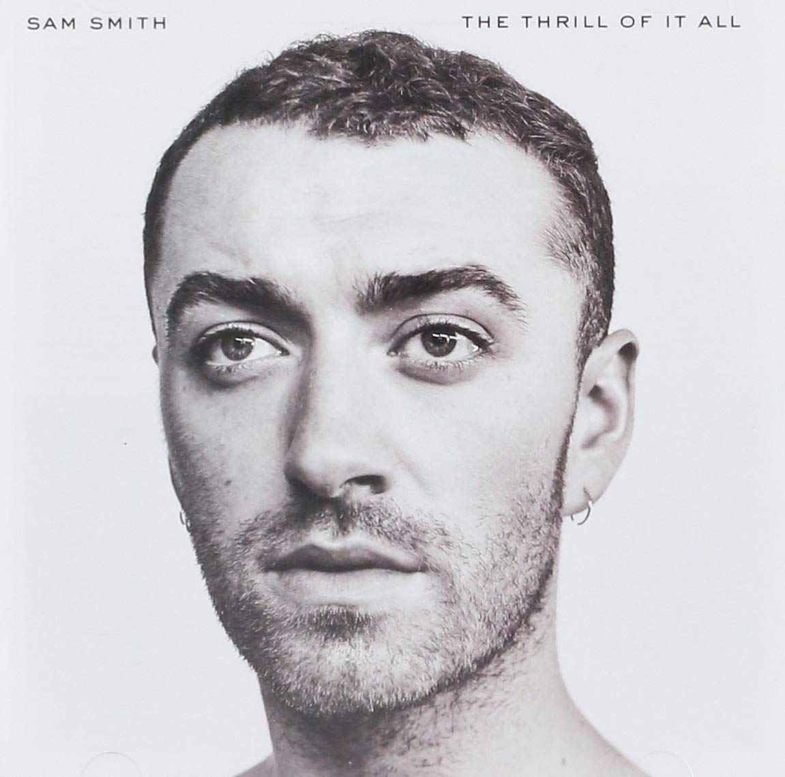

import { Slider, Button } from 'carbon-components-react';
import { ArrowUpRight24  } from '@carbon/icons-react';

import SliderJS1 from "../review/slider1"
import SliderJS2 from "../review/slider2"
import SliderJS3 from "../review/slider3"
import SliderJS4 from "../review/slider4"

import { Link } from "gatsby"

CD review

<h1 className="h1--no--margin">{props.pageContext.frontmatter.title}</h1>

<Link to="/best50/2020/">2020 Black Music Best No.5</Link>

<Row  className="image-card-group">
	<Column colMd={"3"} colLg={"4"} noGutterMdLeft="">
       <ImageCard>

 
</ImageCard>
	</Column>
	<Column colMd={"4"} colLg={"8"} noGutterMdLeft="">
	

	デビュー作が特大ヒットとなり、グラミーも多数獲得したSam Smithの3年ぶりの2作目。その間の日記と本人もいっているように、Lyricはパーソナルなものだし、カミングアウトしたゲイを前提としたものもある。前作からの流れを踏襲したオーガニックでアコースティックな作品ではあるが、Gospelっぽい曲があったり、John Legendかと思うような太めの低音を披露したりと広がりを見せている。お馴染みのJimmy NapesとSteve Fitzmauriceがメインプロデューサーではあるが、そういったTrackでは、Emile Haynie、TimbalandといったHip-Hop系Producerが控えめに色を出している。本人のVocalも厚みと表現力が増していて、着実な成長が判る。冬の帰り道に聴くと、ほんと、沁みてきます。
	

	

	  <Button className="button-right-mergin"  href="https://amzn.to/39mn853" kind="primary" size="small" renderIcon={ArrowUpRight24}>
      amazon.com
    </Button>
    <Button className="button-right-mergin"  href="https://amzn.to/39mINdB" kind="secondary" size="small" renderIcon={ArrowUpRight24}>
      amazon.co.jp
    </Button>
	

	
	
	</Column>
</Row>
<Row >
	<Column colMd={"4"} colLg={"4"} noGutterMdLeft="">

    <h3>Score card</h3>
	<SliderJS1 value="5" />
    <SliderJS2 value="1" />
	<SliderJS3 value="1" />
    <SliderJS4 value="9" />

</Column>
<Column colMd={"8"} colLg={"8"} noGutterMdLeft="">

<h3>Producers</h3>

Jimmy Napes, Steve Fitzmaurice and Stargate(1)
 Malay, Jimmy Napes and Steve Fitzmaurice(2)
 Jimmy Napes, Steve Fitzmaurice and Tyler Johnson(3)
 Jimmy Napes and Steve Fitzmaurice(4,5,8)
 Steve Fitzmaurice and Brendan Grieve(6)
 Emile Haynie, Jimmy Napes and Steve Fitzmaurice(7)
 Tyler Johnson(9)
 Timbaland Jimmy Napes and Steve Fitzmaurice(10)

<h3>Guests</h3>

Yebba

</Column>
</Row>

<h3>Tracks</h3>

| No. |	 Title                  |	 Composers                                                                                                                                                                                                      |	 Performer         	| Time	|
| --- |	----------------------- | ----------------------------------------------------------------------------------------------------------------------------------------------------------------------------------------------------------------- | ---------------------	| ----- |
| 1	  |	Too Good at Goodbyes   	| Mikkel Storleer Eriksen / Tor Erik Hermansen / James Napier / Sam Smith                                                                                                                                          	| Sam Smith            	| 03:36 |
| 2	  |	Say It First           	| James Ryan Ho / James Napier / Sam Smith                                                                                                                                                                         	| Sam Smith            	| 04:12 |
| 3	  |	One Last Song          	| Tyler Johnson / James Napier / Charles Emanuel Smalls / Sam Smith                                                                                                                                                	| Sam Smith            	| 03:15 |
| 4	  |	Midnight Train         	| James Ryan Ho / James Napier / Sam Smith                                                                                                                                                                         	| Sam Smith            	| 03:31 |
| 5	  |	Burning                	| Jason "Pooh Bear" Boyd / Jimmy Giannos / Dominic Jordan / Sam Smith                                                                                                                                              	| Sam Smith            	| 03:29 |
| 6	  |	Him                    	| Brendan Grieve / Reuben James / Sam Smith                                                                                                                                                                        	| Sam Smith            	| 03:14 |
| 7	  |	Baby, You Make Me Crazy	| Robert "Kool" Bell / Ronald Bell / George "Funky" Brown / Emile Haynie / Robert "Spike" Mickens / James Napier / Gene Redd / Claydes Smith / Sam Smith / Woody Sparrow / Dennis "D.T." Thomas / Richard Westfield	| Sam Smith            	| 03:31 |
| 8	  |	No Peace               	| James Napier / Abbey Smith / Sam Smith                                                                                                                                                                           	| Sam Smith feat. Yebba	| 04:49 |
| 9	  |	Palace                 	| Tyler Johnson / Camaron Ochs / Sam Smith                                                                                                                                                                         	| Sam Smith            	| 03:10 |
| 10  |	Pray                   	| Larrance Dopson / Timothy Mosley / James Napier / Darryl Pearson / Sam Smith / Jose Valasquez                                                                                                                    	| Sam Smith            	| 04:00 |
