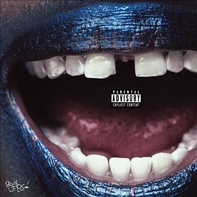

import { Slider, Button } from "@carbon/react";
import { ArrowUpRight } from "@carbon/icons-react";

import SliderJS1 from "../review/slider1";
import SliderJS2 from "../review/slider2";
import SliderJS3 from "../review/slider3";
import SliderJS4 from "../review/slider4";
import AdvJS2 from "../review/adv2";
import AdvJS3 from "../review/adv3";

import { Link } from "gatsby";

import Review1 from "../review/schoolboyq3.mdx";

Album review

<h1 className="h1--no--margin">{props.pageContext.frontmatter.title}</h1>

<Row  className="image-card-group">
	<Column colMd={3} colLg={4} noGutterMdLeft="">
       <ImageCard>

</ImageCard>
	</Column>
	<Column colMd={4} colLg={8} noGutterMdLeft="">
		

			Schoolboy Qの2年ぶりのフィジカル2作目。2016年夏にリリースされ、今回もチャートアクションは好調だった。社会派Rapが評価される昨今にあって、あくまでもWest Sideらしい、Gangsta Rapであり、全編シリアスで物悲しい曲が続く。打ち込み、サンプリング中心の如何にもな前半に比べると、後半はジャジーであったり、コミカルであったり、ダウナーであったりと、サウンド面で興味深いTrackが配されている。
		

		

		  <Button className="button-right-mergin"  href="https://amzn.to/4fWbv6S" renderIcon={ArrowUpRight} size='sm' kind='primary'>
  	    amazon.com
  	  </Button>
  	  <Button className="button-right-mergin"  href="https://amzn.to/3XrDJiN" renderIcon={ArrowUpRight} size='sm' kind='secondary'>
  	    amazon.co.jp
  	  </Button>
			<Button className="button-right-mergin"  href="https://apple.co/3X6actA" renderIcon={ArrowUpRight} size='sm' kind='tertiary'>
				apple music
			</Button>
			<AdvJS2/>
		

	</Column>
</Row>
<Row >
	<Column colMd={4} colLg={4} noGutterMdLeft="">
		

		  <h3>Score card</h3>
			<SliderJS1 value="1" />
		  <SliderJS2 value="1" />
			<SliderJS3 value="2" />
		  <SliderJS4 value="9" />
		

	</Column>
	<Column colMd={8} colLg={8} noGutterMdLeft="">
		

			<h3>Producers</h3>
			

				Taebeast and Jlbs(1)
				 Beat Buther, Mario Luciano and Taebeast(2)
				 Kal Banx and Jlbs(3)
				 Taebeast, Mario Luciano and Jason Wool(4,10)
				 Cardo, Johnny Juliano and Yex(5,9)
				 Orel Yoel, Devin Marik and Jlbs(6)
				 Mike Hector, Lawthegreat and Taebeast(7)
				 Taebeast, Mario Luciano, Jason Wool and Uzimaki(8)
				 Cardo, Devin Marik, Orel Yoel, Johnny Juliano and Yex(11)
				 Childish Major, DJ Kahlil and Daniel Seeff(12)
				 Willgell and Taebeast(13)
				 The Alchemist and FU(14)
				 Taebeast and Uzimaki(15)
				 Jlbs(16)
				 Taebeast, Kal Banx and Flip_00(17)
				 Devin Marik and Frollen Music Library(18)
			

			<h3>Guests</h3>
			

				Rico Nasty, Devin Malik, Lance Skiiiwalker, AzChike, Freddie Gibbs, Ab-Soul, Jozzy, Childish Major
			

		

	</Column>
</Row>

<h3>Tracks</h3>

| No. | Title          | Composers                                                                                                                         | Performer                                         | Time  |
| --- | -------------- | --------------------------------------------------------------------------------------------------------------------------------- | ------------------------------------------------- | ----- |
| 1   | Funny Guy      | Quincy Matthew Hanley / Charles Hemphill / Donte Perkins / Jason Pounds                                                           | ScHoolboy Q feat: Rico Nasty                      | 02:38 |
| 2   | Pop            | Matthew Day / Eliot Dubock / Quincy Matthew Hanley / Jozzy / Maria Cecilia Simone Kelly / Mario Luciano / Donte Perkins           | ScHoolboy Q                                       | 03:16 |
| 3   | THank god 4 me | Paul Beauregard / Kalon Berry / Quincy Matthew Hanley / Jordan Houston / Dion Norman / Derrick Ordogne / Jason Pounds / Todd Shaw | ScHoolboy Q                                       | 02:56 |
| 4   | Blueslides     | Quincy Matthew Hanley / Mario Luciano / Donte Perkins / Lauren Santi / Jason Wool                                                 | ScHoolboy Q                                       | 03:54 |
| 5   | Yeern 101      | Cardo / Quincy Matthew Hanley                                                                                                     | ScHoolboy Q                                       | 02:26 |
| 6   | Love Birds     | Alejandro Garcia / Quincy Matthew Hanley / Joshua Lane / Salvador Samano / Devin Williams / Oren Yoel                             | ScHoolboy Q feat: Devin Malik / Lance Skiiiwalker | 03:55 |
| 7   | Movie          | Quincy Matthew Hanley / Mike Hector / Ronald McDonald / Donte Perkins / Hubert Powell / Damaria Walker                            | ScHoolboy Q feat: AzChike                         | 01:53 |
| 8   | Cooties        | Quincy Matthew Hanley / Mario Luciano / Donte Perkins / Jason Wool                                                                | ScHoolboy Q                                       | 02:53 |
| 9   | oHio           | Cardo / Quincy Matthew Hanley / Joey Molina / Jason Pounds / Fredrick Tipton / Devin Williams                                     | ScHoolboy Q feat: Freddie Gibbs                   | 04:51 |
| 10  | Foux           | Quincy Matthew Hanley / Herbert Anthony Stevens IV / Mario Luciano / Donte Perkins / Lauren Santi / Jason Wool                    | ScHoolboy Q feat: Ab-Soul                         | 04:41 |
| 11  | First          | Cardo / Quincy Matthew Hanley / Devin Williams / Oren Yoel                                                                        | ScHoolboy Q                                       | 04:05 |
| 12  | Nunu           | Khalil Abdul-Rahman / Quincy Matthew Hanley / Markus Randle / Daniel Seeff                                                        | ScHoolboy Q                                       | 02:47 |
| 13  | Back n Love    | Quincy Matthew Hanley / Donte Perkins / Gil Scott-Heron / Willgell                                                                | ScHoolboy Q feat: Devin Malik                     | 03:50 |
| 14  | Lost Times     | Matthew Day / Jocelyn Donald / Quincy Matthew Hanley / Kiyoshi Hasegawa / Hiroki Inui / Alan Maman / Yumi Matsutoya               | ScHoolboy Q feat: Jozzy                           | 02:53 |
| 15  | Germany 86'    | Quincy Matthew Hanley / Jackie Members / Donte Perkins / Richard Poindexter / Robert Poindexter                                   | ScHoolboy Q                                       | 02:07 |
| 16  | Time killers   | Quincy Matthew Hanley / Jairus Mozee / Jason Pounds                                                                               | ScHoolboy Q                                       | 02:37 |
| 17  | Pig feet       | Kalon Berry / Quincy Matthew Hanley / Jiseok Lee / Donte Perkins / Markus Randle                                                  | ScHoolboy Q feat: Childish Major                  | 03:15 |
| 18  | Smile          | Quincy Matthew Hanley / Henry Jenkins / David Thor / Hudson Whitlock / Devin Williams                                             | ScHoolboy Q                                       | 01:12 |

<h3>Other Reviews</h3>

<Row>
  <Column colMd={3} colLg={3} noGutterMdLeft>
    <Review1 />
  </Column>
</Row>

<AdvJS3 />
