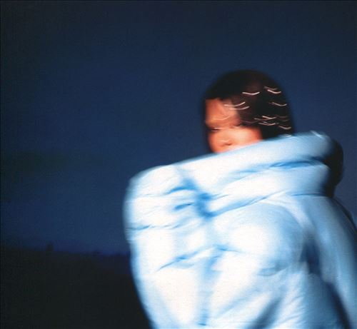

import { Slider, Button } from "@carbon/react";
import { ArrowUpRight } from "@carbon/icons-react";

import SliderJS1 from "../review/slider1";
import SliderJS2 from "../review/slider2";
import SliderJS3 from "../review/slider3";
import SliderJS4 from "../review/slider4";
import AdvJS2 from "../review/adv2";
import AdvJS3 from "../review/adv3";

import { Link } from "gatsby";

Album review

<h1 className="h1--no--margin">{props.pageContext.frontmatter.title}</h1>

  <Link to="/best50/2022/">2022 Black Music Best No.24</Link>

<Row  className="image-card-group">
	<Column colMd={3} colLg={4} noGutterMdLeft="">
       <ImageCard>

</ImageCard>
	</Column>
	<Column colMd={4} colLg={8} noGutterMdLeft="">
		

			South London出身のArtist, Shygirlのデビューアルバム。2017年あたりから、活動を始め、EPや客演で注目を集め、29歳でのアルバムリリースに至っている。
			 Left Field, Experimental Popとしてジャンル分けされるような、Club, Dance, ElectroにHip-Hopをミックスしたようなミニマルなサウンドが特徴となっている。
			 制作陣は、Sega Bodega, Arca, Mura Masaをはじめとする、界隈では知られたCollaborater, Producerたちが参加しており、各曲とも、きちんと作りこまれている。
			 同じような傾向の曲が多くなってしまうが、②ではレゲトン調なTrackが印象的だし、Popで聴き易い曲も少なくない。
			 ShygirlのVocalとRapは、低体温で、抑えた感じであり、Trackと合わせて、Experimentalな感じになっている。また、Lyricのテーマは恋愛やセクシャリティについてが多くなっている。
		

		

		  <Button className="button-right-mergin"  href="https://amzn.to/41UaOTN" renderIcon={ArrowUpRight} size='sm' kind='primary'>
  	    amazon.com
  	  </Button>
  	  <Button className="button-right-mergin"  href="https://amzn.to/40FjqMZ" renderIcon={ArrowUpRight} size='sm' kind='secondary'>
  	    amazon.co.jp
  	  </Button>
			<Button className="button-right-mergin"  href="https://apple.co/41DJSrw" renderIcon={ArrowUpRight} size='sm' kind='tertiary'>
  	   	apple music
  	  </Button>
			<AdvJS2/>
		

	</Column>
</Row>
<Row >
	<Column colMd={4} colLg={4} noGutterMdLeft="">
		

		  <h3>Score card</h3>
			<SliderJS1 value="4" />
		  <SliderJS2 value="1" />
			<SliderJS3 value="2" />
		  <SliderJS4 value="8" />
		

	</Column>
	<Column colMd={8} colLg={8} noGutterMdLeft="">
		

			<h3>Producers</h3>
			

				Sega Bodega, Karma Kid and Shygirl(1)
				 Arca and Shygirl(2)
				 BloodPop, Sega Bodega and Shygirl(3)
				 Sega Bodega and Shygirl(4,11)
				 Sega Bodega, Kingdom and Shygirl(5)
				 Sega Bodega, Karma Kid, Mura Masa and Shygirl(6)
				 Kingdom, Mura Masa and Shygirl(7)
				 Mura Masa, Oscar Scheller and Shygirl(8)
				 Danny L. Harle and Shygirl(9)
				 Shygirl and Vegyn(10)
				 BloodPop, Sega Bodega, Noah Goldstein and Shygir(12)
			

			<h3>Guests</h3>
			

			

		

	</Column>
</Row>

<h3>Tracks</h3>

| No. | Title                     | Composers                                                              | Performer | Time  |
| --- | ------------------------- | ---------------------------------------------------------------------- | --------- | ----- |
| 1   | Woe                       | Sega Bodega / Danny L. Harle / Karma Kid / Caroline Polachek / Shygirl | Shygirl   | 03:41 |
| 2   | Come for Me               | Arca / Shygirl                                                         | Shygirl   | 03:44 |
| 3   | Shlut                     | BloodPop / Sega Bodega / Cosha / Shygirl                               | Shygirl   | 02:12 |
| 4   | Little Bit                | Sega Bodega / Shygirl                                                  | Shygirl   | 01:20 |
| 5   | Firefly                   | Cecile Believe / Sega Bodega / Kingdom / Shygirl                       | Shygirl   | 03:18 |
| 6   | Coochie (A Bedtime Story) | Sega Bodega / Cosha / Karma Kid / Mura Masa / Shygirl                  | Shygirl   | 03:02 |
| 7   | Heaven                    | Sega Bodega / Danny L. Harle / Kingdom / Mura Masa / Shygirl           | Shygirl   | 02:44 |
| 8   | Nike                      | Mura Masa / Oscar Scheller / Shygirl                                   | Shygirl   | 02:07 |
| 9   | Poison                    | Sega Bodega / Danny L. Harle / Shygirl                                 | Shygirl   | 02:48 |
| 10  | Honey                     | Cater Lang / Shygirl / Vegyn                                           | Shygirl   | 03:39 |
| 11  | Missing U                 | Sega Bodega / Shygirl                                                  | Shygirl   | 00:59 |
| 12  | Wildfire                  | BloodPop / Sega Bodega / Cosha / Noah Goldstein / Shygir               | Shygirl   | 02:58 |

<AdvJS3 />
