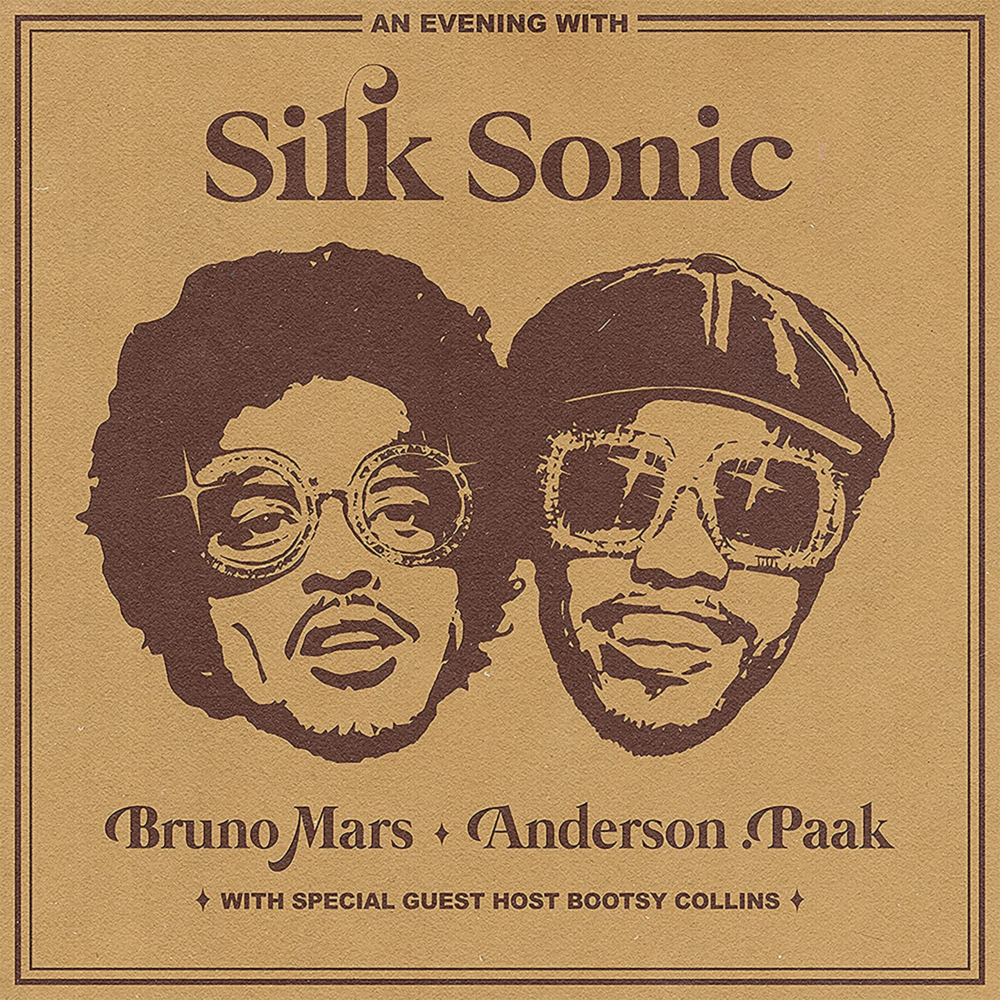

import { Slider, Button } from "carbon-components-react";
import { ArrowUpRight24 } from "@carbon/icons-react";

import SliderJS1 from "../review/slider1";
import SliderJS2 from "../review/slider2";
import SliderJS3 from "../review/slider3";
import SliderJS4 from "../review/slider4";
import AdvJS2 from "../review/adv2";
import AdvJS3 from "../review/adv3";

import { Link } from "gatsby";

import Review1 from "../review/brunomars3.mdx";

import Review11 from "../review/andersonpaak4.mdx";
import Review12 from "../review/andersonpaak3.mdx";
import Review13 from "../review/andersonpaak2.mdx";

Album review

<h1 className="h1--no--margin">{props.pageContext.frontmatter.title}</h1>

  <Link to="/best50/2021/">2021 Black Music Best No.5</Link>

<Row  className="image-card-group">
	<Column colMd={"3"} colLg={"4"} noGutterMdLeft="">
       <ImageCard>

</ImageCard>
	</Column>
	<Column colMd={"4"} colLg={"8"} noGutterMdLeft="">
		

			人気、実力とも折り紙付きのBruno Mars, Anderson .Paakによる、何とも豪華なユニット、Silk Sonicによる1stアルバム。Bruno Marsの前作"24K Magic"の流れを組んでいるが、ただし、今回は時代をもう少し遡って、70年代ソウルへのオマージュ感溢れる作品になっている。ハッピーでスイートなR&B作品であり、ストリングスやブラスがはいったTrackはゴージャスで煌びやか。メロディもキャッチーで馴染みやすい。
			 ユニット作ではあるが、Produce面含めて、全般的にBruno Mars色が強く、Anderson .PaakらしいHip-Hop色は皆無でVocalに専念している。また、Bootsy Collinsが数曲において声で参加しており、花を添えている。
			 コロナ禍の陰鬱とした空気をぶっ飛ばそうという気概が感じられる作品。同じような曲が並ぶが、30分強とコンパクトにまとめられているので、一気に聴きとおせる。
		

		

		  <Button className="button-right-mergin"  href="https://amzn.to/3FxrbtQ" kind="primary" size="small" renderIcon={ArrowUpRight24}>
  	    amazon.com
  	  </Button>
  	  <Button className="button-right-mergin"  href="https://amzn.to/3trb12O" kind="secondary" size="small" renderIcon={ArrowUpRight24}>
  	    amazon.co.jp
  	  </Button>
			<Button className="button-right-mergin"  href="https://apple.co/3quVAoo" kind="tertiary" size="small" renderIcon={ArrowUpRight24}>
  	   	apple music
  	  </Button>
			<AdvJS2/>
		

	</Column>
</Row>
<Row >
	<Column colMd={"4"} colLg={"4"} noGutterMdLeft="">
		

		  <h3>Score card</h3>
			<SliderJS1 value="5" />
		  <SliderJS2 value="2" />
			<SliderJS3 value="1" />
		  <SliderJS4 value="9" />
		

	</Column>
	<Column colMd={"8"} colLg={"8"} noGutterMdLeft="">
		

			<h3>Producers</h3>
			

				Bruno Mars and D'Mile(1,2,3,5,6,8,9)
				 Bruno Mars, D'Mile and The Stereotypes(4)
				 Bruno Mars(7)
			

			<h3>Guests</h3>
			

				Thundercat, Bootsy Collins, Babyface
			

		

	</Column>
</Row>

<h3>Tracks</h3>

| No. | Title                 | Composers                                                                                                                                            | Performer                          | Time  |
| --- | --------------------- | ---------------------------------------------------------------------------------------------------------------------------------------------------- | ---------------------------------- | ----- |
| 1   | Silk Sonic Intro      | Bruno Mars, Brandon Anderson, Dernst Emile II                                                                                                        | Silk Sonic                         | 01:03 |
| 2   | Leave the Door Open   | Bruno Mars, Brandon Anderson, Dernst Emile II, Christopher Brody Brown                                                                               | Silk Sonic                         | 04:02 |
| 3   | Fly as Me             | Bruno Mars, Brandon Anderson, Dernst Emile II, James Fauntleroy, Span Anderson                                                                       | Silk Sonic                         | 03:39 |
| 4   | After Last Night      | Bruno Mars, Brandon Anderson, Dernst Emile II, James Fauntleroy, Stephen Bruner, Jonathan Yip, Ray Ronulas, Jeremy Reeves, Ray Charles McCullough II | Silk Sonic w/ Thundercat and Booty | 04:09 |
| 5   | Smokin Out the Window | Bruno Mars, Brandon Anderson, Dernst Emile II                                                                                                        | Silk Sonic                         | 03:17 |
| 6   | Put on a Smile        | Bruno Mars, Brandon Anderson, Dernst Emile II, Kenny "Babyface" Edmonds                                                                              | Silk Sonic                         | 04:15 |
| 7   | 777                   | Bruno Mars, Brandon Anderson, Dernst Emile II, Christopher Brody Brown                                                                               | Silk Sonic                         | 02:44 |
| 8   | Skate                 | Bruno Mars, Brandon Anderson, Dernst Emile II, James Fauntleroy, Domitille Degalle, J. D. Beck                                                       | Silk Sonic                         | 03:23 |
| 9   | Blast Off             | Bruno Mars, Brandon Anderson, Dernst Emile II                                                                                                        | Silk Sonic                         | 04:44 |

<h3>Other Reviews</h3>

<Row>
  <Column colMd={3} colLg={3} noGutterMdLeft>
    <Review1 />
  </Column>
</Row>

<Row>
  <Column colMd={3} colLg={3} noGutterMdLeft>
    <Review11 />
  </Column>
  <Column colMd={3} colLg={3} noGutterMdLeft>
    <Review12 />
  </Column>
	<Column colMd={3} colLg={3} noGutterMdLeft>
    <Review13 />
  </Column>
</Row>

<AdvJS3 />
