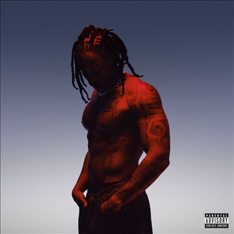

import { Slider, Button } from "@carbon/react";
import { ArrowUpRight } from "@carbon/icons-react";

import SliderJS1 from "../review/slider1";
import SliderJS2 from "../review/slider2";
import SliderJS3 from "../review/slider3";
import SliderJS4 from "../review/slider4";
import AdvJS2 from "../review/adv2";
import AdvJS3 from "../review/adv3";

import { Link } from "gatsby";

Album review

<h1 className="h1--no--margin">{props.pageContext.frontmatter.title}</h1>

<Row  className="image-card-group">
	<Column colMd={3} colLg={4} noGutterMdLeft="">
       <ImageCard>

</ImageCard>
	</Column>
	<Column colMd={4} colLg={8} noGutterMdLeft="">
		

			CaliforniaのInglewood出身で、現在はTDEのトップシンガーでもあるSiRの4枚目のアルバム。既に37歳ということで、2010年代中盤よりアーティスト活動を開始し、当作にゲスト参加してるAnderson .PaakやChris Daveなど主に西海岸中心に様々なアーティストと共演を経て、実力を認められるようになり現在に至っている。
			 前作より5年たち、その間にアルコールや薬物依存、恋愛問題などいろいろあったようだが、そんな状況を癒すようなメローでメロディアス、スローなTrackが続き、⑯の70年代ソウルで締めている。耳に心地よいリラックスした曲も多く、タイトルやジャケットからイメージされるダークな印象は薄い。
			 SiRのVocalは熱唱型ではなく、落ち着いた感じ、少しひしゃげた味のある歌唱である。なお、①では実兄のD SmokeがPianoを弾いている。
		

		

		  <Button className="button-right-mergin"  href="https://apple.co/3YBdghO" renderIcon={ArrowUpRight} size='sm' kind='primary'>
  	    amazon.com
  	  </Button>
  	  <Button className="button-right-mergin"  href="https://amzn.to/40D7Qp4" renderIcon={ArrowUpRight} size='sm' kind='secondary'>
  	    amazon.co.jp
  	  </Button>
			<Button className="button-right-mergin"  href="https://apple.co/44iOeql" renderIcon={ArrowUpRight} size='sm' kind='tertiary'>
  	   	apple music
  	  </Button>
			<AdvJS2/>
		

	</Column>
</Row>
<Row >
	<Column colMd={4} colLg={4} noGutterMdLeft="">
		

		  <h3>Score card</h3>
			<SliderJS1 value="4" />
		  <SliderJS2 value="2" />
			<SliderJS3 value="1" />
		  <SliderJS4 value="9" />
		

	</Column>
	<Column colMd={8} colLg={8} noGutterMdLeft="">
		

			<h3>Producers</h3>
			

				SiR(1)
				 Bankroll Got It, Diego Ave, Pitt Tha Kid, Ace G and Benji.(2)
				 Sigurd(3)
				 TaeBeast and Rascal(4,5)
				 Taylor Hill(6)
				 Noiz(7)
				 Rascal and WU10(8)
				 J. White Did It(9)
				 SiR and D.K. The Punisher(10)
				 Steve Octave and Rascal(11)
				 JonahPH and Scribz Riley(12)
				 D.K. The Punisher(13)
				 SamTrax(14)
				 Cardiak and WU10(15)
				 Taylor Hill(16)
			

			<h3>Guests</h3>
			

				Ty Dolla $ign, Isaiah Rashad, Anderson .Paak, Ab-Soul, Scribz Riley
			

		

	</Column>
</Row>

<h3>Tracks</h3>

| No. | Title                | Composers                                                                                                                                                                                  | Performer                | Time  |
| --- | -------------------- | ------------------------------------------------------------------------------------------------------------------------------------------------------------------------------------------ | ------------------------ | ----- |
| 1   | Intro                | SiR, Bradford Tidwell, Daniel Farris                                                                                                                                                       | SiR                      | 01:04 |
| 2   | Ignorant             | SiR, Ty Dolla $ign, Jozzy                                                                                                                                                                  | SiR feat. Ty Dolla $ign  | 03:04 |
| 3   | Karma                | SiR, Isaiah Rashad                                                                                                                                                                         | SiR feat. Isaiah Rashad  | 03:07 |
| 4   | Heavy                | SiR                                                                                                                                                                                        | SiR                      | 03:45 |
| 5   | Six Whole Days       | SiR                                                                                                                                                                                        | SiR                      | 03:07 |
| 6   | No Evil              | SiR                                                                                                                                                                                        | SiR                      | 02:25 |
| 7   | Poetry In Motion     | SiR, Anderson .Paak                                                                                                                                                                        | SiR feat. Anderson .Paak | 03:11 |
| 8   | I'm Not Perfect      | SiR, Ab-Soul, Rascal, WU10                                                                                                                                                                 | SiR feat. Ab-Soul        | 03:25 |
| 9   | You                  | SiR                                                                                                                                                                                        | SiR                      | 03:31 |
| 10  | Only Human           | SiR, Rotimi, JDP & Tee                                                                                                                                                                     | SiR                      | 04:25 |
| 11  | Satisfaction         | Rascal, Steve Octave, SiR                                                                                                                                                                  | SiR                      | 02:10 |
| 12  | Life Is Good         | SiR, Scribz Riley, JonahPH, Rae Khalil                                                                                                                                                     | SiR feat. Scribz Riley   | 04:16 |
| 13  | Ricky's Song         | SiR, D.K. The Punisher                                                                                                                                                                     | SiR                      | 03:29 |
| 14  | Nothing Even Matters | SiR, SamTrax, Angie Stone, D’Angelo, Luther Archer, Gene Redd Jr., Claydes, Smith, George Brown, Ricky West, Robert “Kool” Bell, Robert Spike Mickens, Dennis “D.T.” Thomas, Khalis Bayyan | SiR                      | 03:39 |
| 15  | Tryin' My Hardest    | SiR, Cardiak, WU10                                                                                                                                                                         | SiR                      | 02:48 |
| 16  | Brighter             | SiR                                                                                                                                                                                        | SiR                      | 02:24 |

<AdvJS3 />
