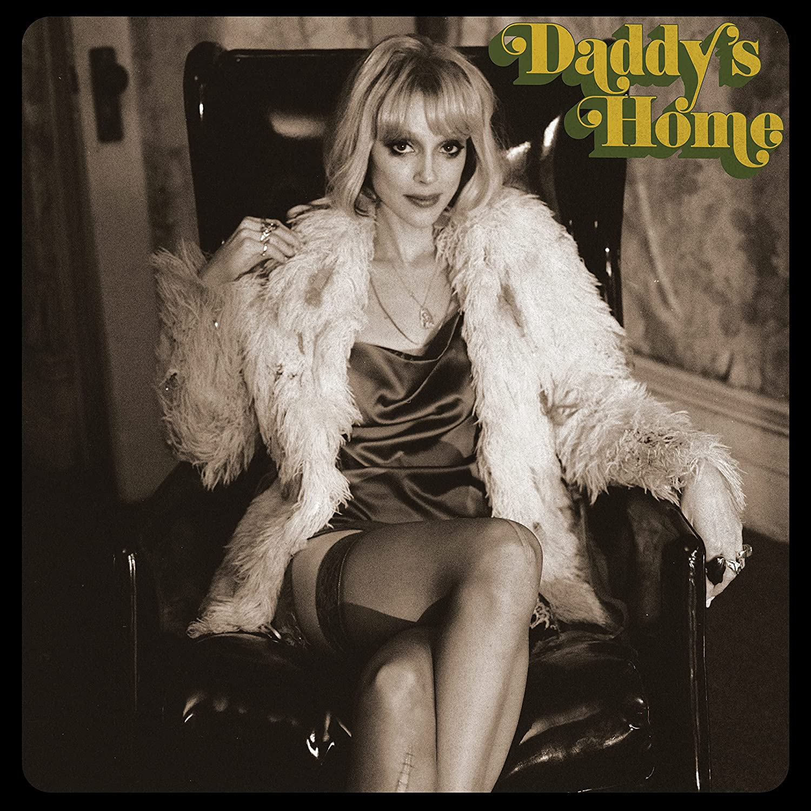

import { Slider, Button } from "carbon-components-react";
import { ArrowUpRight24 } from "@carbon/icons-react";

import SliderJS1 from "../review/slider1";
import SliderJS2 from "../review/slider2";
import SliderJS3 from "../review/slider3";
import SliderJS4 from "../review/slider4";
import AdvJS2 from "../review/adv2";
import AdvJS3 from "../review/adv3";

import { Link } from "gatsby";

Album Review

<h1 className="h1--no--margin">{props.pageContext.frontmatter.title}</h1>

  <Link to="/best50/2021/">2021 Black Music Best No.12</Link>

<Row  className="image-card-group">
	<Column colMd={"3"} colLg={"4"} noGutterMdLeft="">
       <ImageCard>

</ImageCard>
	</Column>
	<Column colMd={"4"} colLg={"8"} noGutterMdLeft="">
	

		2000年代から活躍する女性Singer, Song WriterのSt. Vincentの3年半ぶりのアルバム。バンドではギターも弾き、Drum担当のJack Antonoffとともに全曲Produceしている。
		 知能犯として収監されていた父親の釈放を契機に、その父親と過ごした70年代へのオマージュをコンセプトにしたアルバムになっており、本人もInspireされた70年代の楽曲をSpotifyで公開している(Black MusicではStevie Wonder, Nina Simmon, Pointer Sisterあたりが含まれている)。
		 そんなノスタルジック感溢れるレイドバックした作品で、RockをベースにR&B, Popsっぽい曲も少々。全体的にミディアム-スロー中心で、抑え気味でときどきEmotionalになるSt. Vincentの唄と一体となっている。Lyricはプライベート感が強いものが多そうだ
	

	

	  <Button className="button-right-mergin"  href="https://amzn.to/3vc444A" kind="primary" size="small" renderIcon={ArrowUpRight24}>
      amazon.com
    </Button>
    <Button className="button-right-mergin"  href="https://amzn.to/3ABL7Jz" kind="secondary" size="small" renderIcon={ArrowUpRight24}>
      amazon.co.jp
    </Button>
		<Button className="button-right-mergin"  href="https://apple.co/3Dzub8w" kind="tertiary" size="small" renderIcon={ArrowUpRight24}>
      apple music
    </Button>
		<AdvJS2/>
	

	</Column>
</Row>
<Row >
	<Column colMd={"4"} colLg={"4"} noGutterMdLeft="">
	

	  <h3>Score card</h3>
		<SliderJS1 value="5" />
	  <SliderJS2 value="2" />
		<SliderJS3 value="1" />
	  <SliderJS4 value="8" />
	

</Column>
<Column colMd={"8"} colLg={"8"} noGutterMdLeft="">

	<h3>Producers</h3>
	

		Annie Clark and Jack Antonoff(all)
	

	<h3>Guests</h3>
	

	

</Column>
</Row>

<h3>Tracks</h3>

| No. | Title                  | Composers                    | Performer   | Time  |
| --- | ---------------------- | ---------------------------- | ----------- | ----- |
| 1   | Pay Your Way in Pain   | Jack Antonoff / Annie Clark  | St. Vincent | 03:03 |
| 2   | Down and Out Downtown  | Annie Clark                  | St. Vincent | 03:42 |
| 3   | Daddy's Home           | Jack Antonoff / Annie Clark  | St. Vincent | 03:19 |
| 4   | Live in the Dream      | Annie Clark                  | St. Vincent | 06:29 |
| 5   | The Melting of the Sun | Annie Clark                  | St. Vincent | 04:17 |
| 6   | Humming [Interlude 1]  | Annie Clark                  | St. Vincent | 00:57 |
| 7   | The Laughing Man       | Jack Antonoff / Annie Clark  | St. Vincent | 03:25 |
| 8   | Down                   | Jack Antonoff / Annie Clark  | St. Vincent | 03:26 |
| 9   | Humming [Interlude 2]  | Annie Clark                  | St. Vincent | 00:28 |
| 10  | Somebody Like Me       | Annie Clark                  | St. Vincent | 03:53 |
| 11  | My Baby Wants A Baby   | Annie Clark / Florrie Palmer | St. Vincent | 03:20 |
| 12  | …At the Holiday Party  | Jack Antonoff / Annie Clark  | St. Vincent | 04:17 |
| 13  | Candy Darling          | Annie Clark                  | St. Vincent | 01:55 |
| 14  | Humming [Interlude 3]  | Annie Clark                  | St. Vincent | 00:38 |

<AdvJS3 />
