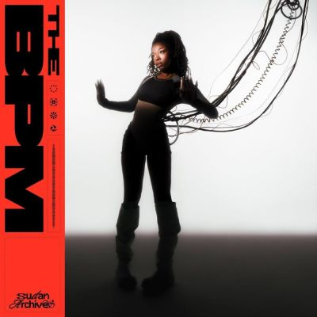

import { Slider, Button } from "@carbon/react";
import { ArrowUpRight } from "@carbon/icons-react";

import SliderJS1 from "../review/slider1";
import SliderJS2 from "../review/slider2";
import SliderJS3 from "../review/slider3";
import SliderJS4 from "../review/slider4";
import AdvJS2 from "../review/adv2";
import AdvJS3 from "../review/adv3";

import { Link } from "gatsby";

import Review1 from "../review/sudanarchives2.mdx";
import Review2 from "../review/sudanarchives1.mdx";

Album review

<h1 className="h1--no--margin">{props.pageContext.frontmatter.title}</h1>

  <Link to="/best50/2025/">2025 Black Music Best No.17</Link>

<Row  className="image-card-group">
	<Column colMd={3} colLg={4} noGutterMdLeft="">
       <ImageCard>

</ImageCard>
	</Column>
	<Column colMd={4} colLg={8} noGutterMdLeft="">
		

			Sudan Archivesの3年ぶりとなる3rdアルバム。前2作に比べてアフロ要素はだいぶ抑えめで、そのかわりにハウス(Chicago)、テクノ(Detroit)、ドラムンベース(UK)に目いっぱい近づいたダンサブルな作品に仕上がっている。
			 引き続き、本人のViolinを含めてストリングスは多用されているが、それと気がつかないぐらいサイバーなTrackに溶け込んでいるのも特徴的である。
			 アートワークにあるようにテクノロジーに生かされているGadget Girlというオルターエゴが設定されており、Sudan ArchivesのVocalも含めて、どこか冷んやりとした感覚をおぼえる作品である。
		

		

		  <Button className="button-right-mergin"  href="https://amzn.to/49fJPIR" renderIcon={ArrowUpRight} size='sm' kind='primary'>
  	    amazon.com
  	  </Button>
  	  <Button className="button-right-mergin"  href="https://amzn.to/3LDwJMs" renderIcon={ArrowUpRight} size='sm' kind='secondary'>
  	    amazon.co.jp
  	  </Button>
			<Button className="button-right-mergin"  href="https://apple.co/3L9WIep" renderIcon={ArrowUpRight} size='sm' kind='tertiary'>
  	    apple music
  	  </Button>
			<AdvJS2/>
		

	</Column>
</Row>
<Row >
	<Column colMd={4} colLg={4} noGutterMdLeft="">
		

		  <h3>Score card</h3>
			<SliderJS1 value="5" />
		  <SliderJS2 value="1" />
			<SliderJS3 value="1" />
		  <SliderJS4 value="9" />
		

	</Column>
	<Column colMd={8} colLg={8} noGutterMdLeft="">
		

			<h3>Producers</h3>
			

				Ben Dickey(1,5)
				 Ben Dickey and Sudan Archives(2,9,10,11,13,15)
				 Ben Dickey, Damon Terrell and Eric Terhune(3)
				 Ben Dickey and Damon Terrell(4)
				 Ben Dickey and Eric Terhune(6,7,12,14)
				 Ben Dickey, Damon Terrell and Sudan Archives(8)
			

			<h3>Guests</h3>
			

			

		

	</Column>
</Row>

<h3>Tracks</h3>

| No. | Title               | Composers                                                                                        | Performer      | Time  |
| --- | ------------------- | ------------------------------------------------------------------------------------------------ | -------------- | ----- |
| 1   | DEAD                | Ben Dickey, Brittney Parks, Eric Terhune, James Robert McCall                                    | Sudan Archives | 04:08 |
| 2   | COME AND FIND YOU   | Ben Dickey, Brittney Parks, James Robert McCall, Umesi Michael, Zep Barnasconi                   | Sudan Archives | 03:50 |
| 3   | YEA YEA YEA         | Ben Dickey, Brittney Parks, Damon Terrell, Eric Terhune, James Robert McCall, Taylor Henderson   | Sudan Archives | 03:15 |
| 4   | TOUCH ME            | Ben Dickey, Brittney Parks, Damon Terrell, James Robert McCall                                   | Sudan Archives | 02:10 |
| 5   | A BUG'S LIFE        | Ben Dickey, Brittney Parks, Eric Terhune, James Robert McCall                                    | Sudan Archives | 03:07 |
| 6   | THE NATURE OF POWER | Ben Dickey, Brittney Parks, Eric Terhune, James Robert McCall                                    | Sudan Archives | 04:09 |
| 7   | MY TYPE             | Ben Dickey, Brittney Parks, Damon Terrell, Eric Terhune, Greenwood, James Robert McCall          | Sudan Archives | 03:08 |
| 8   | SHE'S GOT PAIN      | Ben Dickey, Brittney Parks, Damon Terrell, James Robert McCall                                   | Sudan Archives | 03:24 |
| 9   | DAVID & GOLIATH     | Ben Dickey, Brittney Parks, Brittney Parks, James Robert McCall                                  | Sudan Archives | 03:52 |
| 10  | A COMPUTER LOVE     | Ben Dickey, Brittney Parks                                                                       | Sudan Archives | 03:51 |
| 11  | THE BPM             | Ben Dickey, Brittney Parks, James Robert McCall                                                  | Sudan Archives | 02:30 |
| 12  | MS. PAC MAN         | Ben Dickey, Brittney Parks, Damon Terrell, Eric Terhune\*, James Robert McCall, Taylor Henderson | Sudan Archives | 03:04 |
| 13  | LOS CINCI           | Ben Dickey, Brittney Parks, Brittney Parks, James Robert McCall, Muhammad Ahmad Hassan           | Sudan Archives | 01:52 |
| 14  | NOIRE               | Ben Dickey, Brittney Parks, Eric Terhune, Ghalani Of Greenwood                                   | Sudan Archives | 05:45 |
| 15  | HEAVEN KNOWS        | Ben Dickey, Brittney Parks, Dexter Story, Eric Terhune, James Robert McCall                      | Sudan Archives | 04:33 |

<h3>Other Reviews</h3>

<Row>
  <Column colMd={3} colLg={3} noGutterMdLeft>
    <Review1 />
  </Column>
  <Column colMd={3} colLg={3} noGutterMdLeft>
    <Review2 />
  </Column>
</Row>

<AdvJS3 />
