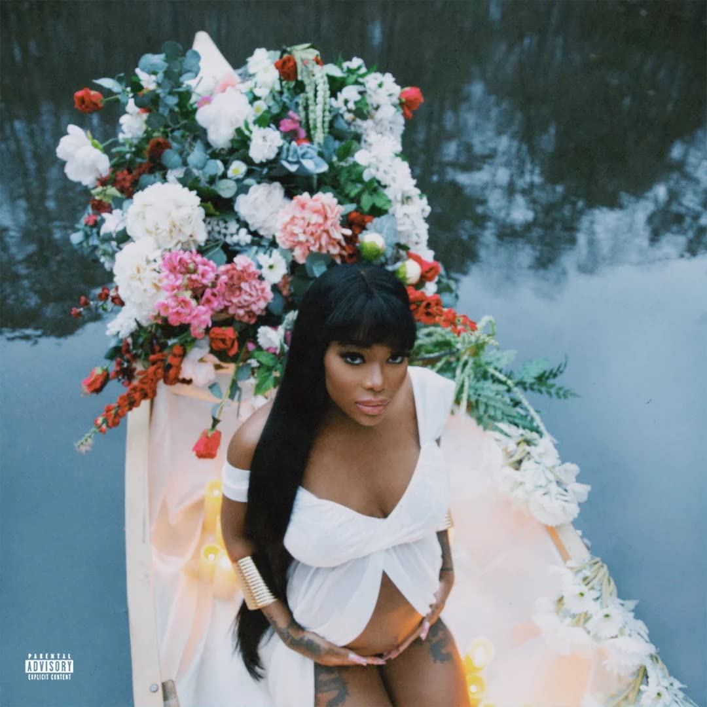

import { Slider, Button } from "@carbon/react";
import { ArrowUpRight } from "@carbon/icons-react";

import SliderJS1 from "./slider1";
import SliderJS2 from "./slider2";
import SliderJS3 from "./slider3";
import SliderJS4 from "./slider4";
import AdvJS2 from "./adv2";
import AdvJS3 from "./adv3";

import { Link } from "gatsby";

import Review1 from "./summerwalker2.mdx";
import Review2 from "./summerwalker1.mdx";

Album review

<h1 className="h1--no--margin">{props.pageContext.frontmatter.title}</h1>

  <Link to="/best50/2023/">2023 Black Music Best No.26</Link>

<Row  className="image-card-group">
	<Column colMd={3} colLg={4} noGutterMdLeft="">
       <ImageCard>

</ImageCard>
	</Column>
	<Column colMd={4} colLg={8} noGutterMdLeft="">
		

			Summer Walkerの2019年リリースのEP、Clearに、Clear 2として9曲足して1枚にした作品。その間は4年とインターバルは空いてるが、統一感は保ててると思う。
			 ジャケットには妊娠中の自分の姿を載せているが、その父親のLVRD Pharohとは既に破局してたりと、穏やかでないが、そんなプライベートを鎮めるように、穏やかで静謐な曲が多い。特に前半のClearの部はJazzyでアコースティックなTrackで占められている。
			 Clear 2の部でも、引き続き、音数は少なく、スローでメロディアスな曲が続いている。今回、Guestも少なめだが、Summer Walkerの表現力豊かでしっとりした唄さえあれば、不要だと思う。
		

		

		  <Button className="button-right-mergin"  href="https://amzn.to/3ulIPBb" renderIcon={ArrowUpRight} size='sm' kind='primary'>
  	    amazon.com
  	  </Button>
  	  <Button className="button-right-mergin"  href="https://amzn.to/48Wx7MD" renderIcon={ArrowUpRight} size='sm' kind='secondary'>
  	    amazon.co.jp
  	  </Button>
			<Button className="button-right-mergin"  href="https://apple.co/3SGx9Cm" renderIcon={ArrowUpRight} size='sm' kind='tertiary'>
  	   	apple music - Clear2 Soft Life : EP
  	  </Button>
			<Button className="button-right-mergin"  href="https://apple.co/3SJq9Vq" renderIcon={ArrowUpRight} size='sm' kind='tertiary'>
  	   	apple music - EP
  	  </Button>
			<AdvJS2/>
		

	</Column>
</Row>
<Row >
	<Column colMd={4} colLg={4} noGutterMdLeft="">
		

		  <h3>Score card</h3>
			<SliderJS1 value="5" />
		  <SliderJS2 value="1" />
			<SliderJS3 value="1" />
		  <SliderJS4 value="9" />
		

	</Column>
	<Column colMd={8} colLg={8} noGutterMdLeft="">
		

			<h3>Producers</h3>
			

				Summer Walker(1,3,4)
				 Z will(2)
				 Wu10 and J.cole(5)
				 Solo Otto(6)
				 Tommy Brown, Charles "Scootie" Anderson and Simon Jonasson(7)
				 Slimwav, Jah Whittingham, Larry Lambert, Remey Williams and Darnell Stoxstell(8)
				 Jay Versace and David "Dos Dias" Bishop(9)
				 Jay Versace, Larry Lambert, Remey Williams, Darnell Stoxstell and Jah Whittingham(10)
				 Qué Soul and John Smythe(11)
				 Jah Whittingham and Summer Walker(12)
				 Solange, Steve Lacy and John Carroll Kirby(13)
			

			<h3>Guests</h3>
			

				J.Cole, Childish Gambino
			

		

	</Column>
</Row>

<h3>Tracks</h3>

| No. | Title                            | Composers                                                                                     | Performer                            | Time  |
| --- | -------------------------------- | --------------------------------------------------------------------------------------------- | ------------------------------------ | ----- |
| 1   | Riot                             | Jasmine Battle/Larry Lambert II/Darnell Stoxley/Summer Walker/Remey Williams                  | Summer Walker                        | 01:49 |
| 2   | Grave                            | Jasmine Battle/Larry Lambert II/Darnell Stoxley/Summer Walker/Remey Williams/Zachary Williams | Summer Walker                        | 03:11 |
| 3   | Wasted                           | Jasmine Battle/Larry Lambert II/Darnell Stoxley/Summer Walker/Remey Williams                  | Summer Walker                        | 02:43 |
| 4   | Settling                         | Jasmine Battle/Larry Lambert II/Darnell Stoxley/Summer Walker/Remey Williams                  | Summer Walker                        | 03:37 |
| 5   | To Summer, From Cole (Audio Hug) | Summer Walker, J. Cole, WU10                                                                  | Summer Walker feat. J.Cole           | 02:27 |
| 6   | Hardlife                         | Summer Walker, Solo Otto                                                                      | Summer Walker                        | 03:13 |
| 7   | How Does It Feel                 | Scootie, Simon Jonasson, Summer Walker, Tarron Crayton, Taylor Hill, TBHits                   | Summer Walker                        | 02:42 |
| 8   | Mind Yo Mouth                    | STOX, Jah Whittingham, Larry Lambert, Remey Williams, Summer Walker, Slimwav                  | Summer Walker                        | 02:28 |
| 9   | Pull Up                          | Summer Walker, Dos Dias, Jay Versace, Tauseef Anam, Tim Maxey, Trey Lander                    | Summer Walker                        | 03:01 |
| 10  | New Type                         | Jay Versace, Larry Lambert, Remey Williams, STOX, Jah Whittingham                             | Summer Walker feat. Childish Gambino | 04:25 |
| 11  | Finding Peace                    | John Smythe, Summer Walker, Qu Soul                                                           | Summer Walker                        | 03:03 |
| 12  | Set Up (2017)                    | Jah Whittingham, Summer Walker                                                                | Summer Walker                        | 02:06 |
| 13  | Agayu's Revelation               | Summer Walker, Solange, Steve Lacy, John Carroll Kirby                                        | Summer Walker                        | 04:39 |

<h3>Other Reviews</h3>

<Row>
  <Column colMd={3} colLg={3} noGutterMdLeft>
    <Review1 />
  </Column>
	<Column colMd={3} colLg={3} noGutterMdLeft>
    <Review2 />
  </Column>
</Row>

<AdvJS3 />
