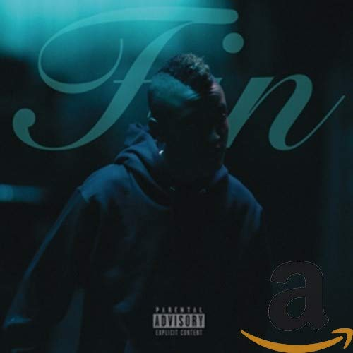

import { Slider, Button } from 'carbon-components-react';
import { ArrowUpRight24  } from '@carbon/icons-react';

import SliderJS1 from "../review/slider1"
import SliderJS2 from "../review/slider2"
import SliderJS3 from "../review/slider3"
import SliderJS4 from "../review/slider4"

import { Link } from "gatsby"

CD review

<h1 className="h1--no--margin">{props.pageContext.frontmatter.title}</h1>

<Link to="/best50/2017/">2017 Black Music Album Best No.10</Link>

<Row  className="image-card-group">
	<Column colMd={"4"} colLg={"4"} noGutterMdLeft="">
       <ImageCard>

 
</ImageCard>
	</Column>
	<Column colMd={"8"} colLg={"8"} noGutterMdLeft="">
	

	The InternetのVocal, Sydのソロデビュー作。The Internetは比較的ストレートなバンドサウンドが特長だが、こちらはより密室的で艶やかなR&B作である。Erykah Baduあたりに近いかもしれない。バンド仲間のSteve Lacyは自身で半数近くをProduceし、その他若手Producerも起用したTrackはスロー中心でエレクトロな雰囲気であり、茫洋としてアンビエント。内省的で静謐なSydの唄がマッチしている。統一感のとれたアルバムでもある。
	

	

	  <Button href="https://amzn.to/39zFbEV" kind="primary" size="small" renderIcon={ArrowUpRight24}>
      amazon.com
      </Button>
      <Button href="https://amzn.to/3jOtO0M" kind="secondary" size="small" renderIcon={ArrowUpRight24}>
      amazon.co.jp
      </Button>
	

	
	
	</Column>
</Row>
<Row >
	<Column colMd={"4"} colLg={"4"} noGutterMdLeft="">

    <h3>Score card</h3>
	<SliderJS1 value="5" />
    <SliderJS2 value="1" />
	<SliderJS3 value="2" />
    <SliderJS4 value="9" />

</Column>
<Column colMd={"8"} colLg={"8"} noGutterMdLeft="">

<h3>Producers</h3>

Hitboy(1)
 Nick Green(2)
 Syd(3,4,6)
 Steve Lacy(5)
 Hazebangs and Isiah Sarazar(7)
 Anthony Kilhoffer and JGramm(8)
 Melo-X(9)
 Flip and Steve Lacy(10)
 Hazebangs(11)
 Rahki(12)

<h3>Guests</h3>

</Column>
</Row>

<h3>Tracks</h3>

| No. |	 Title             |	 Composers                                                                                 | Performer | Time  |
| --- |	------------------ | --------------------------------------------------------------------------------------------- | --------- | ----- |
| 1	  |	Shake Em Off       | Syd Bennett / Nicholas Eaholtz / Nick Green / Chauncey Hollis                                 | Syd       | 03:00 |
| 2	  |	Know               | Syd Bennett / Michael Davidson / Nicholas Eaholtz / Nick Green / Rose Marie Tan               | Syd       | 03:35 |
| 3	  |	No Complaints      | Syd Bennett                                                                                   | Syd       | 01:14 |
| 4	  |	Nothin to Somethin | Syd Bennett                                                                                   | Syd       | 03:29 |
| 5	  |	All About Me       | Syd Bennett / Steve Lacy                                                                      | Syd       | 03:31 |
| 6	  |	Smile More         | Syd Bennett                                                                                   | Syd       | 04:02 |
| 7	  |	Got Her Own        | Syd Bennett / Nicholas Eaholtz / Nick Green / Rashad Muhammad / Isiah Salazar                 | Syd       | 03:06 |
| 8	  |	Drown in It        | Syd Bennett / Nicholas Eaholtz / Julian Gramma / Nick Green / Anthony Kilhoffer               | Syd       | 01:10 |
| 9	  |	Body               | Syd Bennett / Nicholas Eaholtz / Nick Green / Rose Marie Tan                                  | Syd       | 04:23 |
| 10  |	Dollar Bills       | Syd Bennett / Ronny Colson / Steve Lacy                                                       | Syd       | 03:08 |
| 11  |	Over               | Syd Bennett / Nicholas Eaholtz / Nick Green / Rashad Muhammad                                 | Syd       | 03:11 |
| 12  |	Insecurities       | Keith Askey / Syd Bennett / Nicholas Eaholtz / Brent Faiyaz / Nick Green / Columbus Smith III | Syd       | 03:25 |
