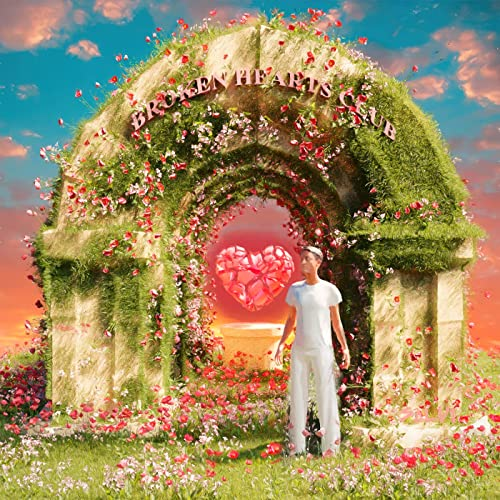

import { Slider, Button } from "@carbon/react";
import { ArrowUpRight } from "@carbon/icons-react";

import SliderJS1 from "../review/slider1";
import SliderJS2 from "../review/slider2";
import SliderJS3 from "../review/slider3";
import SliderJS4 from "../review/slider4";
import AdvJS2 from "../review/adv2";
import AdvJS3 from "../review/adv3";

import { Link } from "gatsby";

import Review1 from "../review/syd1.mdx"

Album review

<h1 className="h1--no--margin">{props.pageContext.frontmatter.title}</h1>

  <Link to="/best50/2022/">2022 Black Music Best No.31</Link>

<Row  className="image-card-group">
	<Column colMd={3} colLg={4} noGutterMdLeft="">
       <ImageCard>

</ImageCard>
	</Column>
	<Column colMd={4} colLg={8} noGutterMdLeft="">
		

			The InternetのVocal, Sydの5年ぶりとなる2作目。近年の自身の大失恋をモチーフにしたらしく、そのコンセプトはタイトルやCDジャケット中央のひび割れたハートにも顕れている。
			 内容も失恋相手に向けたLove Songになり、密室的で私的な要素が強くなっている。Trackも楽器中心の落ち着いて静謐な曲が多く、Sydもこれに合わせてエモーショナルで切なく囁くようなVocalを披露している。
			 ただし、暗くてネガティブな印象は受けないので、そこは有難い。多くのWriterやProducerが参加しているが、統一感の高い作品になっていて、そんな中で同志のStece Lacyによる⑪などはPopで良いと思う。
		

		

		  <Button className="button-right-mergin"  href="https://amzn.to/3uCi5sZ" renderIcon={ArrowUpRight} size='sm' kind='primary'>
  	    amazon.com
  	  </Button>
  	  <Button className="button-right-mergin"  href="https://amzn.to/3IuUOPK" renderIcon={ArrowUpRight} size='sm' kind='secondary'>
  	    amazon.co.jp
  	  </Button>
			<Button className="button-right-mergin"  href="https://apple.co/3IsV1mv" renderIcon={ArrowUpRight} size='sm' kind='tertiary'>
  	    apple music
  	  </Button>
			<AdvJS2/>
		

	</Column>
</Row>
<Row >
	<Column colMd={4} colLg={4} noGutterMdLeft="">
		

    	<h3>Score card</h3>
			<SliderJS1 value="5" />
    	<SliderJS2 value="1" />
			<SliderJS3 value="1" />
    	<SliderJS4 value="9" />
		

	</Column>
	<Column colMd={8} colLg={8} noGutterMdLeft="">
		

			<h3>Producers</h3>
			

				Bran Shoop(1)
				 Syd(2,5,8,13)
				 Brandon Hodge, Troy Taylor and Raymond Hinton(3)
				 ForteBowie(4,10)
				 Rodney Jerkins(6)
				 Dave Rosser and Nick Green(7)
				 Syd and G Loop(9)
				 Steve Lacy(11)
				 Biloba(12)
				 Guests
			

			<h3>Guests</h3>
			

				Lucky Daye, Smino, Kehlani
			

		

	</Column>
</Row>

<h3>Tracks</h3>

| No. | Title               | Composers                                                                           | Performer            | Time  |
| --- | ------------------- | ----------------------------------------------------------------------------------- | -------------------- | ----- |
| 1   | CYBAH               | Brandon Shoop, David Debrandon Brown, Michael La Vell McGregor, Syd                 | Syd feat. Lucky Daye | 04:04 |
| 2   | Tie the Knot        | Syd, Tatiana Tenise Matthews                                                        | Syd                  | 02:31 |
| 3   | Fast Car            | Brandon Hodge, Naji Kareen Loren Bennet, Troy Taylor                                | Syd                  | 03:30 |
| 4   | Right Track         | Christopher Smith Jr., Denzel Mbeng Ayuk-Okata, Paul Mond, Syd                      | Syd feat. Smino      | 02:38 |
| 5   | Sweet               | Javonte Polland, Shawntoni Nichols, Syd                                             | Syd                  | 02:30 |
| 6   | Control             | Rodney Jerkins, Syd                                                                 | Syd                  | 02:20 |
| 7   | No Way              | Dave Rosser, Nick Green, Nicholas Eaholtz, Syd                                      | Syd                  | 03:02 |
| 8   | Getting Late        | Syd                                                                                 | Syd                  | 03:10 |
| 9   | Out Loud            | G Koop, Kehlani Parish, Rob Mandel, Shawntoni Nichols, Syd, Tatiana Tenise Matthews | Syd feat. Khelani    | 03:23 |
| 10  | Heartfelt Freestyle | Denzel Mbeng Ayuk-Okata, Laura Lee Ochoa, Mark Stefan Speer, Syd                    | Syd                  | 02:25 |
| 11  | BMHWDY              | Rose Marie Tan, Steve Lacy, Syd                                                     | Syd                  | 03:06 |
| 12  | Goodbye My Love     | Daniel Stanfill, Syd                                                                | Syd                  | 02:14 |
| 13  | Missing Out         | Syd                                                                                 | Syd                  | 03:59 |

<h3>Other Reviews</h3>

<Row>
  <Column colMd={3} colLg={3} noGutterMdLeft>
    <Review1 />
  </Column>
</Row>

<AdvJS3 />
