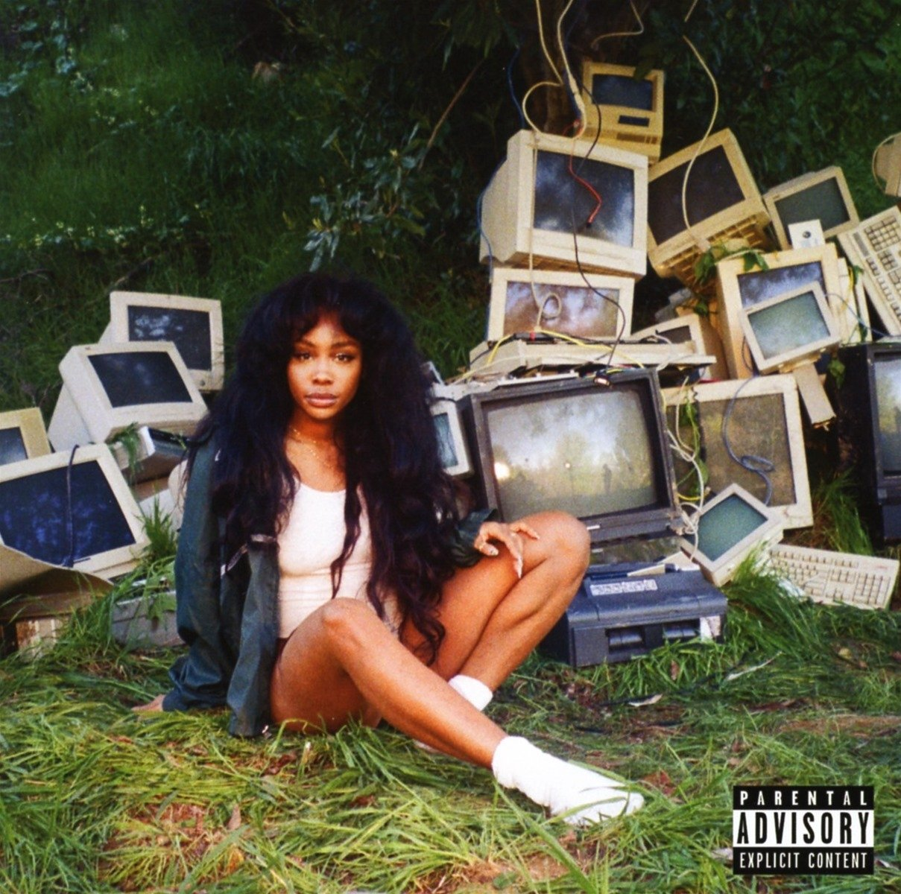

import { Slider, Button } from 'carbon-components-react';
import { ArrowUpRight24  } from '@carbon/icons-react';

import SliderJS1 from "../review/slider1"
import SliderJS2 from "../review/slider2"
import SliderJS3 from "../review/slider3"
import SliderJS4 from "../review/slider4"

import { Link } from "gatsby"

CD review

<h1 className="h1--no--margin">{props.pageContext.frontmatter.title}</h1>

<Link to="/best50/2017/">2017 Black Music Album Best No.2</Link>

<Row  className="image-card-group">
	<Column colMd={"4"} colLg={"4"} noGutterMdLeft="">
       <ImageCard>

 
</ImageCard>
	</Column>
	<Column colMd={"8"} colLg={"8"} noGutterMdLeft="">
	

	St. Louis出身で27歳になるSinger, Song Writer, SZAのメジャーデビュー作。Artist nameはRZAへのリスペクトを込めているらしい。デジタルでのEPを経て、満を持してのリリースであり、TDEの紅一点ということでレーベルメイトのKendrick Lamarもゲスト参加している。いわゆるR&B色は希薄で、オーガニックでゆったりとしたサウンドが特徴的。Rock, Folk, JazzにHip-Hopなどをミックスしたような独特のみずみずしい作風であり、既にしっかりと個を確立している。Vocalも力強く、表現力も高い。メインプロデューサーを3人に絞ったことにより、まとまりの良いアルバムになっている。
	

	

	  <Button href="https://amzn.to/2DGfW8e" kind="primary" size="small" renderIcon={ArrowUpRight24}>
      amazon.com
      </Button>
      <Button href="https://amzn.to/3h0IvvA" kind="secondary" size="small" renderIcon={ArrowUpRight24}>
      amazon.co.jp
      </Button>
	

	
	
	</Column>
</Row>
<Row >
	<Column colMd={"4"} colLg={"4"} noGutterMdLeft="">

    <h3>Score card</h3>
	<SliderJS1 value="4" />
    <SliderJS2 value="2" />
	<SliderJS3 value="1" />
    <SliderJS4 value="9" />

</Column>
<Column colMd={"8"} colLg={"8"} noGutterMdLeft="">

<h3>Producers</h3>

Scum(1,5,10)
 Thankgod4cody and Carter Lang(2)
 Cam O'bi(3)
 Carter Lang and Scum(4,7,14)
 Thankgod4cody(6,9)
 Bekon(8)
 Thankgod4cody and Prophit(11)
 Carter Lang(12)
 Scum, Carter Lang and Josef Leimberg(13)

<h3>Guests</h3>

Travis Scott, Kendrick Lamar, James Fauntleroy, Isaiah Rashad

</Column>
</Row>

<h3>Tracks</h3>

| No. |	 Title                   |	 Composers                                                                                                                 |	 Performer              | Time	|
| --- |	------------------------ | --------------------------------------------------------------------------------------------------------------------------- | -------------------------- | ----- |
| 1	  |	Supermodel               | Tyran Donaldson / Terrence Henderson / Greg Landfair, Jr. / Solana Rowe / Pharrell Williams                                 | SZA                       	| 03:01 |
| 2	  |	Love Galore              | Cody Fayne / Terrence Henderson / Carter Lang / Solana Rowe / Jacques Webster                                               | SZA feat. Travis Scott    	| 04:35 |
| 3	  |	Doves in the Wind        | John Bowman / Kendrick Duckworth / Reggie Noble / Cameron Osteen / Solana Rowe / Trevor Smith / Dana Stinson / James Yancey | SZA feat. Kendrick Lamar  	| 04:26 |
| 4	  |	Drew Barrymore           | Tyran Donaldson / Terrence Henderson / Carter Lang / Solana Rowe / Macie Stewart                                            | SZA                       	| 03:51 |
| 5	  |	Prom                     | Tyran Donaldson / Carter Lang / Solana Rowe                                                                                 | SZA                       	| 03:16 |
| 6	  |	The Weekend              | Cody Fayne / Nate Hills / Timothy Mosley / Solana Rowe / Justin Timberlake                                                  | SZA                       	| 04:32 |
| 7	  |	Go Gina                  | Tyran Donaldson / Adam Feeney / Carter Lang / Solana Rowe                                                                   | SZA                       	| 02:41 |
| 8	  |	Garden (Say It Like Dat) | Craig Balmoris / Solana Rowe / Daniel Tannenbaum                                                                            | SZA                       	| 03:28 |
| 9	  |	Broken Clocks            | Cody Fayne / Adam Feeney / Thomas Paxton-Beesley / Solana Rowe / Angela Simmons                                             | SZA                       	| 03:51 |
| 10  |	Anything                 | Pete Bellotte / Tyran Donaldson / Carter Lang / Giorgio Moroder / Solana Rowe / Donna Summer / Peter Wilkins                | SZA                       	| 02:29 |
| 11  |	Wavy (Interlude)         | James Fauntleroy / Cody Fayne / Lukasz Plas / Solana Rowe                                                                   | SZA feat. James Fauntleroy	| 01:15 |
| 12  |	Normal Girl              | Tyran Donaldson / Terrence Henderson / Carter Lang / Solana Rowe                                                            | SZA                       	| 04:13 |
| 13  |	Pretty Little Birds      | Tyran Donaldson / Carter Lang / Josef Leimberg / Isaiah McClain / Solana Rowe                                               | SZA feat. Isaiah Rashad   	| 04:05 |
| 14  |	20 Something             | Tyran Donaldson / Carter Lang / Solana Rowe                                                                                 | SZA                       	| 03:18 |
