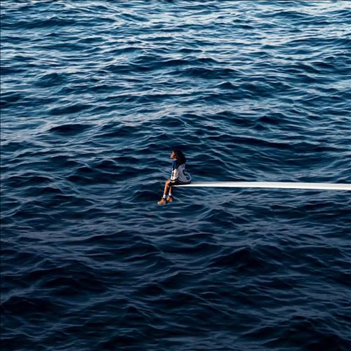

import { Slider, Button } from "@carbon/react";
import { ArrowUpRight } from "@carbon/icons-react";

import SliderJS1 from "../review/slider1";
import SliderJS2 from "../review/slider2";
import SliderJS3 from "../review/slider3";
import SliderJS4 from "../review/slider4";
import AdvJS2 from "../review/adv2";
import AdvJS3 from "../review/adv3";

import { Link } from "gatsby";

import Review1 from "../review/sza1.mdx";

Album review

<h1 className="h1--no--margin">{props.pageContext.frontmatter.title}</h1>

  <Link to="/best50/2022/">2022 Black Music Album Best No.3</Link>

<Row  className="image-card-group">
	<Column colMd={3} colLg={4} noGutterMdLeft="">
       <ImageCard>

</ImageCard>
	</Column>
	<Column colMd={4} colLg={8} noGutterMdLeft="">
		

			高評価を得たデビュー作で一定のポジションを得たSZAのなんと5年ぶりの2作目。客演仕事が多く、あまり不在感はなかったが、長いインターバルを埋めるかのように23曲、70分弱の大作になっている。デビュー作後すぐに次作の噂があったが、レコード会社との折り合いなどあって、間隔が空いたようだ。また、そこにも関係ありそうだが、海上で1人助けを待つ姿がアルバムジャケットに描かれている。前作のパーソナルでオーガニックな側面を残しつつ、全体的には、音の広がりを感じる作品になっており、R&B, Hip-Hopだけでなく、Gospel, Rock, Folk, Countryなど幅広い作風になっている。曲数が多い分、Producerも多めになっていて、バラエティに富んだ作品でもる。30歳を越えたSZAであるが、歌声は、まだまだ、みずみすしく、少女らしさを残しつつ、メロディアスな曲での穏やかな歌唱が印象に残る。
		

		

		  <Button className="button-right-mergin"  href="https://amzn.to/3IRGwKB" renderIcon={ArrowUpRight} size='sm' kind='primary'>
  	    amazon.com
  	  </Button>
  	  <Button className="button-right-mergin"  href="https://amzn.to/3kq2R8S" renderIcon={ArrowUpRight} size='sm' kind='secondary'>
  	    amazon.co.jp
  	  </Button>
			<Button className="button-right-mergin"  href="https://apple.co/3m95dcH" renderIcon={ArrowUpRight} size='sm' kind='tertiary'>
  	    apple music
  	  </Button>
			<AdvJS2/>
		

	</Column>
</Row>
<Row >
	<Column colMd={4} colLg={4} noGutterMdLeft="">
		

		  <h3>Score card</h3>
			<SliderJS1 value="4" />
		  <SliderJS2 value="2" />
			<SliderJS3 value="1" />
		  <SliderJS4 value="9" />
		

	</Column>
	<Column colMd={8} colLg={8} noGutterMdLeft="">
		

			<h3>Producers</h3>
			

				Jay Versace(1,11)
				 Carter Lang(2)
				 Rob Bisel, Carter Lang, Scum and ThankGod4Cody(3)
				 Rob Bise, Alessandro Buccellati and Aire Atlantica(4)
				 Yakob, Carter, Lang and ThankGod4Cody(5)
				 Rob Bisel, Carter Lang, William MillerYuli(6)
				 DJ Dahi(7)
				 Babyface and The Rascals(8)
				 Teo Halm, Michael Uzowuru, Rob Bisel, Carter Lang and ThankGod4Cody(9)
				 Jeff Bhasker, Emile Haynie, Rob Bisel, Carter Lang and ThankGod4Cody(10)
				 Rob Bisel and Carter Lang(12,13)
				 Benny Blanco, Rob Bisel and Carter Lang(14)
				 ThankGod4Cody(15)
				 Benny Blanco, Shellback and Rob Bisel(16)
				 Still Woozy, Samuel Witte, Rob Bisel, Carter Lang and ThankGod4Cody(17)
				 Rob Bisel, Carter Lang, Los Hendrix, Beat Butcha and Scum(18)
				 Darkchild and Freaky Rob(19)
				 Teo Halm, Michael Uzowuru and Rob Bisel(20)
				 Rob Bisel, Carter Lang, ThankGod4CodyS and ir Dylan(21)
				 Carter Lang and Los Hendrix(22)
				 Darkchild(23)
			

			<h3>Guests</h3>
			

				Don Triver, Phoebe Bridgers, Travis Scott, Ol' Dirty Bastard
			

		

	</Column>
</Row>

<h3>Tracks</h3>

| No. | Title                 | Composers                                                                                                                                              | Performer                   | Time  |
| --- | --------------------- | ------------------------------------------------------------------------------------------------------------------------------------------------------ | --------------------------- | ----- |
| 1   | SOS                   | Solána Rowe, Gabriel Hardeman, Rob Bise, lJahlil Gunter                                                                                                | SZA                         | 01:57 |
| 2   | Kill Bill             | Solána Rowe, Carter Lang, Rob Bisel                                                                                                                    | SZA                         | 02:33 |
| 3   | Seek & Destroy        | Solána Rowe, Rob Bisel, Carter Lang, Tyran Donaldson, Cody Fayne                                                                                       | SZA                         | 03:23 |
| 4   | Low                   | Solána Rowe, Rob Bisel, Alessandro Buccellati, Joseph Pincus, Jocelyn Donald                                                                           | SZA                         | 03:01 |
| 5   | Love Language         | Solána Rowe, Tyrone Griffin, Jr., Anthony Clemons, Jr., Pharrell Williams, Chad Hugo, Jazzaé De Waal, Jakob Rabitsch, Carter Lang, Cody Fayne, Rob Bis | SZA                         | 03:03 |
| 6   | Blind                 | Solána Rowe, Carter Lang, William Miller, Margaux Whitney                                                                                              | SZA                         | 02:30 |
| 7   | Used                  | Solána Rowe, Caleb Toliver, John Hill, Dacoury Natche, Danny McKinnon, Ely Rise, John Key                                                              | SZA feat. Don Triver        | 02:26 |
| 8   | Snooze                | Solána Rowe, Kenneth Edmonds, Khristopher Riddick-Tynes, Leon Thomas III, Blair Ferguson                                                               | SZA                         | 03:21 |
| 9   | Notice Me             | Solána Rowe, Teo Halm, Michael Uzowuru, Rob Bisel, Carter Lang, Cody Fayne                                                                             | SZA                         | 02:40 |
| 10  | Gone Girl             | Solána Rowe, Jeff Bhasker, Emile Haynie, Rob Bisel, Carter Lang, Cody Fayne                                                                            | SZA                         | 04:04 |
| 11  | Smoking on my Ex Pack | Solána Rowe, Clarence Scarborough, Raina Taylor, lJahlil Gunter                                                                                        | SZA                         | 01:23 |
| 12  | Ghost in the Machine  | Solána Rowe, Phoebe Bridgers, Rob Bisel, Carter Lang, Matt Cohn, Marshall Vore                                                                         | SZA feat. Phoebe Bridgers   | 03:38 |
| 13  | F2F                   | Solána Rowe, Melissa Jefferson, Rob Bisel, Carter Lang                                                                                                 | SZA                         | 03:05 |
| 14  | Nobody Gets Me        | Solána Rowe, Benjamin Levin, Rob Bisel, Carter Lang                                                                                                    | SZA                         | 03:00 |
| 15  | Conceited             | Solána Rowe, Cody Fayne, Rob Bisel                                                                                                                     | SZA                         | 02:31 |
| 16  | Special               | Solána Rowe, Benjamin Levin, Johan Schuster, Rob Bisel                                                                                                 | SZA                         | 02:38 |
| 17  | Too Late              | Solána Rowe, Sven Gamsky, Samuel Witte, Rob Bisel, Carter Lang, Cody Fayne                                                                             | SZA                         | 02:44 |
| 18  | Far                   | Solána Rowe, Rob Bisel, Carter Lang, Carlos Muñoz, Eliot Dubock, Tyran Donaldson                                                                       | SZA                         | 03:00 |
| 19  | Shirt                 | Solána Rowe, Rodney Jerkins, Robert Gueringer                                                                                                          | SZA                         | 03:01 |
| 20  | Open Arms             | Solána Rowe, Jacques Webster II, Halm, Uzowuru, Rob Bisel, Douglas Ford                                                                                | SZA feat. Travis Scott      | 03:59 |
| 21  | I Hate U              | Solána Rowe, Rob Bisel, Carter Lang, Cody Fayne, Dylan Patrice                                                                                         | SZA                         | 02:53 |
| 22  | Good Days             | Solána Rowe, Jacob Collier, Carter Lang, Muñoz, Christopher Ruelas                                                                                     | SZA                         | 04:38 |
| 23  | Forgiveless           | Solána Rowe, Russell Jones, Björk Guðmundsdóttir, Guy Sigsworth, Mark Bell, Rodney Jerkins                                                             | SZA feat. Ol' Dirty Bastard | 02:21 |

<h3>Other Reviews</h3>

<Row>
  <Column colMd={3} colLg={3} noGutterMdLeft>
    <Review1 />
  </Column>
</Row>

<AdvJS3 />