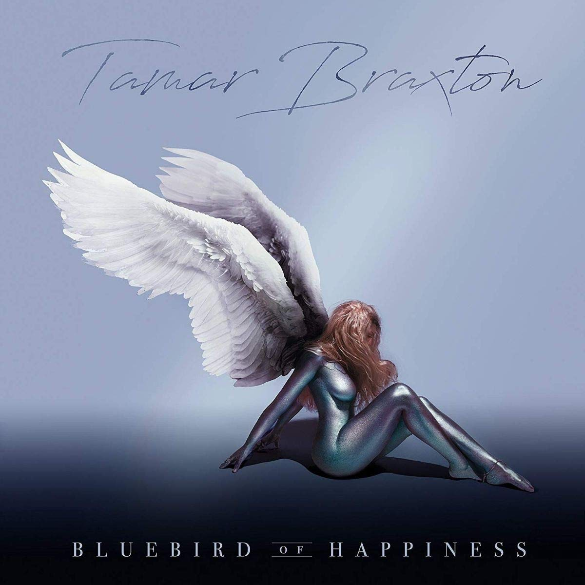

import { Slider, Button } from 'carbon-components-react';
import { ArrowUpRight24  } from '@carbon/icons-react';

import SliderJS1 from "../review/slider1"
import SliderJS2 from "../review/slider2"
import SliderJS3 from "../review/slider3"
import SliderJS4 from "../review/slider4"

import { Link } from "gatsby"

Album review

<h1 className="h1--no--margin">{props.pageContext.frontmatter.title}</h1>

<Link to="/best50/2017/">2017 Black Music Album Best No.46</Link>

<Row  className="image-card-group">
	<Column colMd={"3"} colLg={"4"} noGutterMdLeft="">
       <ImageCard>

 
</ImageCard>
	</Column>
	<Column colMd={"4"} colLg={"8"} noGutterMdLeft="">
	

	Toniの妹のという枕詞が不要になったTamar Braxtonの2年ぶりの4作目。本人によるとアルバムとしてはこれが最後になるとのこと。(どうもArtist活動は続けているようだが)。レーベル(Sony)との金にまつわるゴタゴタを経て、自身のレーベルからのリリースとなる。そんな動きはあったものの、アルバム自体は質の良いものに仕上がっている。Producerを一新し、特にRodney Jerkins、Troy TaylorなどR&B畑の実力派Producerを迎えたこともあり、スロー中心の落ち着いたR&B作になっている。レゲエやカ
	リブっぽい曲もあるが、しっとりした曲が中心となる。TamarのVocalも低音から高音まで曲に合わせて、使い分けていて、流石の表現力を魅せている。

	

	  <Button className="button-right-mergin"  href="https://amzn.to/3hmHgHc" kind="primary" size="small" renderIcon={ArrowUpRight24}>
      amazon.com
    </Button>
    <Button className="button-right-mergin"  href="https://amzn.to/2OHxVx4" kind="secondary" size="small" renderIcon={ArrowUpRight24}>
      amazon.co.jp
    </Button>
	

	
	
	</Column>
</Row>
<Row >
	<Column colMd={"4"} colLg={"4"} noGutterMdLeft="">

    <h3>Score card</h3>
	<SliderJS1 value="5" />
    <SliderJS2 value="1" />
	<SliderJS3 value="1" />
    <SliderJS4 value="8" />

</Column>
<Column colMd={"8"} colLg={"8"} noGutterMdLeft="">

<h3>Producers</h3>

Jevin Hill, Stanley Black and Tiyon "TC" Mack(1)
 Yonni(2)
 Troy Taylor and Birdgetown(3)
 Donald "Hazel" Sales and Tiyon "TC" Mack(4)
 Ronald "Darkchild" Jerkins and Reezytunez(5)
 Ronald "Darkchild" Jerkins(6,7
 Bob Robinson(8)
 Troy Taylor and $K(9)
 Damon Thomas and Vincent Berry II(10)
 Vincent Berry II(11)

<h3>Guests</h3>

Yo Gotti

</Column>
</Row>

<h3>Tracks</h3>

| No. |	 Title             |	 Composers                                                                                                                      |	 Performer                 | Time  |
| --- |	------------------ | ---------------------------------------------------------------------------------------------------------------------------------- | ---------------------------- | ----- |
| 1	  |	My Forever         | Tamar Braxton / Tiyon Mack                                                                                                        	| Tamar Braxton                | 03:31 |
| 2	  |	Wanna Love You Boy | Eric Bellinger / Tamar Braxton / Robin Thicke / Pharrell Williams                                                                 	| Tamar Braxton                | 02:52 |
| 3	  |	Run Run            | Tamar Braxton / Makeba Riddick / Winston Delano Riley / Troy Taylor                                                               	| Tamar Braxton                | 02:40 |
| 4	  |	Hol' Up            | Tamar Braxton / O'Kelly Isley / Ronald Isley / Rudolph Isley / Hi Jackson                                                         	| Tamar Braxton feat. Yo Gotti | 03:59 |
| 5	  |	The Makings of You | Anesha Birchett / Antea Birchett / Tamar Braxton / Rodney "Darkchild" Jerkins / Curtis Mayfield / Jared Thorne                    	| Tamar Braxton                | 05:02 |
| 6	  |	Heart in My Hands  | Tamar Braxton / Rodney "Darkchild" Jerkins / Priscilla Renea                                                                      	| Tamar Braxton                | 03:15 |
| 7	  |	Blind              | Vincent Berry / Tamar Braxton / Billy Foster / Rodney "Darkchild" Jerkins / Ellington Jordan / Carmen Reecey                      	| Tamar Braxton                | 05:01 |
| 8	  |	My Man             | Tamar Braxton / Cory Rooney                                                                                                       	| Tamar Braxton                | 04:12 |
| 9	  |	Pick Me Up         | Tamar Braxton / Michael Jones / Makeba Riddick / Troy Taylor                                                                      	| Tamar Braxton                | 02:46 |
| 10  |	How I Feel         | Vincent Berry / Tamar Braxton / Malcolm Harvest / Mike Jiminez                                                                    	| Tamar Braxton                | 03:46 |
| 11  |	Empty Boxes        | Lajoel Augustin / Joshua Berry / Vincent Berry / Tamar Braxton / Don Corleone / LaShawn Daniels / Robin Ingouma / Jean-Guy Leconte	| Tamar Braxton                | 03:49 |
