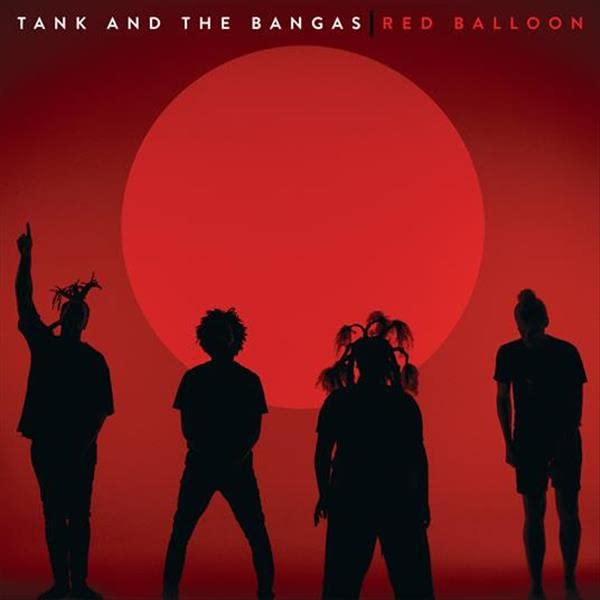

import { Slider, Button } from "carbon-components-react";
import { ArrowUpRight24 } from "@carbon/icons-react";

import SliderJS1 from "../review/slider1";
import SliderJS2 from "../review/slider2";
import SliderJS3 from "../review/slider3";
import SliderJS4 from "../review/slider4";
import AdvJS2 from "../review/adv2";
import AdvJS3 from "../review/adv3";

import { Link } from "gatsby";

Album review

<h1 className="h1--no--margin">{props.pageContext.frontmatter.title}</h1>

<Row  className="image-card-group">
	<Column colMd={"3"} colLg={"4"} noGutterMdLeft="">
       <ImageCard>

</ImageCard>
	</Column>
	<Column colMd={"4"} colLg={"8"} noGutterMdLeft="">
		

			New Orleansをベースに活動するR&B Band、Tank and The Bangasのメジャー2作目。2011年にバンド結成し、Indy中心に活動してきたが、前作ではGrammyにもノミネートされ、今が旬のBandでもある。
			 CDジャケットにも写っている4人(女性Vo1人、男性3人(そのうち1人が白人))がコアメンバーで、加えてツアーやアルバムでのサポートメンバーの5人で構成されている。R&BにHip-Hip、Jazz、ちょっとAfroをミックスしたようなサウンドは、NOらしいアーシーな部分を残しつつ、洗練されており、曲調も様々で、かなりの面白さ。
			 ブラスも多用しており、Trombone ShortyがGuestでPeter Cottontale製作の⑨などはお洒落でもある。
			 Lyricは恋愛と身の回りに、一部社会性を加えたものになっている。VocalのTankの唄や声も魅力的で、バンドの一体感もあり、楽しくて躍動感に溢れる作品である。
		

  		

			<Button className="button-right-mergin"  href="https://amzn.to/3gvbvk0" kind="primary" size="small" renderIcon={ArrowUpRight24}>
  	  	amazon.com
  		</Button>
  		<Button className="button-right-mergin"  href="https://amzn.to/3TKIY8g" kind="secondary" size="small" renderIcon={ArrowUpRight24}>
  	  	amazon.co.jp
  		</Button>
			<Button className="button-right-mergin"  href="https://apple.co/3Dl8r2O" kind="tertiary" size="small" renderIcon={ArrowUpRight24}>
  	  		amazon.co.jp
  		</Button>
			<AdvJS2/>
		

	</Column>
</Row>
<Row >
	<Column colMd={"4"} colLg={"4"} noGutterMdLeft="">

  <h3>Score card</h3>
	<SliderJS1 value="4" />
  <SliderJS2 value="3" />
	<SliderJS3 value="1" />
  <SliderJS4 value="9" />

</Column>
<Column colMd={"8"} colLg={"8"} noGutterMdLeft="">

	<h3>Producers</h3>
	

		Tank and The Bangas(1,2)
		 Joshua Johnson(3)
		 Jeff Gitty(4,8,13,14)
		 Biako(5,15)
		 Phoelix(6)
		 Biako and BLVK(7,11)
		 Peter Cottontale(9,12)
		 Alb The Builder(10
	

	<h3>Guests</h3>
	

		Wayne Brady, The Hamiltons, Jamison Ross, Trombone Shorty, Freedia, Lalah Hathaway, Jacob Collier
	

</Column>
</Row>

<h3>Tracks</h3>

| No. | Title               | Composers                                                                                                                                                          | Performer                                               | Time  |
| --- | ------------------- | ------------------------------------------------------------------------------------------------------------------------------------------------------------------ | ------------------------------------------------------- | ----- |
| 1   | Intro               | Albert Allenback / Tarriona 'Tank' Ball / Wayne Brady / Joe Johnson / Joshua Johnson                                                                               | Tank and the Bangas feat. Wayne Brady                   | 00:45 |
| 2   | Mr. Bluebell        | Daniel Abel / Albert Allenback / Tarriona 'Tank' Ball / Joe Johnson / Joshua Johnson / Norman Spence                                                               | Tank and the Bangas                                     | 02:32 |
| 3   | Anxiety             | Tarriona 'Tank' Ball / Joshua Johnson                                                                                                                              | Tank and the Bangas                                     | 02:28 |
| 4   | Oak Tree            | Daniel Abel / Albert Allenback / Tarriona 'Tank' Ball / Jeff Gitty / Joshua Johnson / Norman Spence / Kevin Theodore                                               | Tank and the Bangas                                     | 03:07 |
| 5   | Communion in My Cup | Albert Allenback / Tarriona 'Tank' Ball / Antonio Bowers / Jonathan Johnson / Joshua Johnson / Itai Shapira / Norman Spence / James Tillman / Corey Williams       | Tank and the Bangas feat. The Hamiltons                 | 03:30 |
| 6   | Who's in Charge     | Albert Allenback / Tarriona 'Tank' Ball / Joshua Johnson / Michael Neil                                                                                            | Tank and the Bangas                                     | 03:31 |
| 7   | Why Try             | Albert Allenback / Tarriona 'Tank' Ball / Nathaniel Austin Brown / Joshua Johnson / Georgia Anne Muldrow / Itai Shapira / Norman Spence / Brian Wiggins            | Tank and the Bangas                                     | 03:36 |
| 8   | No ID               | Albert Allenback / Tarriona 'Tank' Ball / Jeff Gitty / Joshua Johnson / Norman Spence / Etienne Jean Stoufflet / Kevin Theodore                                    | Tank and the Bangas                                     | 03:11 |
| 9   | Café Du Monde       | Albert Allenback / Tarriona 'Tank' Ball / Peter Cottontale / Joe Johnson / Joshua Johnson / Rachel Robinson / Jamison Ross / John Michael Rouchell / Norman Spence | Tank and the Bangas feat. Jamison Ross, Trombone Shorty | 03:59 |
| 10  | Easy Goes It        | Albert Allenback / Tarriona 'Tank' Ball / Lalah Hathaway / Joe Johnson / Joshua Johnson                                                                            | Tank and the Bangas feat. Lalah Hathaway                | 01:37 |
| 11  | Stolen Fruit        | Ron Allen / Albert Allenback / Tarriona 'Tank' Ball / Nathaniel Austin Brown / Joshua Johnson / Brian London / Itai Shapira / Norman Spence                        | Tank and the Bangas                                     | 03:37 |
| 12  | Big                 | Albert Allenback / Tarriona 'Tank' Ball / Peter Cottontale / Joe Johnson / Joshua Johnson / Norman Spence                                                          | Tank and the Bangas feat. Freedia                       | 01:41 |
| 13  | Heavy               | Albert Allenback / Tarriona 'Tank' Ball / Jeff Gitty / Joshua Johnson / Norman Spence / Kevin Theodore                                                             | Tank and the Bangas                                     | 02:41 |
| 14  | Jellyfish           | Albert Allenback / Tarriona 'Tank' Ball / Jeff Gitty / Joshua Johnson / Norman Spence / Kevin Theodore                                                             | Tank and the Bangas                                     | 03:27 |
| 15  | Where Do We All Go  | Albert Allenback / Tarriona 'Tank' Ball / Jacob Collier / Ishmael Cotton / Joshua Johnson / David Phelps / Itai Shapira / Norman Spence                            | Tank and the Bangas feat. Lalah Hathaway, Jacob Collier | 03:55 |

<AdvJS3 />
