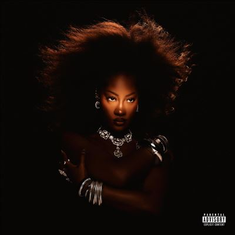

import { Slider, Button } from "@carbon/react";
import { ArrowUpRight } from "@carbon/icons-react";

import SliderJS1 from "../review/slider1";
import SliderJS2 from "../review/slider2";
import SliderJS3 from "../review/slider3";
import SliderJS4 from "../review/slider4";
import AdvJS2 from "../review/adv2";
import AdvJS3 from "../review/adv3";

import { Link } from "gatsby";

Album review

<h1 className="h1--no--margin">{props.pageContext.frontmatter.title}</h1>

<Row  className="image-card-group">
	<Column colMd={3} colLg={4} noGutterMdLeft="">
       <ImageCard>

</ImageCard>
	</Column>
	<Column colMd={4} colLg={8} noGutterMdLeft="">
		

			ナイジェリア人の母と英国人の父を持ち、自身もナイジェリア出身で、幼少期の一部をUKでの生活を送ったという、Singer, Song Writer, Temsのフルデビューアルバム。
			 2020年代にはいるあたりから、客演仕事で目立つようになり、最近勢いづいているAfrican Pop勢の一翼を占めるようになった。
			 ガーナ人ProducerのGuilty BeatzらによるTrackは打ち込みメインではあるがアコースティックな印象を受けるものが多く、Afro Popに軸足を置きつつ、普通っぽいソウル、メランコリックなスパニッシュ風、レゲエ風など、グローバルなものになっており、ゆったりとした曲が多めとなっている。
			 Temsの唄はアラサーということもあって、落ち着きのあるもので、自身の生い立ちや恋愛を唄っており、染みてくるような曲も少なくない。
		

		

		  <Button className="button-right-mergin"  href="https://amzn.to/4eEd747" renderIcon={ArrowUpRight} size='sm' kind='primary'>
  	    amazon.com
  	  </Button>
  	  <Button className="button-right-mergin"  href="https://amzn.to/4dNVhdN" renderIcon={ArrowUpRight} size='sm' kind='secondary'>
  	    amazon.co.jp
  	  </Button>
			<Button className="button-right-mergin"  href="https://apple.co/4dGgmH3" renderIcon={ArrowUpRight} size='sm' kind='tertiary'>
  	   	apple music
  	  </Button>
			<AdvJS2/>
		

	</Column>
</Row>
<Row >
	<Column colMd={4} colLg={4} noGutterMdLeft="">
		

		  <h3>Score card</h3>
			<SliderJS1 value="5" />
		  <SliderJS2 value="4" />
			<SliderJS3 value="1" />
		  <SliderJS4 value="9" />
		

	</Column>
	<Column colMd={8} colLg={8} noGutterMdLeft="">
		

			<h3>Producers</h3>
			

				Guilty Beatz and Tems(1,3,4,9,16,18)
				 Tems(2,13)
				 Guilty Beatz and Spax(5)
				 Sarz(6)
				 Guilty Beatz(7,15,17)
				 Spax(8)
				 Guilty Beatz and Nsikak David(10)
				 DAMEDAME*(11)
				 P2J(12)
				 Thisizlondon(14)
			

			<h3>Guests</h3>
			

				Asake, J. Cole
			

		

	</Column>
</Row>

<h3>Tracks</h3>

| No. | Title                         | Composers                                                                                                | Performer | Time             |
| --- | ----------------------------- | -------------------------------------------------------------------------------------------------------- | --------- | ---------------- |
| 1   | Born in the Wild              | Ronald Banful, Temilade Openiyi                                                                          | Tems      | 02:16            |
| 2   | Special Baby (Interlude)      | Temilade Openiyi                                                                                         | Tems      | 01:29            |
| 3   | Burning                       | Ronald Banful, Temilade Openiyi                                                                          | Tems      | 02:55            |
| 4   | Wickedest                     | Ronald Banful, Temilade Openiyi, David Tayorault, Edson D. Tayoro, Salif Traore                          | Tems      | 02:37            |
| 5   | Love Me JeJe                  | Samuel Akano, Ronald Banful, Temilade Openiyi, Seyi Sodimu, Akano Samuel Wisdom                          | Tems      | 03:01            |
| 6   | Get It Right                  | Ahmed Ololade Asake, Temilade Openiyi, Osabuohien Osaretin                                               | Tems      | Tems feat: Asake |
| 7   | Ready                         | Ronald Banful, Temilade Openiyi                                                                          | Tems      | 03:45            |
| 8   | Gangsta                       | Samuel Akano, Diana King, Temilade Openiyi, Arnold Roman, Andrew Michael Saidenberg, Akano Samuel Wisdom | Tems      | 02:42            |
| 9   | Unfortunate                   | Ronald Banful, Temilade Openiyi                                                                          | Tems      | 03:39            |
| 10  | Boy O Boy                     | Ronald Banful, David Nsikak, Temilade Openiyi                                                            | Tems      | 02:52            |
| 11  | Forever                       | Ronald Banful, DAMEDAME\*, Temilade Openiyi                                                              | Tems      | 03:16            |
| 12  | Free Fall                     | Jermaine Cole, Richard Isong, Temilade Openiyi                                                           | Tems      | feat: J. Cole    |
| 13  | Voices in My Head (Interlude) | Temilade Openiyi                                                                                         | Tems      | 01:27            |
| 14  | Turn Me Up                    | Michael Hunter, Temilade Openiyi                                                                         | Tems      | 03:37            |
| 15  | Me & U                        | Ronald Banful, Temilade Openiyi                                                                          | Tems      | 03:12            |
| 16  | T-Unit                        | Ronald Banful, Lauryn Hill, Temilade Openiyi                                                             | Tems      | 03:04            |
| 17  | You in My Face                | Ronald Banful, Temilade Openiyi                                                                          | Tems      | 04:29            |
| 18  | Hold On                       | Ronald Banful, Temilade Openiyi                                                                          | Tems      | 04:05            |

<AdvJS3 />
