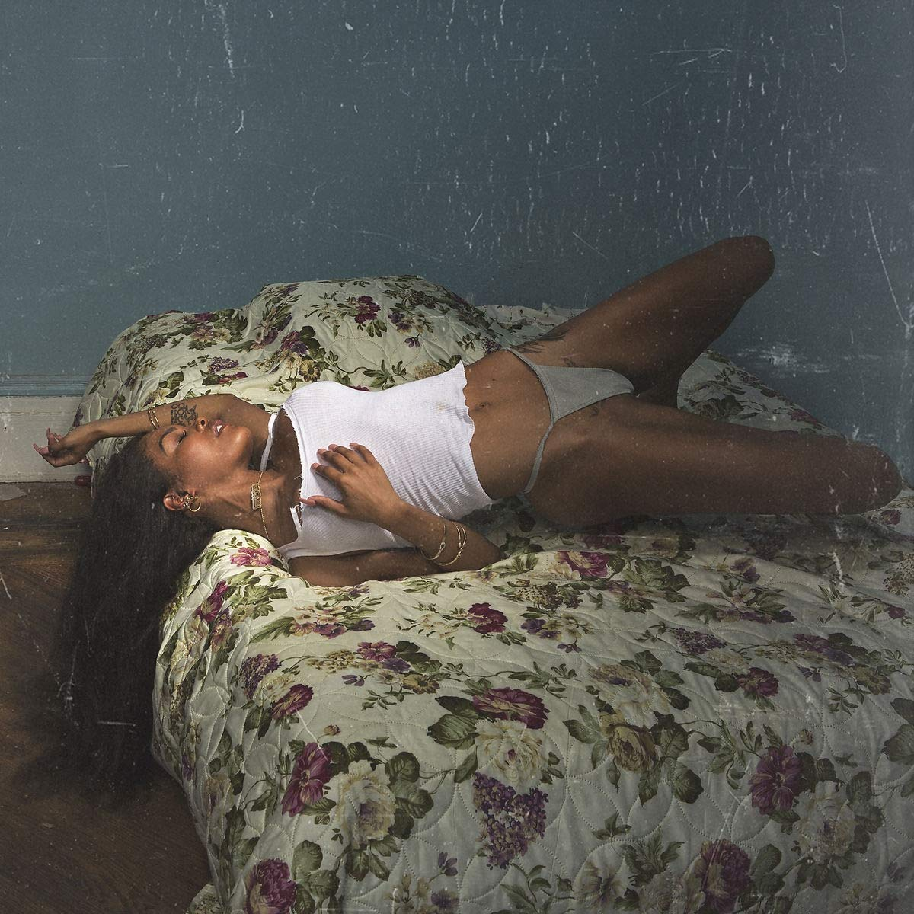

import { Slider, Button } from 'carbon-components-react';
import { ArrowUpRight24  } from '@carbon/icons-react';

import SliderJS1 from "../review/slider1"
import SliderJS2 from "../review/slider2"
import SliderJS3 from "../review/slider3"
import SliderJS4 from "../review/slider4"

import { Link } from "gatsby"

CD review

<h1 className="h1--no--margin">{props.pageContext.frontmatter.title}</h1>
<h3><Link to="/best50/2018/">2018 Black Music Best No.20</Link></h3>

<Row  className="image-card-group">
	<Column colMd={"4"} colLg={"4"} noGutterMdLeft="">
       <ImageCard>

</ImageCard>
	</Column>
	<Column colMd={"8"} colLg={"8"} noGutterMdLeft="">
	

	Teyana Taylorの4年振り2作目。2018年夏のKanye Westによる5週連続Produce作EPリリースの一つでもある。全体としての印象はメロディアスでオーソドックスなR&Bで、そこに初期のKanyeっぽい仕掛けが加わっている。Trackはスロー中心の構成となる。少し掠れた声色からはエロいAlicia Keysと言ってもいい気がするが、曲によって、様々に唄い分けており、表現力では28歳とは思えないベテラン感を出している。なお、タイトルはKeep That Same Energyの略だとのこと。
	

	

	  <Button href="https://amzn.to/2VlrEex" kind="primary" size="small" renderIcon={ArrowUpRight24}>
      amazon.com
      </Button>
      <Button href="https://amzn.to/2BJ2Q90" kind="secondary" size="small" renderIcon={ArrowUpRight24}>
      amazon.co.jp
      </Button>
	

	
	
	</Column>
</Row>
<Row >
	<Column colMd={"4"} colLg={"4"} noGutterMdLeft="">

    <h3>Score card</h3>
	<SliderJS1 value="4" />
    <SliderJS2 value="2" />
	<SliderJS3 value="1" />
    <SliderJS4 value="9" />

</Column>
<Column colMd={"8"} colLg={"8"} noGutterMdLeft="">

<h3>Producers</h3>

Nathaniel Alford, Mark Batson, Boogz, Che Pope, Mike Dean and Kanye West(1)
 Boogz, Mike Dean and Kanye West(2)
 Boogz, Plain Pat and Kanye West(3)
 Nathaniel Alford, Boogz, Mike Dean and Kanye West(4)
 Kanye West(5,7)
 Boogz and Kanye West(6)
 Mykki Blanco, NOVA Wav and Kanye West(8)

<h3>Guests</h3>

	Mykki Blancoi

</Column>
</Row>

<h3>Tracks</h3>

| No. |	Title                    |	 Composers                                                                                   |	 Performer                     | Time  |
| --- |	------------------------ | --------------------------------------------------------------------------------------------- | ------------------------------- | ----- |
| 1	  |	No Manners               | Aliandro Prawl, Anthony Clemons, Kanye West, Scott Carter (11), Teyana Taylor                 | Teyana Taylor                   | 01:39 |
| 2	  |	Gonna Love Me            | Brittany Coney, Denisia Andrews, Kanye West, Noah Goldstein, Teyana Taylor                    | Teyana Taylor                   | 02:47 |
| 3	  |	Issues / Hold On         | Anthony Clemons, Kanye West, Scott Carter, Teyana Taylor, Uforo Ebong                         | Teyana Taylor                   | 03:06 |
| 4	  |	Hurry                    | Anthony Clemons, Kanye West, Scott Carter, Teyana Taylor, Uforo Ebong                         | Teyana Taylor feat. kanye West  | 02:54 |
| 5	  |	3Way                     | Eric Bellinger, Kanye West, Rodney Jerkins, Teyana Taylor, Antony Williams, Tyrone Griffin Jr | Teyana Taylor                   | 03:24 |
| 6	  |	Rose In Harlem           | Brittany Coney, Denisia Andrews, Kanye West, Mike Dean, Teyana Taylor                         | Teyana Taylor                   | 03:43 |
| 7	  |	Never Would Have Made It | Kanye West, Teyana Taylor                                                                     | Teyana Taylor                   | 02:40 |
| 8	  |	WTP                      | Andrew Dawson, Danielle Balbuena, Kanye West, Michael Quattlebaum*, Teyana Taylor             | Teyana Taylor                   | 02:47 |
