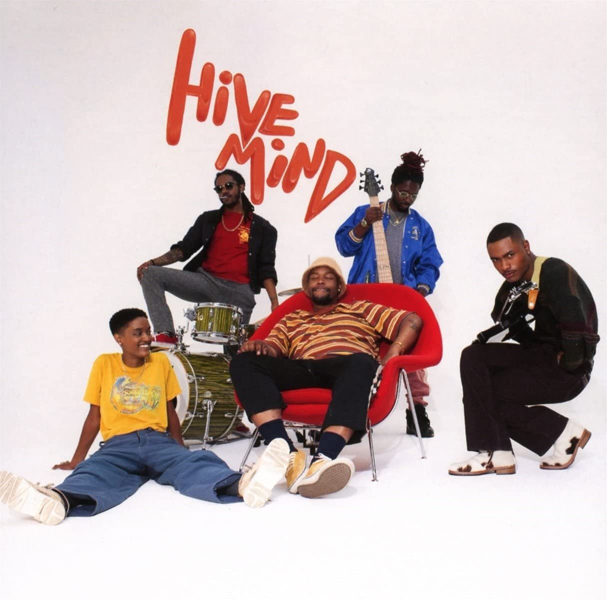

import { Slider, Button } from 'carbon-components-react';
import { ArrowUpRight24  } from '@carbon/icons-react';

import SliderJS1 from "../review/slider1"
import SliderJS2 from "../review/slider2"
import SliderJS3 from "../review/slider3"
import SliderJS4 from "../review/slider4"

import { Link } from "gatsby"

import Review1 from "../review/stevelacy1.mdx"

CD review

<h1 className="h1--no--margin">{props.pageContext.frontmatter.title}</h1>

<Link to="/best50/2018/">2018 Black Music Best No.7</Link>

<Row  className="image-card-group">
	<Column colMd={"4"} colLg={"4"} noGutterMdLeft="">
       <ImageCard>

 

</ImageCard>
	</Column>
	<Column colMd={"8"} colLg={"8"} noGutterMdLeft="">
	

	一人減って5人になったThe Internetの3年ぶりのメジャー3作目。個人活動も好調で”Odd Future所属の”という枕詞がいらないくらいメジャーになり、一種の余裕が感じられる。Guestもなし、Produceも自身のみでの構成は、バンドとしての自信の表れであろう。抑制が効いて必要以上に盛り上がらないサウンドはまさにクール。TrackはJazzやLatinもとりいれつつ、hip-hop的感覚を忘れてないところが良い。Sydの静謐で浮遊感漂うVocaに加えSteve Lacyも数曲歌っている。
	

	

	  <Button href="https://amzn.to/2BqsTSc" kind="primary" size="small" renderIcon={ArrowUpRight24}>
      amazon.com
      </Button>
      <Button href="https://amzn.to/2YfteAj" kind="secondary" size="small" renderIcon={ArrowUpRight24}>
      amazon.co.jp
      </Button>
	

	
	
	</Column>
</Row>
<Row >
	<Column colMd={"4"} colLg={"4"} noGutterMdLeft="">

    <h3>Score card</h3>
	<SliderJS1 value="5" />
    <SliderJS2 value="2" />
	<SliderJS3 value="1" />
    <SliderJS4 value="9" />

</Column>
<Column colMd={"8"} colLg={"8"} noGutterMdLeft="">

<h3>Producers</h3>

The Internet(all)

<h3>Guests</h3>

</Column>
</Row>

<h3>Tracks</h3>

| No. |	 Title                     |	 Composers                                                                                                |	 Performer   |	Time |
| --- |	-------------------------- | ------------------------------------------------------------------------------------------------------------ | ------------ | ----- |
| 1	  |	Come Together              | Sydney Bennett / Steve Lacy                                                                                  |	The Internet | 03:40 |
| 2	  |	Roll (Burbank Funk)        | Thorir Baldursson / Sydney Bennett / Mats Bjoerklund / Patrick Paige II / J?rgen S. Korduletsch / Steve Lacy |	The Internet | 03:11 |
| 3	  |	Come Over                  | Sydney Bennett                                                                                               |	The Internet | 05:21 |
| 4	  |	La Di Da                   | Sydney Bennett / Steve Lacy                                                                                  |	The Internet | 03:27 |
| 5	  |	Stay the Night             | Sydney Bennett / Steve Lacy                                                                                  |	The Internet | 04:21 |
| 6	  |	Bravo                      | Sydney Bennett / Christopher Allan Smith                                                                     |	The Internet | 03:26 |
| 7	  |	Mood                       | Sydney Bennett / Steve Lacy                                                                                  |	The Internet | 03:18 |
| 8	  |	Next Time/Humble Pie       | Sydney Bennett / Nick Green / Steve Lacy / Iman Osman                                                        |	The Internet | 05:40 |
| 9	  |	It Gets Better (With Time) | Sydney Bennett / Steve Lacy / Christopher Allan Smith                                                        |	The Internet | 05:26 |
| 10  |	Look What U Started        | Sydney Bennett / Nick Green / Steve Lacy                                                                     |	The Internet | 04:30 |
| 11  |	Wanna Be                   | Sydney Bennett / Steve Lacy                                                                                  |	The Internet | 04:27 |
| 12  |	Beat Goes On               | Steve Lacy / Matthew Martin                                                                                  |	The Internet | 04:16 |
| 13  |	Hold On                    | Nicholas Bennett / Sydney Bennett / Steve Lacy / Christopher Allan Smith                                     |	The Internet | 06:46 |

<h3>Other Reviews</h3>

<Row>
<Column colMd={3} colLg={3} noGutterMdLeft>
<Review1 />
</Column>
</Row>