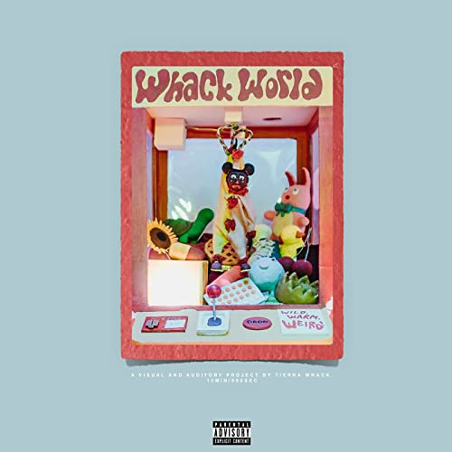

import { Slider, Button } from 'carbon-components-react';
import { ArrowUpRight24  } from '@carbon/icons-react';

import SliderJS1 from "../review/slider1"
import SliderJS2 from "../review/slider2"
import SliderJS3 from "../review/slider3"
import SliderJS4 from "../review/slider4"

import { Link } from "gatsby"

CD review

<h1 className="h1--no--margin">{props.pageContext.frontmatter.title}</h1>

<Link to="/best50/2018/">2018 Black Music Best No.9</Link>

<Row  className="image-card-group">
	<Column colMd={"3"} colLg={"4"} noGutterMdLeft="">
       <ImageCard>

</ImageCard>
	</Column>
	<Column colMd={"4"} colLg={"8"} noGutterMdLeft="">
	

	1995年生まれでフィラデルフィア出身のFemale Rapper, Tierra Whackのデビュー作。InstagramのStorｙの長さに合わせた1分間の曲をインターバル無く15曲繋ぎ合わせた、つまり15分の作品。同じ構成のMVはGrammyにノミネートされている。ただこの構成は気まぐれによるものらしく、崇高なコンセプトなどが無いところがかえって清々しい。Trackは、ミニマルな感じで、緩やかで落ち着くようなものが多く、バックは楽器がベースとなっている。業界にメジャーなメンターがいるわけでもないので、どこの流派にも属さないユニークなところがある。(敢えて比較するならNonameあたり)。唄2:Rap1程度の割合なのだが、声と唄い方を曲によって使い分けているので、何人もマイクをとっているように感じられるが、もう一つの特徴だ。
	

	

	  <Button href="https://amzn.to/3egRcAN" kind="primary" size="small" renderIcon={ArrowUpRight24}>
      amazon.com
    </Button>
    <Button href="https://amzn.to/3hMYbUf" kind="secondary" size="small" renderIcon={ArrowUpRight24}>
      amazon.co.jp
    </Button>
	

	
	
	</Column>
</Row>
<Row >
	<Column colMd={"4"} colLg={"4"} noGutterMdLeft="">

    <h3>Score card</h3>
	<SliderJS1 value="3" />
    <SliderJS2 value="2" />
	<SliderJS3 value="1" />
    <SliderJS4 value="8" />

</Column>
<Column colMd={"8"} colLg={"8"} noGutterMdLeft="">

<h3>Producers</h3>

Kenete Simms(1,2,3,5,8,14,15)
 Nick Verruto(4,6,7,10)
 J Melodic(9)
 RicandThadeus(11)
 J Melodic and DJ Fly Guy(12)
 Scott Styles(13)

<h3>Guests</h3>

</Column>
</Row>

<h3>Tracks</h3>

| No. |	 Title       |	 Composers                     | Performer    |	 Time |
| --- |	------------ | ------------------------------- | ------------ | ----- |
| 1	  |	Black Nails  | Kenete Simms / Tierra Whack     | Tierra Whack |	01:00 |
| 2	  |	Bugs Life    | Kenete Simms / Tierra Whack     | Tierra Whack |	01:00 |
| 3	  |	Flea Market  | Kenete Simms / Tierra Whack     | Tierra Whack |	01:00 |
| 4	  |	Cable Guy    | Nick Verruto / Tierra Whack     | Tierra Whack |	01:00 |
| 5	  |	4 Wings      | Kenete Simms / Tierra Whack     | Tierra Whack |	01:00 |
| 6	  |	Hookers      | Nick Verruto / Tierra Whack     | Tierra Whack |	01:00 |
| 7	  |	Hungry Hippo | Nick Verruto / Tierra Whack     | Tierra Whack |	01:00 |
| 8	  |	Pet Cemetery | Kenete Simms / Tierra Whack     | Tierra Whack |	01:00 |
| 9	  |	Fuck Off     | Tierra Whack                    | Tierra Whack |	01:00 |
| 10  |	Silly Sam    | Nick Verruto / Tierra Whack     | Tierra Whack |	01:00 |
| 11  |	Fruit Salad  | Quentin Shemwell / Tierra Whack | Tierra Whack |	01:00 |
| 12  |	Pretty Ugly  | David Bowden / Tierra Whack     | Tierra Whack |	01:00 |
| 13  |	Sore Loser   | Tierra Whack                    | Tierra Whack |	01:00 |
| 14  |	Dr. Seuss    | Kenete Simms / Tierra Whack     | Tierra Whack |	01:00 |
| 15  |	Waze         | Kenete Simms / Tierra Whack     | Tierra Whack |	01:00 |
