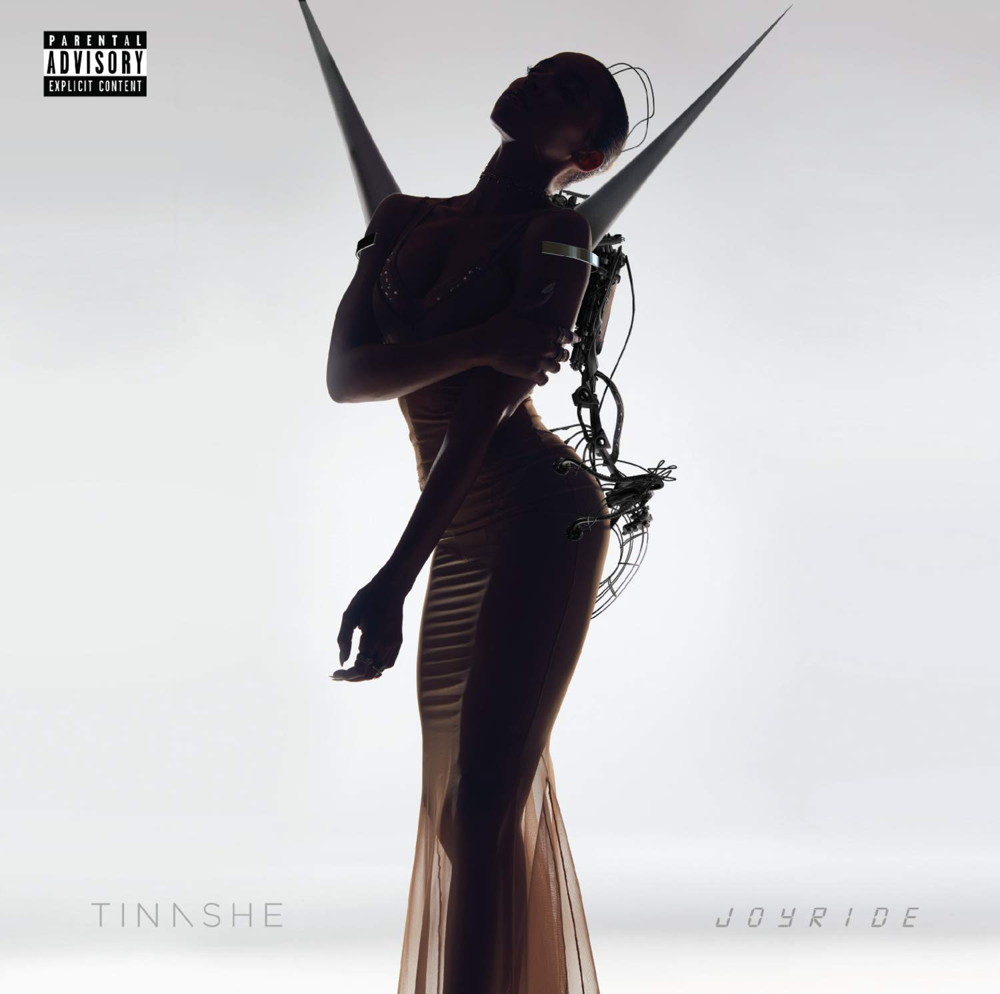

import { Slider, Button } from 'carbon-components-react';
import { ArrowUpRight24  } from '@carbon/icons-react';

import SliderJS1 from "../review/slider1"
import SliderJS2 from "../review/slider2"
import SliderJS3 from "../review/slider3"
import SliderJS4 from "../review/slider4"

import { Link } from "gatsby"

CD review

<h1 className="h1--no--margin">{props.pageContext.frontmatter.title}</h1>

<Row  className="image-card-group">
	<Column colMd={"3"} colLg={"4"} noGutterMdLeft="">
       <ImageCard>

</ImageCard>
	</Column>
	<Column colMd={"4"} colLg={"8"} noGutterMdLeft="">
	

	Vocalだけでなく、Dancer/Song writerとしての才能も持つTinasheの4年振りのphysical作。Visual Queen/Street Queenとしての称号を得る才色兼備なひとでもある。当作は2015年9月の告知より、途中、配信のみのアルバムを挟みつつ、2年半を経てやっとリリースされた。浮遊感のあるゆったりとしたTrackに囁くようなVocalというスタイルは維持しつつ、ダークで気怠い歌声の曲なども多く、曲調は様々。加えてシャープな地声も披露し、Trackによって唄い分けている。日系VocalのYukimi Nagano率いるSweedenのバンドLittle Dragon参加するElectro Popな曲もあったりして、37分弱ながらかなり濃密な作品。
	

	

	  <Button className="button-right-mergin"  href="https://amzn.to/38C3H7O" kind="primary" size="small" renderIcon={ArrowUpRight24}>
      amazon.com
    </Button>
    <Button className="button-right-mergin"  href="https://amzn.to/3fayV8S" kind="secondary" size="small" renderIcon={ArrowUpRight24}>
      amazon.co.jp
    </Button>
	

	
	
	</Column>
</Row>
<Row >
	<Column colMd={"4"} colLg={"4"} noGutterMdLeft="">

    <h3>Score card</h3>
	<SliderJS1 value="4" />
    <SliderJS2 value="1" />
	<SliderJS3 value="2" />
    <SliderJS4 value="8" />

</Column>
<Column colMd={"8"} colLg={"8"} noGutterMdLeft="">

<h3>Producers</h3>

Tinashe(1)
 Hit-Boy(2)
 Stargate(3,11)
 T-Minus(4)
 J White(5)
 Dre Moon, Floyd "A1" Bentley, HITMAKA, Wavy and BLWYRMND(6)
 Mario Lucciano(7)
 Felix Snow and Reckless(8)
 Tinashe and Ritz Reynolds(9)
 @soundz(10,12)
 Joel Compass and Amanda Ghost(13)

<h3>Guests</h3>

Offset, Ty Dolla $ign, French Montana, Future, Little Dragon

</Column>
</Row>

<h3>Tracks</h3>

| No. |	 Title                             |	 Composers                                                                                                                                                                                                             |	 Performer                               | Time	 |
| --- |	---------------------------------- | ------------------------------------------------------------------------------------------------------------------------------------------------------------------------------------------------------------------------- | ------------------------------------------- | ----- |
| 1	  |	Keep Your Eyes on the Road (Intro) |                                                                                                                                                                                                                           | Tinashe                                     | 01:09 |
| 2	  |	Joyride                            | Chauncey Hollis / Tinashe Kachingwe / Allen Ritter / Jacques Webster                                                                                                                                                      | Tinashe                                     | 03:25 |
| 3	  |	No Drama                           | Kiari Cephus / Mikkel Storleer Eriksen / Tinashe Kachingwe / Youth Wilde                                                                                                                                                  | Tinashe feat. Offset                        | 03:19 |
| 4	  |	He Don't Want It                   | Tinashe Kachingwe / Tyler Williams                                                                                                                                                                                        | Tinashe                                     | 02:52 |
| 5	  |	Ooh La La                          | Denisia Andrews / Brittany Coney / Jocelyn a. Donald / Tinashe Kachingwe / Klenord Raphael / Anthony G. White                                                                                                             | Tinashe                                     | 03:15 |
| 6	  |	Me So Bad                          | Floyd Bentley / Christopher Dotson / Tyrone Griffin / Mayila Caieme Marie Jones / Tinashe Kachingwe / Karim Kharbouch / Montrell "Wavy" Martinez / Mele Moore / Andre Proctor / Simon "Blwyrmnd" Schranz / Christian Ward | Tinashe feat. Ty Dolla $ign, French Montana | 03:08 |
| 7	  |	Ain't Good for Ya (Interlude)      | Bobby Brackins / Tinashe Kachingwe / Mario Lucciano / Sidnie Tipton                                                                                                                                                       | Tinashe                                     | 01:03 |
| 8	  |	Stuck With Me                      | Chelsea Davenport / Tinashe Kachingwe / Marcus Moore / Yukimi Nagano / David Singer-Vine / William Vanderheyden                                                                                                           | Tinashe feat. Little Dragon                 | 03:25 |
| 9	  |	Go Easy on Me (Interlude)          |                                                                                                                                                                                                                           | Tinashe                                     | 00:31 |
| 10  |	Salt                               | Kenneth Coby / Sarah Hudson / Clarence Coffee, Jr. / Tinashe Kachingwe / Kieran Lasker                                                                                                                                    | Tinashe                                     | 03:48 |
| 11  |	Faded Love                         | Noonie Bao / Tor Erik Hermansen / Tinashe Kachingwe / Sasha Sloan / Nayvadius Wilburn                                                                                                                                     | Tinashe feat. Future                        | 03:23 |
| 12  |	No Contest                         | Kenneth Coby / Jeremih Felton / Ray Holton / Tinashe Kachingwe / Sayyid McDonald                                                                                                                                          | Tinashe                                     | 03:47 |
| 13  |	Fires and Flames                   | Joel Compass / Amanda Ghost / Tinashe Kachingwe / K Stewart                                                                                                                                                               | Tinashe                                     | 03:46 |
