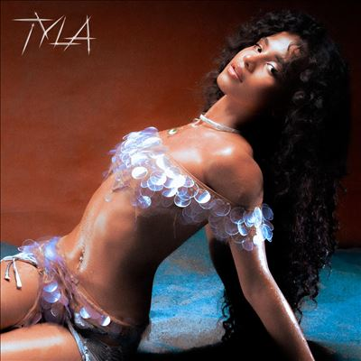

import { Slider, Button } from "@carbon/react";
import { ArrowUpRight } from "@carbon/icons-react";

import SliderJS1 from "../review/slider1";
import SliderJS2 from "../review/slider2";
import SliderJS3 from "../review/slider3";
import SliderJS4 from "../review/slider4";
import AdvJS2 from "../review/adv2";
import AdvJS3 from "../review/adv3";

import { Link } from "gatsby";

Album review

<h1 className="h1--no--margin">{props.pageContext.frontmatter.title}</h1>

<Row  className="image-card-group">
	<Column colMd={3} colLg={4} noGutterMdLeft="">
       <ImageCard>

</ImageCard>
	</Column>
	<Column colMd={4} colLg={8} noGutterMdLeft="">
	

		南アフリカ・ヨハネスブルグ出身のSinger, Song Writer, Tyka(22歳)のデビューアルバム。2024・66th Grammy賞でBest African Music Performanceを受賞し、ここ数年、ジャンルとしてブレークしているAmapianoを、世に広げる役目も果たしている。
		 言ってしまえば、ゆったりとしたアフロビートにハウス、ジャズなど都会的なサウンドをミックスして、Popにしたものと言えるが、ログドラムというパーカッシブなシンセベースを多用しているのも特徴的で、普通のドラム的な音はあまり使われいない。
		 Tylaの可憐な唄声もそんなTrackにマッチして、軽やかでPopな印象を与えてくれる。また、本人もSong Writingに加わっているLyricはラブソング中心となっている。
		 アフリカのルーツをしっかりと維持しつつ、ギリギリまでPopにしました、といえるような作品。
	

	

	  <Button className="button-right-mergin"  href="https://amzn.to/3YPjLPU" renderIcon={ArrowUpRight} size='sm' kind='primary'>
      amazon.com
    </Button>
    <Button className="button-right-mergin"  href="https://amzn.to/4dLPkyb" renderIcon={ArrowUpRight} size='sm' kind='secondary'>
      amazon.co.jp
    </Button>
		<Button className="button-right-mergin"  href="https://apple.co/3YPaXK2" renderIcon={ArrowUpRight} size='sm' kind='tertiary'>
      apple music
    </Button>
		<AdvJS2/>
	

	</Column>
</Row>
<Row >
	<Column colMd={4} colLg={4} noGutterMdLeft="">
		

    	<h3>Score card</h3>
			<SliderJS1 value="5" />
    	<SliderJS2 value="3" />
			<SliderJS3 value="1" />
    	<SliderJS4 value="9" />
		

	</Column>
	<Column colMd={8} colLg={8} noGutterMdLeft="">
		

			<h3>Producers</h3>
			

				Kelvin Mono(1)
				 Sammy Soso(2,3,4,9,10,12,14)
				 Alex Lustig and Sammy Soso(5)
				 Sammy Soso and Rayo(6)
				 Sir Nolan(7)
				 Believve(8)
				 Sammy Soso & P2J(11)
				 Manana, Christer & LuuDadeejay(13)
			

			<h3>Guests</h3>
			

				Kelvin Mono, Tems, Gunna, Skillibeng, Travis Scott, Becky G
			

		

	</Column>
</Row>

<h3>Tracks</h3>

| No. | Title         | Composers                                                                                                                              | Performer                    | Time  |
| --- | ------------- | -------------------------------------------------------------------------------------------------------------------------------------- | ---------------------------- | ----- |
| 1   | Intro         | Tyla Seethal, Kelvin Mono                                                                                                              | Tyla feat. Kelvin Mono       | 00:41 |
| 2   | Safer         | Tyla Seethal, Ari PenSmith, Mocha Bands, Corey Marlon Lindsay-Keay, Sammy Soso, Tricky Stewart                                         | Tyla                         | 02:39 |
| 3   | Water         | Tyla Seethal, Ari PenSmith, Believve, Sammy Soso, Mocha Bands                                                                          | Tyla                         | 03:20 |
| 4   | Truth or Dare | Tyla Aeethal, Ari PenSmith, Believve, Sammy Soso, Mocha Bands                                                                          | Tyla                         | 03:10 |
| 5   | Breathe Me    | Maesu, Tems, Tyla, Alex Lustig, Sammy Soso, Ari PenSmith, Jamal Europe                                                                 | Tyla Feat. Tems              | 02:27 |
| 6   | Priorities    | Tyla Seethal, Rayo, Corey Marlon Lindsay-Keay, Ari PenSmith, Jamal Europe, Sammy Soso                                                  | Tyla                         | 03:21 |
| 7   | Butterflies   | Sir Nolan, Ari PenSmith, Marcus Semaj                                                                                                  | Tyla                         | 02:42 |
| 8   | On and On     | Tyla Seethal, Corey Marlon Lindsay-Keay                                                                                                | Tyla                         | 02:47 |
| 9   | Jump          | Tyla Seethal, Skillibeng, Ari PenSmith, Mocha Bands, Corey Marlon Lindsay-Keay, Gunna                                                  | Tyla feat .Gunna, Skillibeng | 02:27 |
| 10  | Art           | Tyla Seethal, Ari PenSmith, Mocha Bands, Corey Marlon Lindsay-Keay, Sammy Soso                                                         | Tyla                         | 02:28 |
| 11  | On My Body    | Tyla Seethal, Ari PenSmith, Corey Marlon Lindsay-Keay, Mocha Bands, Sammy Soso                                                         | Tyla feat. Becky G           | 02:55 |
| 12  | Priorities    | Tyla Seethal, Ari PenSmith, Mocha Bands, Corey Marlon Lindsay-Keay, Sammy Soso                                                         | Tyla                         | 03:14 |
| 13  | To Last       | LuuDadeejay, Christer, Manana, Tyla Seethal                                                                                            | Tyla                         | 03:14 |
| 14  | Water [Remix] | Tyla Seethal, Travis Scott, Sammy Soso, Rayo, Jack LoMastro, Olmo Zucca, Ari PenSmith, Believve, Mocha Bands, Dougie F, Tricky Stewart | Tyla feat. Travis Scott      | 03:20 |

<AdvJS3 />
